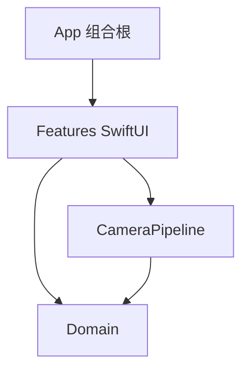
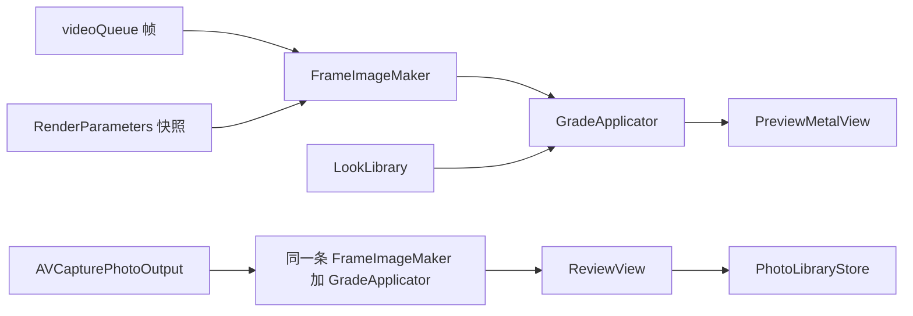

# 架构

一个应用目标，三层目录，先不拆 Swift Package。边界稳定、并且 Domain 能单独测试之后，再把 Domain 抽成包。

依赖向下。App 是组合根。Features 可以使用 CameraPipeline 和 Domain。CameraPipeline 可以使用 Domain。Domain 不 import SwiftUI、AVFoundation、Core Image、PhotoKit。CameraPipeline 不 import SwiftUI。`CVPixelBuffer` 和 `CIImage` 留在 CameraPipeline。

当前组合根很薄：`AngieFilter/App/AngieFilterApp.swift` 只放上 `CameraView`。`CameraViewModel` 自己创建 `CameraSessionController`。

## Domain 拥有什么

与平台无关、需要被验收的决策：

| 类型 | 文件 | 职责 |
| --- | --- | --- |
| `Look`、`GrainPlateKind` | `AngieFilter/Domain/Looks/Look.swift` | 风格数据。`clarity`、`grain`、`grainPlate`、`vignette`。`colorCubeName` 对原图为 `nil`，其余等于 `id` |
| `LookLibrary` | `AngieFilter/Domain/Looks/LookLibrary.swift` | 从包内 `Looks.json` 加载。读失败时只返回原图 |
| `AspectRatio` | `AngieFilter/Domain/Capture/AspectRatio.swift` | `fourThree` / `sixteenNine` / `square`，以及 `next()` |
| `AspectCrop` | `AngieFilter/Domain/Capture/AspectCrop.swift` | 转正之后的中心裁切 `pixelRect` |
| `ZoomStop`、`CameraStatus`、`CameraFacing`、`FlashMode`、`CameraAuthorization` | `AngieFilter/Domain/Capture/CameraControls.swift` | 界面消费的值。界面不读 `AVCaptureDevice` |
| `RenderParameters`、`RenderQuality` | `AngieFilter/Domain/Rendering/RenderParameters.swift` | 跨队列的 `Sendable` 快照 |

`RenderParameters` 的字段：`aspectRatio`、`lookID`、`intensity`（0–1，界面显示为 0–100）、`orientation`、`mirrorHorizontally`、`quality`（`preview` 或 `still`）。

Domain 里没有 `CameraEffect`，也没有 `LookFamily`。风格是数据，节点留在 CameraPipeline，因为入参是 `CIImage`。

几何使用 CoreGraphics 的 `CGRect` / `CGFloat`，方向使用 ImageIO 的 `CGImagePropertyOrientation`。这些是值，不是会话，也不是图像缓冲。

## CameraPipeline 拥有什么

会话、预览帧、把 `Look` 画成图像、写入相册。

| 类型 | 文件 |
| --- | --- |
| `CameraSessionController` | `AngieFilter/CameraPipeline/Capture/CameraSessionController.swift` |
| `ZoomLadderBuilder` | `AngieFilter/CameraPipeline/Capture/ZoomLadderBuilder.swift` |
| `FrameImageMaker` | `AngieFilter/CameraPipeline/Rendering/FrameImageMaker.swift` |
| `GradeApplicator` | `AngieFilter/CameraPipeline/Rendering/GradeApplicator.swift` |
| `ColorCubeStore` | `AngieFilter/CameraPipeline/Rendering/ColorCubeStore.swift` |
| `GrainLibrary` | `AngieFilter/CameraPipeline/Rendering/GrainLibrary.swift` |
| `PreviewMetalView` | `AngieFilter/CameraPipeline/Rendering/CoreImageFrameRenderer.swift` |
| `PhotoLibraryStore`、`PhotoLibraryError` | `AngieFilter/CameraPipeline/Photos/PhotoLibraryStore.swift` |
| `Locked` | `AngieFilter/CameraPipeline/Support/Locked.swift` |

`CoreImageFrameRenderer.swift` 里的类型是 `PreviewMetalView`。计划里曾经分开的 `ColorCubeGrade`、`ClarityGrade`、`GrainGrade` 已经收进 `GradeApplicator`。

## Features 拥有什么

| 类型 | 文件 |
| --- | --- |
| `CameraView` | `AngieFilter/Features/Camera/CameraView.swift` |
| `CameraViewModel` | `AngieFilter/Features/Camera/CameraViewModel.swift` |
| `FilterStripView` | `AngieFilter/Features/Camera/FilterStripView.swift` |
| `ReviewView` | `AngieFilter/Features/Review/ReviewView.swift` |

`CameraViewModel` 在主线程，保存界面状态：当前 `lookID`、强度、强度条是否展开、滤镜面板是否展开、确认页照片、保存中、对焦框、缩略图。设备状态由 `CameraStatus` 推上来。

ViewModel 发意图：变焦、切换风格、快门、画幅、闪光灯、翻转。它不配置 `AVCaptureSession`。缩略图刷新是当前的例外：`CameraViewModel.refreshThumbnails()` 自己建了一个 `CIContext`，并直接调用 `GradeApplicator.apply`。滤镜节点仍在 `GradeApplicator` 内部创建。

## 队列和快照

- `sessionQueue`（`angie.camera.session`）配置和操作 `AVCaptureSession`
- `videoQueue`（`angie.camera.video`）接收视频帧

不用 actor 包住 `AVCaptureSession`。会话回调留在它自己的队列上。`RenderParameters` 放在 `Locked` 里，视频队列取出一份值再渲染，不在预览队列里锁住 ViewModel。`onStatus`、`onPhoto`、`onFailure` 都回到主队列。

预览忙时，`CameraSessionController` 用 `isDrawing` 丢掉还没画完的新帧。视频输出同时 `alwaysDiscardsLateVideoFrames = true`。

## 命名

类型和文件同名，一个文件一个主类型。代码里叫 `Look`，界面文案叫「滤镜」。`Filter` 会和 `CIFilter` 撞名。条的视图类型是 `FilterStripView`，因为它画的是「滤镜」按钮打开的那一排；模型仍然是 `Look`。

不用 Manager、Helper、Engine，也不做 Coordinator、Rx、服务定位器、`Base`、`Utils`。两个页面用 SwiftUI 切换 `reviewImage`，不做路由框架。

协议曾经按角色设计过，用来在测试里换假实现：

- `CameraControlling`：开始、停止、变焦、切镜头、对焦、闪光灯、预览帧、拍一张
- `LookRendering`：用 `RenderParameters` 处理预览和成片
- `PhotoLibrarySaving`：保存已编码的照片

这些协议没有进当前代码。界面持有具体的 `CameraSessionController`，用 `onStatus`、`onPhoto`、`onFailure` 三个闭包回传。渲染入口是 `GradeApplicator.apply`。存图入口是 `PhotoLibraryStore.save`。相册失败是 `PhotoLibraryError`。会话失败目前是字符串，经 `onFailure` 变成界面横幅。

`LUT` 只出现在资源说明里。类型名用 `ColorCube`。强度属性是 `intensity`，镜像是 `mirrorHorizontally`，画幅是 `aspectRatio`。

## 数据流

缩略图取最近一帧已经转正、镜像和裁切过的源图，缩到宽 160，再对目录里每一款调用 `GradeApplicator.apply`，强度 1，质量 `preview`。面板打开时大约每 0.6 秒刷新一次。
