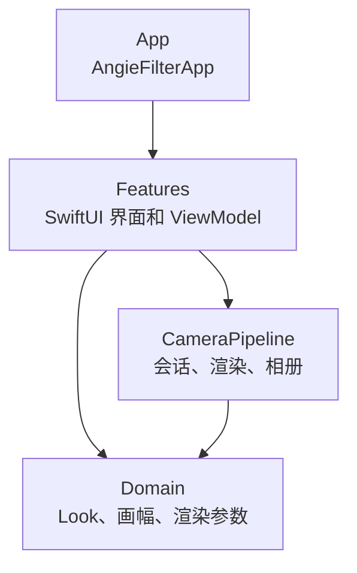
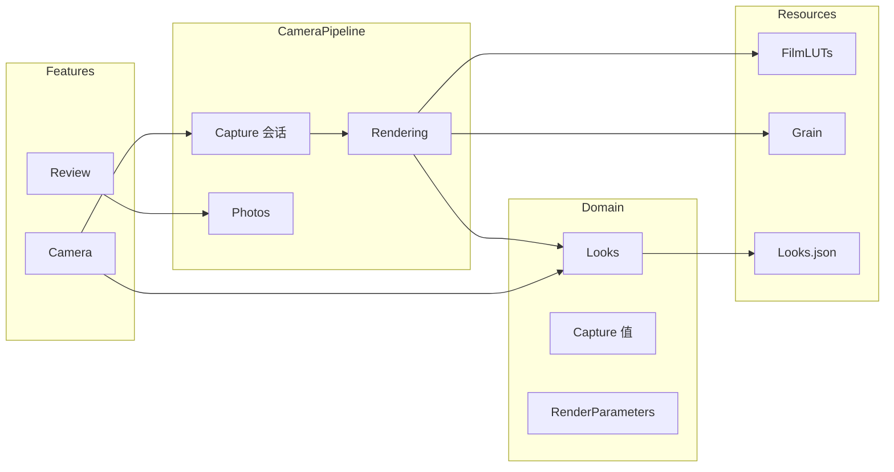
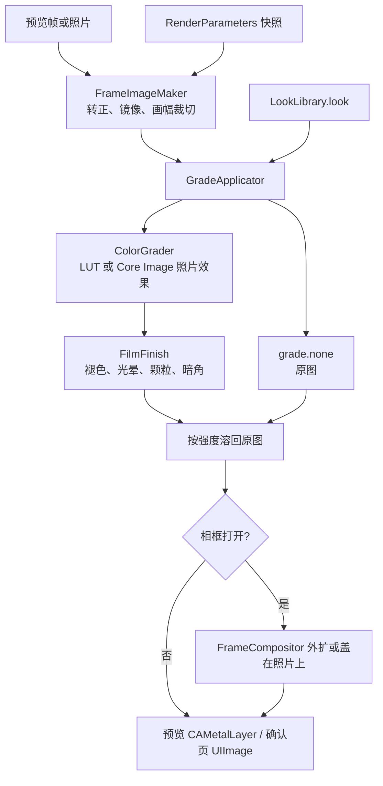
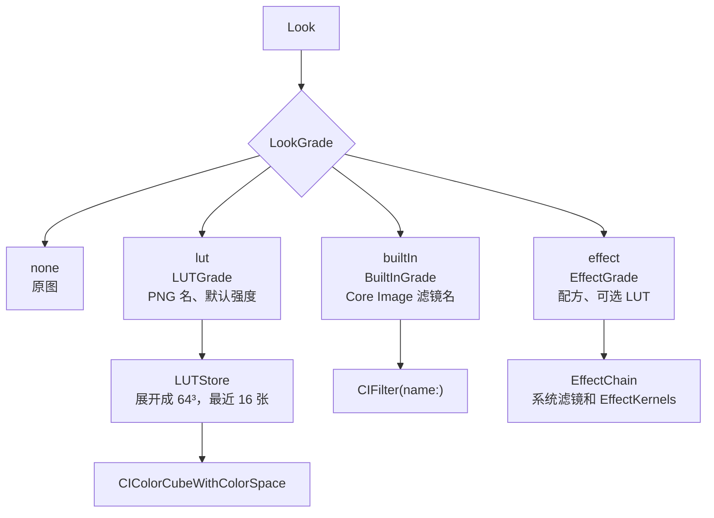
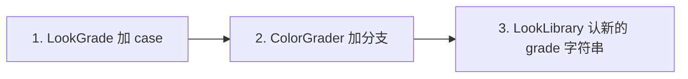
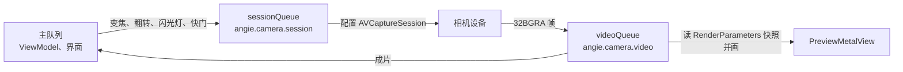

# 架构

一个应用目标，三层目录，先不拆 Swift Package。边界稳定、并且 Domain 能单独测试之后，再把 Domain 抽成包。

这份文档按代码来写。图里的名字都能在 `AngieFilter/` 里找到。

## 分层

依赖向下。App 是组合根。Features 可以使用 CameraPipeline 和 Domain。CameraPipeline 可以使用 Domain。Domain 不 import SwiftUI、AVFoundation、Core Image、PhotoKit。CameraPipeline 不 import SwiftUI。`CVPixelBuffer` 和 `CIImage` 留在 CameraPipeline。

当前组合根很薄：`AngieFilter/App/AngieFilterApp.swift` 只放上 `CameraView`。`CameraViewModel` 自己创建 `CameraSessionController` 和 `DualSessionController`，同一时间只让其中一个 `startRunning`。预览仍是单摄创建的那一个 `PreviewMetalView`。

风格是数据，渲染节点留在 CameraPipeline，因为入参是 `CIImage`。`Look.grade` 只描述用哪条方案和它的资源，不持有滤镜对象。

几何使用 CoreGraphics 的 `CGRect` / `CGFloat`，方向使用 ImageIO 的 `CGImagePropertyOrientation`。这些是值，不是会话，也不是图像缓冲。

## 目录

| 层 | 目录 | 放什么 |
| --- | --- | --- |
| Domain | `AngieFilter/Domain/Looks/` | `Look`、`LookGrade`、`LookFamily`、`LookLibrary` |
| Domain | `AngieFilter/Domain/Capture/` | 画幅、变焦档、闪光灯、朝向、权限。界面不读 `AVCaptureDevice` |
| Domain | `AngieFilter/Domain/Rendering/` | `RenderParameters`、`LookAdjustment`、`RenderQuality` |
| CameraPipeline | `AngieFilter/CameraPipeline/Capture/` | `CameraSessionController`、`DualSessionController`、`ZoomLadderBuilder` |
| CameraPipeline | `AngieFilter/CameraPipeline/Rendering/` | 几何、分发、颜色、收尾、LUT 缓存、预览 |
| CameraPipeline | `AngieFilter/CameraPipeline/Photos/` | `PhotoLibraryStore` |
| Features | `AngieFilter/Features/Camera/` | `CameraView`、`CameraViewModel`、`FilterStripView` |
| Features | `AngieFilter/Features/Review/` | `ReviewView` |
| 资源 | `AngieFilter/Resources/` | 胶片 LUT 和许可、富士官方 LUT、颗粒板、目录 JSON |

## 一帧怎么走

预览和成片共用几何和风格。差的是像素从哪来，以及 `RenderQuality` 是 `preview` 还是 `still`。

`RenderParameters` 放在 `Locked` 里。`videoQueue` 取出一份值再渲染，不在预览队列里锁住 ViewModel。预览画进 `CAMetalLayer`，渲染不经过主线程；GPU 上同时只有一帧，其余只留最新一张。

缩略图取 `ThumbnailFrameTap` 每 0.5 秒拷下的一张位图：最近一帧已经转正、镜像和裁切过，缩到宽 160，不再引用相机缓冲。缩略图再取中间正方形。先把这一帧渲成小图，再对当前分类调用 `GradeApplicator.apply`，调节用这款的默认值，质量 `thumbnail`。已选那一款先渲，每 4 张交给界面一次。同一套 `CIContext` 一直复用。缩略图不加相框。面板打开时大约每 1 秒刷新这一排；上一轮没算完就跳过，不打断。分类由 `LookLibrary.families` 决定，原图单独一组排在最前。

相框在 `GradeApplicator` 之后。预览和成片共用 `FrameCompositor`。底栏字图在主线程生成，`videoQueue` 只贴图。细节在 [frame.md](frame.md)。

双摄不走上面这张单路图。两路各自转正、调色，由 `DualFrameComposer` 贴进同一张外框，再套相框。缩略图仍用选中那一路的单帧，不合成。细节在 [multicam.md](multicam.md)。

## 颜色方案怎么并存

`LookGrade` 是扩展点。它是封闭枚举，编译器会要求 `ColorGrader` 写全每个分支。方案只决定颜色从哪来，颜色之后的收尾所有款共用。

| 方案 | 资源 | 目录 |
| --- | --- | --- |
| `none` | 无 | 原图 |
| `lut` | `FilmLUTs/film-<id>.png` 或 `FujiLUTs/fuji-<机型>-<模拟>.png` | `Looks.json`（由导入脚本写） |
| `builtIn` | 无 | `Looks.json` |
| `effect` | 可选的 `FilmLUTs` 底色，kernel 在 `default.metallib` | `LabLooks.json`，手工编辑 |

`effect` 里会移动像素的配方（鱼眼）先在 `GradeApplicator` 里弯曲，强度混合用弯曲后的图，避免重影。

`LookFinish` 是目录里的褪色、光晕、颗粒、颗粒板和暗角默认值。`LookAdjustment.baseline` 从它和 `Look.strength` 得出第一次套上时的调节。所有非原图款的面板都是强度、褪色、颗粒、暗角，`Look.showsHalation` 为真时多一根光晕。

调节后的数值按滤镜 id 记在 `CameraViewModel` 的内存字典里，不写磁盘。点保存才写入。收起或不保存就回到上次保存的值；没有保存过则回到默认。缩略图始终用默认参数，方便和改过的画面对照。

再加一种颜色来源时走这三步，预览、成片和缩略图的调用点不用改：

Domain 仍然不出现 `CIImage`。像素工作留在 CameraPipeline。

## Domain 类型

| 类型 | 文件 | 职责 |
| --- | --- | --- |
| `Look`、`GrainPlateKind` | `AngieFilter/Domain/Looks/Look.swift` | 风格数据，以及第一次套上时的强度 |
| `LookFinish` | `AngieFilter/Domain/Looks/LookFinish.swift` | 目录里的褪色、光晕、颗粒、暗角 |
| `LookGrade`、`LUTGrade`、`BuiltInGrade`、`EffectGrade` | `AngieFilter/Domain/Looks/LookGrade.swift` | 一款滤镜的颜色从哪来 |
| `EffectRecipe` | `AngieFilter/Domain/Looks/EffectRecipe.swift` | 实验室配方的 id |
| `LookFamily` | `AngieFilter/Domain/Looks/LookFamily.swift` | 分类。成员仍是 `Look` |
| `LookLibrary` | `AngieFilter/Domain/Looks/LookLibrary.swift` | 读 `Looks.json`。缺失时只返回原图，不认识的条目跳过 |
| `AspectRatio`、`AspectCrop` | `AngieFilter/Domain/Capture/` | 画幅和转正之后的中心裁切 |
| `ZoomStop`、`CameraStatus`、`CameraFacing`、`FlashMode`、`CameraAuthorization` | `AngieFilter/Domain/Capture/CameraControls.swift` | 界面消费的值 |
| `RenderParameters`、`LookAdjustment`、`RenderQuality` | `AngieFilter/Domain/Rendering/RenderParameters.swift` | 跨队列的 `Sendable` 快照。`dual` 有值时是双摄 |
| `DualLayout`、`PipCorner`、`DualSettings` | `AngieFilter/Domain/Rendering/DualSettings.swift` | 五种排列、小窗的角、两路滤镜 |
| `DualFrameGeometry` | `AngieFilter/Domain/Rendering/DualFrameGeometry.swift` | 两路在外框里的矩形或圆 |
| `DualFocusMap` | `AngieFilter/Domain/Rendering/DualFocusMap.swift` | 格子内点击映射到对焦点 |
| `FrameStyle`、`FrameSettings`、`FrameLayout`、`FrameDateText` | `AngieFilter/Domain/Rendering/FrameSettings.swift` | 相框样式、外框尺寸、日期字符串 |
| `PhoneModelName` | `AngieFilter/Domain/Rendering/PhoneModelName.swift` | 机型标识到营销名 |
| `PlaceCaption` | `AngieFilter/Domain/Rendering/PlaceCaption.swift` | 城市和区拼成底栏地点 |

`RenderParameters` 的字段：`aspectRatio`、`lookID`、`adjustment`、`frame`、`frameModelName`、`frameDate`、`framePlace`、`orientation`、`mirrorHorizontally`、`quality`（`preview`、`still` 或 `thumbnail`）、`dual`（双摄时的排列和两路滤镜，单摄为 nil）。

## CameraPipeline 类型

| 类型 | 文件 |
| --- | --- |
| `CameraSessionController` | `AngieFilter/CameraPipeline/Capture/CameraSessionController.swift` |
| `DualSessionController` | `AngieFilter/CameraPipeline/Capture/DualSessionController.swift` |
| `ZoomLadderBuilder` | `AngieFilter/CameraPipeline/Capture/ZoomLadderBuilder.swift` |
| `FrameImageMaker` | `AngieFilter/CameraPipeline/Rendering/FrameImageMaker.swift` |
| `GradeApplicator` | `AngieFilter/CameraPipeline/Rendering/GradeApplicator.swift` |
| `FilmFinish` | `AngieFilter/CameraPipeline/Rendering/FilmFinish.swift` |
| `FrameCompositor` | `AngieFilter/CameraPipeline/Rendering/FrameCompositor.swift` |
| `DualFrameComposer` | `AngieFilter/CameraPipeline/Rendering/DualFrameComposer.swift` |
| `FrameCaptionKey`、`FrameCaptionCache`、`FrameCaptionRenderer` | `AngieFilter/CameraPipeline/Rendering/FrameCaption.swift` |
| `ColorGrader` | `AngieFilter/CameraPipeline/Rendering/ColorGrader.swift` |
| `EffectChain` | `AngieFilter/CameraPipeline/Rendering/EffectChain.swift` |
| `EffectKernels` | `AngieFilter/CameraPipeline/Rendering/EffectKernels.swift`、`EffectKernels.metal` |
| `AutoLevels` | `AngieFilter/CameraPipeline/Rendering/AutoLevels.swift` |
| `LUTStore` | `AngieFilter/CameraPipeline/Rendering/LUTStore.swift` |
| `GrainLibrary` | `AngieFilter/CameraPipeline/Rendering/GrainLibrary.swift` |
| `PreviewMetalView` | `AngieFilter/CameraPipeline/Rendering/CoreImageFrameRenderer.swift` |
| `PhotoLibraryStore`、`PhotoLibraryError` | `AngieFilter/CameraPipeline/Photos/PhotoLibraryStore.swift` |
| `Locked` | `AngieFilter/CameraPipeline/Support/Locked.swift` |
| `DeviceMachine` | `AngieFilter/CameraPipeline/Support/DeviceMachine.swift` |

`CoreImageFrameRenderer.swift` 里的类型是 `PreviewMetalView`。

## Features

| 类型 | 文件 |
| --- | --- |
| `CameraView` | `AngieFilter/Features/Camera/CameraView.swift` |
| `CameraViewModel` | `AngieFilter/Features/Camera/CameraViewModel.swift` |
| `PlaceReader` | `AngieFilter/Features/Camera/PlaceReader.swift` |
| `FilterStripView` | `AngieFilter/Features/Camera/FilterStripView.swift` |
| `ReviewView` | `AngieFilter/Features/Review/ReviewView.swift` |

`CameraViewModel` 在主线程。它保存当前 `lookID`、分类、调节草稿、已保存的调节、滤镜面板和相框面板是否展开、`FrameSettings`、确认页照片、保存中、对焦框、缩略图。双摄打开时另记两路的滤镜、排列、小窗位置和选中的镜头；退出双摄时恢复进入前的单摄镜头和滤镜。设备状态由 `CameraStatus` 推上来，双摄期间只采用 `DualSessionController` 的状态。相框选择只留在这次启动的内存里。地点由 `PlaceReader` 读，解析出的字符串放进 `framePlace`。

ViewModel 发意图：变焦、切换风格、调节、相框、快门、画幅、闪光灯、翻转、开关双摄和改排列。它不配置 `AVCaptureSession`。缩略图刷新是当前的例外：`CameraViewModel.refreshThumbnails()` 用一个共用的 `CIContext`，并直接调用 `GradeApplicator.apply`。双摄时缩略图用选中那一路的最近一帧。

## 队列

不用 actor 包住 `AVCaptureSession`。会话回调留在它自己的队列上。`onStatus`、`onPhoto`、`onFailure` 都回到主队列。

预览忙时，`CameraSessionController` 在视频队列上占住 `renderBusy`，这一帧还没画完就不再建下一帧的图。画完再放开。视频输出同时 `alwaysDiscardsLateVideoFrames = true`。双摄用自己的 `angie.camera.dual.session`、`angie.camera.dual.video` 和 `angie.camera.dual.photo`。合成忙时合并成下一次绘制，不让后置的忙挡住前置更新最近一帧。两套会话不同时 `startRunning`。

## 命名

类型和文件同名，一个文件一个主类型。代码里叫 `Look`，界面文案叫「滤镜」。`Filter` 会和 `CIFilter` 撞名。条的视图类型是 `FilterStripView`，因为它画的是「滤镜」按钮打开的那一排；模型仍然是 `Look`。

不用 Manager、Helper、Engine，也不做 Coordinator、Rx、服务定位器、`Base`、`Utils`。两个页面用 SwiftUI 切换 `reviewImage`，不做路由框架。

协议曾经按角色设计过，用来在测试里换假实现：`CameraControlling`、`LookRendering`、`PhotoLibrarySaving`。这些协议没有进当前代码。界面持有具体的 `CameraSessionController` 和 `DualSessionController`，用 `onStatus`、`onPhoto`、`onFailure` 三个闭包回传。渲染入口是 `GradeApplicator.apply`。双摄合成入口是 `DualFrameComposer.compose`。存图入口是 `PhotoLibraryStore.save`。相册失败是 `PhotoLibraryError`。会话失败目前是字符串，经 `onFailure` 变成界面横幅。

颜色来源用 `LookGrade` 的 case 区分，不用一组可替换的渲染协议。加来源时改枚举和分发，调用方保持一个入口。
