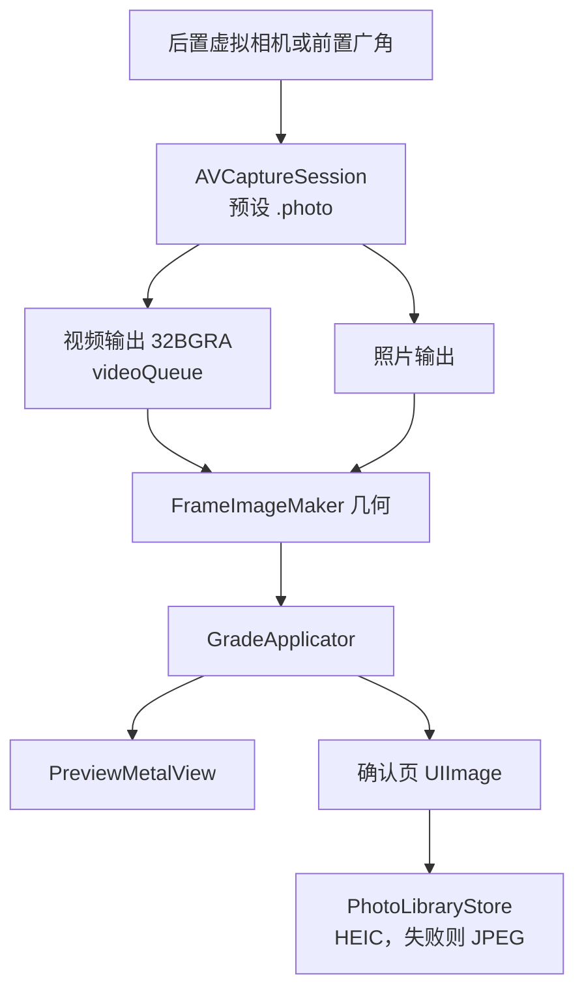

# 采集

采集在 `CameraSessionController`。双摄另走 `DualSessionController`，见 [multicam.md](multicam.md)。预览画到 `CAMetalLayer`（`PreviewMetalView`），不用 `AVCaptureVideoPreviewLayer`。不要设 `deliversPreviewSizedOutputBuffers`：`.photo` 预设下它会抛异常闪退。预览尺寸由 `FrameImageMaker` 把长边收到 1920。`CIContext` 的工作色彩空间是 Display P3。LUT 在 sRGB 里查表，转换由 `CIColorCubeWithColorSpace` 做，不在采集这一层做。渲染怎么套风格见 [rendering.md](rendering.md)。

采集直接用 AVFoundation，代码组织向 Apple 的 AVCam 和 AVMultiCamPiP 两个官方样例看齐，不引入第三方相机库。原因见最后一节。

## 会话

后置按这个顺序选第一台能用的虚拟设备，没有再往下：

1. `builtInTripleCamera`
2. `builtInDualWideCamera`
3. `builtInDualCamera`
4. `builtInWideAngleCamera`

前置固定 `builtInWideAngleCamera`。

会话预设 `.photo`。输出：

- `AVCaptureVideoDataOutput`：像素格式 `32BGRA`，`alwaysDiscardsLateVideoFrames = true`，委托在 `videoQueue`
- `AVCapturePhotoOutput`：`maxPhotoQualityPrioritization = .quality`

不开启人像。Live Photo 和录像的路线在最后一节。

**银幕款拍 ProRAW。** 选中「银幕」分类里的款时，`CameraSessionController.applyProRAW` 打开 `photoOutput.isAppleProRAWEnabled`，离开这个分类就关掉。打开要重建采集管线，头文件说很慢，所以只在进出银幕时切一次，别的分类照片输出和以前完全一样。快门时如果 ProRAW 已开、没有开实况，就用 `AVCapturePhotoSettings(rawPixelFormatType:)` 只拍一张 ProRAW（ProRAW 不能带实况视频，所以实况开着时银幕仍拍普通照片）。设备不支持 ProRAW 时自动回到普通照片。双摄不拍 RAW。

ProRAW 由 `ProRAWDevelopment` 用 `CIRAWFilter` 显影两次：

- 场景光：`baselineExposure = 0`、`boostAmount = 0`（不加全局曲线）、`localToneMapAmount = 0`（关局部色调映射）、`extendedDynamicRangeAmount = 2`。不开扩展范围时滤镜截在 1，会丢掉约一档半高光；开了以后大于 1 的值在 Display P3 工作空间里也能保留下来。`exposure` 必须留在 0：滤镜是在 context 的工作空间里乘曝光的，P3 是伽马编码，设 −2 实际压暗约四档。第一版就是这样错的，成片暗且发灰，和取景差很多。基准曝光由 `ScreenPrint.sceneLight` 乘回，见 [rendering.md](rendering.md) 的「银幕的 RAW 成片」。
- Apple 默认显影：强度滑杆往回混用它；拍完到出片之间换成了别的分类时也用它，当作普通照片处理。

画面方向按 DNG 里的方向自动转正，前置的镜像仍由 `FrameImageMaker` 加。画幅切换不重建会话，裁切发生在渲染。翻转摄像头会拆掉当前输入再挂上另一侧的设备，并回到该设备的 1x 档。

性能预算（iPhone 13）：预览 30fps，忙时丢旧帧，拍照不堵住预览队列，`CIContext` 复用。预览的 context 建在 `PreviewMetalView` 上，成片也用它的 `makeImage`。会话目前只丢迟到帧，还没有把 `activeVideoMinFrameDuration` 锁到 30fps。

## 变焦

变焦写在设备的 `videoZoomFactor` 上，渲染图不放大。

`ZoomLadderBuilder`：

- 广角因子 `wideAngleFactor`：虚拟设备切换点的第一档；没有切换点时用 `max(minAvailableVideoZoomFactor, 1)`
- 主摄焦段 `mainFocalLength`：取广角那颗镜头当前格式的 `videoFieldOfView`（4:3 横向视角），按 35mm 对角线 43.27mm 换算：`f = 21.63 / (tan(视角/2) × 1.25)`。离 24 或 26 不到 2mm 时取整到这两个标称值，读不出视角时用 26
- 等效焦段 = 主摄焦段 × 设备因子 / 广角因子
- 上限 = `min(设备最大变焦, 广角因子 × 5)`
- 档位 = 实体镜头（最小变焦，加上 `virtualDeviceSwitchOverVideoZoomFactors` 里不超过上限的点），再加推荐焦段 28、35、50、85 里落在范围内的。推荐焦段离某颗实体镜头不到 10% 时不单独出档
- 前置的推荐焦段只到 35；双摄是多摄格式，推荐焦段只到 50
- 打开或翻转后，落到广角因子，即主摄焦段

iPhone 16 Pro 后置得到 13、24、28、35、50、85、120。档位标签只写数字。当前所在或刚越过的那一档改写成实时焦段，如「40mm」，黄字。取景画面上不显示焦段。捏合以开始时的 `zoomFactor` 为基准连续变化，上限同样是广角因子 × 5。

变焦档每一档占 44pt 的点击区，整条变焦条吞掉档与档之间的点击，点偏了不会落到下面的点按对焦上。

## 画幅

界面锁竖屏（`UIInterfaceOrientationPortrait`）。`AspectCrop.pixelRect` 在图像转正之后做中心裁切，预览和成片共用这个矩形。

| 画幅 | `widthOverHeight` | 转正后的框 |
| --- | --- | --- |
| 3:4 | 3/4 | 竖向，传感器原生比例，默认 |
| 2:3 | 2/3 | 竖向 |
| 9:16 | 9/16 | 竖向长条 |
| 1:1 | 1 | 正方形 |
| 4:3 | 4/3 | 横向 |
| 3:2 | 3/2 | 横向 |
| 16:9 | 16/9 | 横向宽条 |
| 2:1 | 2 | 横向宽条 |
| 1.85:1 | 1.85 | 宽银幕遮幅（flat） |
| 2.39:1 | 2.39 | 宽银幕变形（scope） |

1.85:1 和 2.39:1 是影院放映的两种宽银幕比例，排在菜单最后，和「银幕」滤镜、「字幕」相框配着用。2.39:1 的照片套字幕相框正好是 16:9。

标签是转正后照片的宽:高。工具托盘的画幅按钮点开是一张菜单，直接选。`CameraView` 的取景区大小固定，照片按同一个 `widthOverHeight` 等比放进去并居中，画幅外是黑底。

## 方向和镜像

界面只竖屏，所以方向是固定映射，没有用 `AVCaptureDevice.RotationCoordinator`。

| 来源 | 后置 | 前置 |
| --- | --- | --- |
| 预览帧 | `CGImagePropertyOrientation.right` | `.leftMirrored` |
| 成片 | 快门前把照片连接设成 `videoRotationAngle = 90`、不镜像；读图用 `CIImage(data:options: [.applyOrientationProperty: true])` 按 EXIF 转正，之后方向按 `.up` | 同样转正，再 `mirrorHorizontally` |

`.leftMirrored` 已经带镜像，预览路径不再额外做一次水平翻转。前置保存结果和取景一致，都是镜像，拍完不会再翻一次。

预览帧的方向不随拿法变。竖屏下镜像预览像一面镜子，镜子跟着手机转，照出来的人始终是正的，所以横拿、倒拿时前置预览也是正的镜像，不用另外处理。

照片的像素仍是传感器横向，方向只写在 EXIF 里。`CIImage(data:)` 默认不读这个标记，不加选项时存下来的是横着的图。连接设置和读图在 `PhotoOrientation`，单摄和双摄共用。

`FrameImageMaker` 的几何顺序：按 `orientation` 转正，需要时水平镜像，再 `AspectCrop`。

### 拿法

界面仍只竖屏，横拿、倒拿靠 `HoldOrientation`（竖、上端朝右、上端朝左、倒）。`MotionHub` 用一路 Core Motion 重力（30Hz，低通）算横滚角 `atan2(g.x, -g.y)`：竖拿 0，上端朝右 +90°，朝左 −90°，倒拿 180°。只有转到离新方向 30° 以内才换拿法；`|g.z| ≥ 0.8`（接近平放）时保持上一次。同一路数据还驱动水平仪，偏差是横滚角减去当前拿法的角度。

拿法写进 `RenderParameters.hold`，只影响成片，不影响预览。快门按下时记下拿法。成片在调色之后、套相框之前由 `FrameImageMaker.turned` 转正，前后置同一条规则：

| 拿法 | 转法 |
| --- | --- |
| 竖 | 不转 |
| 上端朝右 | `.right`（顺时针 90°） |
| 上端朝左 | `.left`（逆时针 90°） |
| 倒 | `.down` |

成片在转正前和竖屏预览一模一样（前置也已镜像），预览在用户眼里是正的，所以只要把手机转过的角度转回来。前置不能把两个横向互换，也不能先转 180°，否则存下来是倒的。双摄整张合成图照这张表转一次。相框在转正后的照片上排版，横拍得到横向的相框。

## 对焦和闪光灯

对焦从裁切后的取景框换算回传感器，同时设 `focusPointOfInterest`（`.autoFocus`）和 `exposurePointOfInterest`（`.autoExpose`）。

当前实现把点击位置归一化到预览视图，再做竖屏轴交换：后置 `(x: y, y: 1 - x)`，前置 `(x: y, y: x)`。单摄这一步还没有按裁切矩形的内边距回推到传感器。双摄先把点击映射进那一路的格子，再用 `DualFocusMap` 按格子的宽高比补上裁切边距。点画面时如果滤镜面板开着，会先收起面板再对焦。拖动画中画或圆窗松手后不对焦。对焦框约 0.9 秒后消失。

闪光灯只作用于后置：关、开、自动。单摄时前置按钮禁用。双摄里按钮仍可点，闪光只写进后置那一路的 `AVCapturePhotoSettings`。设备不支持的模式不写入。

## 保存

确认页持有已经裁切并套好完整风格的 `UIImage`。`PhotoLibraryStore.save`：

1. 请求或沿用 `.addOnly` 权限。`.authorized` 和 `.limited` 都可以写
2. 优先 HEIC（`public.heic`，质量 0.92），失败则 JPEG 0.92
3. `PHAssetCreationRequest.forAsset()` 追加照片资源

不创建相册。成功后回到取景，横幅「已保存到最近项目」。失败横幅「保存失败，可以再试一次」。重拍只清掉确认页图片。单摄的风格、画幅和变焦留着。双摄重拍回到双摄，排列和两套滤镜留着。

Info.plist 由构建设置生成，声明相机、「仅添加照片」和相框地点：

- `NSCameraUsageDescription`
- `NSPhotoLibraryAddUsageDescription`
- `NSLocationWhenInUseUsageDescription`：地点只在相框打开地点开关时使用
- `NSMicrophoneUsageDescription`：只在实况打开或录像模式里录声音

## Live Photo

界面叫「实况」，工具行第二个按钮，开关记在 `UserDefaults` 的 `capture.live`，默认关。只在单摄：以 `AVCapturePhotoOutput.isLivePhotoCaptureSupported` 为准，双摄时按钮变灰。

1. `CameraSessionController.applyCaptureExtras` 在会话配好之后、`startRunning` 之前打开 `isLivePhotoCaptureEnabled`，换镜头后再设一次。开着实况且麦克风已授权时加一路音频输入，关掉就拿掉；没授权就录无声的。第一次打开实况时请求麦克风。
2. 快门给 `livePhotoMovieFileURL`，按 `uniqueID` 记一条 `LiveShot`。静图和短视频到达的先后不定，两样都到了才开始处理。
3. 静图照旧走 `stillPipeline`：镜像、裁切、调色、按拿法转正、套相框。确认页马上显示静图，角标「实况」转圈，保存按钮显示「实况处理中」。
4. `LivePhotoMovieRenderer` 用 `AVAssetReader` 读出每帧，按轨道的 `preferredTransform` 转正（它按 y 朝下写，Core Image 是 y 朝上，要用翻转共轭），再过同一个 `stillPipeline`，用低优先级的 `CIContext` 渲进缓冲池，`AVAssetWriter` 写 HEVC，色彩标 P3。音轨原样拷。输出尺寸先拿一张同尺寸的空图过一遍管线量出来，取偶数。
5. 配对靠两处同一个 UUID：静图 HEIC 的 Apple maker note 键 `17`，视频的 `com.apple.quicktime.content.identifier`。视频另写一条 `com.apple.quicktime.still-image-time` 元数据轨，时间用相机给的 `photoDisplayTime`。
6. 做好后确认页换成 `PHLivePhotoView`，先轻播一下，之后长按播放。`PHLivePhoto.request(withResourceFileURLs:)` 能加载，说明这对文件能配上。
7. 保存时 `PHAssetCreationRequest` 同时加 `.photo` 和 `.pairedVideo`。视频失败时横幅「实况没有生成，会保存为照片」，照常存静图。重拍、再拍或保存成功都删掉临时文件。

颗粒是一张固定的平铺图，和取景一样不随帧跳动。银幕款例外，颗粒每 1/24 秒换一个位置。

## 双摄

单摄继续用上面的 `AVCaptureSession` 和虚拟相机。点「双摄」后先停掉它，再启动 `AVCaptureMultiCamSession`。退出时反过来。预览视图不换。两路先各自调色，合成后再套相框。成片在双摄自己的 `CIContext` 里导出，不占用预览那一个 context。模拟器 `isMultiCamSupported` 为 false，工具行没有这个按钮。

## 录像

快门上方一行「照片 · 录像」切模式，选中的是黄色。单摄和双摄都能录，录下来的就是取景里调好色、带相框的画面，双摄是合成后的整张图。

- 不用 `AVCaptureMovieFileOutput`，它写进去的是没调色的原始帧。`VideoRecorder` 接住每一帧画进取景的图，用自己的 `CIContext` 渲进 `AVAssetWriterInputPixelBufferAdaptor` 的缓冲池，`AVAssetWriter` 写 HEVC，色彩标 P3、传递函数 BT.709，码率按像素数算，最低 8Mbps。编码器忙时丢帧，不排队。
- 尺寸就是取景帧的尺寸（长边 1920 以内），在第一帧到来时定下；所以录像时相框、画幅、双摄排列和单双摄切换都锁住变灰，滤镜和调节可以改。
- 拿法在开录那一刻定下，整段不变。竖拿直接录取景那张图；横拿、倒拿先按成片同一条规则转正，再套相框，相框和字是横的。前置照旧是镜像。
- 时间戳用采样缓冲自己的，写入从第一帧开始，之前的声音丢掉。双摄的合成图每来一路新帧就重画一次，录像按后置那一路的时间戳，每个后置帧最多记一帧。
- 声音：录像模式下加麦克风输入和 `AVCaptureAudioDataOutput`，编码参数用 `recommendedAudioSettingsForAssetWriter`，AAC。第一次切到录像时请求麦克风，没授权就录无声的。单摄在录像模式里关掉实况。双摄用 `addInputWithNoConnections` 加麦克风，手动连到音频输出；`removeAll` 之后按模式重新加。两个会话各自记着模式，录像模式里切单双摄麦克风跟着走。
- 帧率：录像模式下工具行第二格（照片模式是实况）换成「30P / 24P / 延时」，点一下换下一档，不是 30P 时是黄色，记在 `UserDefaults` 的 `capture.frameRate`，录制中锁住。双摄里只在 30P 和 24P 之间换，开双摄时若是延时就退回 30P。24P 把 `activeVideoMinFrameDuration` 和 `activeVideoMaxFrameDuration` 都锁在 1/24，暗光也不降帧，取景跟着变成 24 帧；格式不支持 24 时退回 30P 的设置。30P 单摄用格式自己的范围，双摄是 30、暗光可降到 15。切回照片模式就放开。`VideoRecorder` 的 `AVVideoExpectedSourceFrameRateKey` 跟着设备当时锁定的帧率。快门角度没有做：自动曝光在亮处会用很短的快门，要稳定的 180°（1/48 秒）得用自定义曝光并配 ND，手机上做不到，所以 24P 在亮处的动态模糊仍比电影少。
- 延时（移动延时）：只有单摄。设备照 30P 拍，取景照常；`VideoRecorder` 的 `speedUp` 是 `VideoFrameRate.lapseSpeed`（6），按拍摄时间每 6 帧留 1 帧（提前半帧也算到点，丢过帧就从这一帧重新数），时间戳按开头压缩成 1/6，播放是 30 帧、6 倍速。不录声音。系统防抖照常开着；走路拍最好配运镜的「跟拍」加「锁平」。每个留下的帧和它前面两帧取平均（前两帧先渲进录像自己的缓冲池，不占相机缓冲），一帧代表的 6 帧里混了一半，像 180° 快门，步伐的起伏抹得软一些。调试台 `recording … speed x6`。没做前瞻平滑。
- 银幕款录 Apple Log：录像模式下选中「银幕」分类里的款，并且设备有 Apple Log 格式（iPhone 15 Pro 及以后）时，`CameraSessionController.applyLogVideo` 把设备切到 Log 格式，帧率按钮下面出现一个黄色的小「LOG」。离开银幕、回到照片模式、翻转摄像头、切双摄时退回 `.photo` 预设。别的分类和照片模式的格式和以前完全一样。
  - 格式：`supportedColorSpaces` 含 `.appleLog`、像素格式是 10 位 `x420`、帧率范围盖住 24 到 30 的里面，先挑和照片格式同比例（4:3，取景视角不变），再挑宽 1920 左右的，和预览尺寸一致。设备没有这样的格式就照旧录普通画面。
  - 切换在一次配置里完成：关 ProRAW（选了 Log 色彩空间时照片输出不能拍照），关 `automaticallyConfiguresCaptureDeviceForWideColor`，设 `activeFormat` 和 `activeColorSpace = .appleLog`，视频输出改成 10 位 `x420`。退回时打开自动广色域、设回 `.photo` 预设、输出改回 `32BGRA`，再按需要打开 ProRAW。换格式前后保持变焦倍数，免得虚拟相机跳回超广角。录制中不切，停下后再补。
  - 帧读法：只有 Log 才要 10 位，所以帧的像素格式就说明它是不是 Log。`FrameImageMaker.logSources` 用 `colorSpace: NSNull()` 读出编码值（YCbCr 转 RGB 仍按帧上的矩阵），转正裁切后交给 `ScreenPrint.sceneLight(fromAppleLog:)` 解码成场景光；缩略图、强度混合和别的分类用它压回的显示图。见 [rendering.md](rendering.md) 的「银幕的 Apple Log 录像」。
  - 调试台里切换时打印 `single: Apple Log on/off` 和格式，换滤镜时的 `preview look` 一行带上帧的 `log curve`。
- 防抖：单摄录像模式下，`applyStabilization` 给视频输出的 connection 设 `preferredVideoStabilizationMode`，按当前格式 `isVideoStabilizationModeSupported` 依次取 `cinematicExtended`、`cinematic`、`standard`。取景、运镜的人脸检测和录像都用这一路帧，所以取景看到的就是录下来的稳定画面。照片模式设回 `off`，取景跟手不拖。防抖跟着格式走，每次 `applyFrameRate` 之后重新判断（切模式、翻转、进出 Log 都会经过），录制中不改。开着时帧会晚一截才到，`camera frames` 一行的 `age` 是帧从拍到到达视频队列的毫秒数。调试台里打印 `single: stabilization wanted … active …` 和格式。双摄没开。实测走路录像明显更稳。
- 运镜：单摄录像模式下，工具托盘在帧率后面多一个按钮，图标跟着选中的运镜变（希区柯克 `person.and.background.dotted`，慢推 `plus.magnifyingglass`，慢拉 `minus.magnifyingglass`，急推 `bolt`，跟拍 `viewfinder`），开着时是黄色，开关不记在本机设置里。关着时点它会用上次的运镜打开，并在焦段环的位置换成两行：第一行「向后走 / 向前走」（希区柯克）｜「慢推 / 慢拉 / 急推」｜「跟拍」，最后是「关闭」，手机太窄时这一行可以横着滑；第二行左边是选中那种的设置，右边是「水平」「手持」「虚化」三个开关（见下面的「运镜选项」）。开着时点托盘按钮显示或收起这两行。选一种会把变焦移到它的起点，横幅说明怎么拍。录制中选项锁住，托盘按钮变成「冲击」（见下面）。运镜开着时点取景还会选跟谁。细节见下面的「运镜」。
- 录制中取景顶部居中显示红底计时。快门变红，录制中缩成红色圆角方块。离开前台时自动停。
- 停下后进确认页：循环播放（带声音），重拍删掉临时文件，保存用 `PHAssetCreationRequest` 的 `.video` 资源。写失败时横幅「录像没有保存下来」。
- 先录 SDR。HDR 以后单独做。

### 运镜

六种运镜的缩放都靠设备的 `videoZoomFactor`，平移、旋转靠渲染里的裁切框（见下面的「跟拍」），由 `CameraSessionController` 按 `CameraMove` 调度，共用下面几条：

- 什么时候动：变焦只在录制中动。录制前变焦停在起点，可以照常点焦段档或捏合来构图，开始录制时的变焦就是这一条的起点。停止录制后变焦用每秒 3 档的速率回到这一条开始时的变焦，接着录下一条。锁平、匀转和手持感在取景里就生效，所见即所录。
- 起点：打开运镜、换一种、翻转镜头、切进录像模式时，变焦用每秒 3 档的速率移到主摄上的起点。往里推的（向后走、慢推、急推）从主摄最广开始，后置 1x，前置 1；向前走从最广的 2.5 倍开始，后置 2.5x，DollyCam 的向前预设是原生 3.0；慢拉从设置里的「从 N 倍」开始（1.5、2.5、4 倍，默认 2.5）。跟拍不动变焦，就用当前的。
- 范围：限制在当前这颗镜头内，从这颗镜头的最小变焦，到下一个切换点的 98% 或变焦上限（广角因子 × 5）为止，越过切换点虚拟相机会换镜头，画面会跳。后置在 1x 时范围是 1x 到 4.9x，全程都是主摄裁切；前置是 1 到 5。
- 执行：每一步都是 `ramp(toVideoZoomFactor:withRate:)`，速率按大约在下一步到来时走完来算，所以两步之间也是连续的。焦段显示最多每秒刷新 4 次，免得整个相机界面每帧重画。
- 人脸：录制中 `FaceWatch` 每一帧视频都拿来测，检测空着时用 `FaceTracker.copy` 拷一张长边 512 的小图，在 `angie.follow` 上跑 `VNDetectFaceRectanglesRequest`；上一帧还没检完就跳过这一帧。测的是裁切前的整幅画面，所以人脸的位置和大小不受裁切框影响。先跟画面里最大的那张脸，之后跟离上次位置最近的那张；最近的一张离上次超过 0.25 个画面宽，就当作没看到；超过 1 秒没看到，重新找最大的那张。每次结果同时交给 `DollyZoom`（量大小）和 `FaceFraming`（量位置）。
- 人体：已经在跟一个人、这一帧附近却没有脸（背过身、侧脸没检出）时，再跑 `VNDetectHumanRectanglesRequest`（只要上半身），取离上次位置 0.35 个画面宽以内最近的那个。人体框只给 `FaceFraming` 定位置；它的大小和距离没有关系，对 `DollyZoom` 来说这一帧就是没看到脸。开拍时只认脸，人体不会单独开始一条的构图。
- 点选：运镜开着时点取景，除了照常对焦，还告诉 `FaceWatch` 跟这里（`pickSubject`，点的位置按上一帧的裁切框反算回整幅画面）。下一次检测时，先找中心离点 0.2 个画面宽以内的脸，再找人体，都没有就把点周围 0.2 宽的方块交给 `VNTrackObjectRequest`（`VNSequenceRequestHandler` 连续跟，置信度低于 0.3 就放掉，回到找脸）。点中的人从这里开始跟：`FaceFraming` 按他此刻的位置重新记偏移，希区柯克重新定基准。录制前点的留到开拍时用，横幅「开拍后跟住这里」。
- 脸、人体、跟住的方块互相切换时，`FaceFraming` 按切换那一刻的构图重新记偏移，因为它们的中心不在一处，不重新记会让画面跳一下。
- 这一帧拍到时的变焦：录制中 `ZoomTrail` 每帧到来时读一次 `videoZoomFactor`，连同时间记下最近 1.5 秒的读数，按帧自己的呈现时间插值，也能算出这一帧前后 0.06 秒里每秒变了几档。希区柯克和变焦模糊都用它。
- 运动：运镜开着时 `MotionTrail` 以 100 Hz 读设备运动（`CMMotionManager` 的 `deviceMotion`，在 `angie.motion` 上），记下最近 1.5 秒的翻滚角（`atan2(g.x, −g.y)`，展开成连续的，转过 ±180° 也不跳）、重力是否大体在屏幕平面里（`g.x² + g.y² > 0.25`，平放时翻滚角没意义）和三轴角速度。运动的时间戳和帧的呈现时间都是主机时钟，所以按帧时间插值就能取到这一帧拍下时的姿态，防抖让帧晚到也对得上。关掉运镜、离开录像模式、切双摄时停。

### 运镜选项

运镜行下面的第二行。都记在本机设置里（`capture.*`），下一条录制生效，录制中锁住；锁平、匀转、手持感在取景里马上生效。点一下换下一档，不是默认值时是黄色。

- 希区柯克：「强度」滑杆，见「希区柯克变焦」。
- 慢推：时长「3 / 6 / 10 秒」（`capture.glideSeconds`，默认 6），幅度「到 1.5 / 2 / 3 倍」（`capture.pushReach`，默认 2）。
- 慢拉：时长同上，起点「从 1.5 / 2.5 / 4 倍」（`capture.pullStart`，默认 2.5），换起点时变焦马上移过去。
- 急推：「0.5 / 1 / 2 秒后」（`capture.crashDelay`，默认 1）；「推 2 / 3 / 4 倍」再「拉 2 / 3 / 4 倍」依次换（`capture.crashReach`、`capture.crashOut`，默认推 3 倍），选到「拉」时运镜行上的名字变成「急拉」，变焦马上移到新的起点；「定格」（`capture.crashFreeze`）。
- 跟拍：没有自己的设置。
- 水平（`capture.horizon`）：点一下在「水平」（关）、「锁平」、「匀转」之间换，见「锁平 / 匀转」。
- 手持（`capture.handheld`）：见「手持感」。
- 虚化（`capture.backgroundBlur`）：见「虚化」。
- 这一行放不下时（急推有三个设置）可以横着滑。
- 横幅照着设置说，例如「慢推：开始录制后 10 秒推近到 3 倍」。

### 跟拍

变焦只能朝画面中心推：人脸不在正中时，推近后会往边上跑；走路时手的晃动也会被长焦放大。`FaceFraming` 在渲染里加一个裁切框来补这两点。运镜里的「跟拍」就是只有这个裁切框、不动变焦的那一种，配合锁平、手持感、延时用。

- 裁切：运镜开着时，`captureOutput` 把整幅画面交给 `FaceFraming.cut` 取一个 1/1.25 大小的框（`FrameCut`：中心、大小、角度），`FrameImageMaker.cut` 把框里的画面转正、放大回原尺寸，之后美颜、调色、边框、取景和录像都用裁过的画面。所以运镜开着时画面比焦段显示的紧 1.25 倍。Log 录像的场景光用同一个框。拍照模式和双摄不裁。
- 余量怎么分：框的角度来自锁平 / 匀转加手持感的微转，先按「转过这个角还能整个落在画面里」限住角度（3:4 竖拍、1.25 倍时约 ±10°，`FrameCut.mostAngle` 二分求），再在转过之后剩下的余量里平移。所以角度优先，平移让路。
- 跟随：开始录制后第一次看到人脸时，记下人脸离裁切框中心的位置；之后裁切框往「人脸位置减去这段偏移」移动，人脸就停在开拍时构图里的位置。框只能在画面内移动，每边最多约 10% 个画面宽。
- 平滑：目标变化小于 0.004 个画面宽时不动；每帧按 0.3 秒的时间常数指数趋近目标，检测的抖动被抹平，动作不突兀。
- 重新定位：录制中点焦段档或捏合变焦，按新的构图重新记偏移。停止录制后框慢慢回到正中。换画幅时框回到正中。
- 画质：缩放仍然是设备变焦做的，裁切框只平移、转一点，手持感最多再多裁约 1.2%，一条之内放大倍数基本固定 1.25，清晰度不会忽好忽坏。1320 宽的取景缓冲裁到 1056 宽再放大回去，比不裁略软。

### 希区柯克变焦

`DollyZoom` 控制设备的 `videoZoomFactor`。思路来自 DollyCam 1.5 的逆向报告（`dollycam-hitchcock-dolly-zoom-1.5.md`）：它把人脸框的大小直接当反馈，量到的大小已经被当前变焦放大过，所以人物并不能真正保持同样大小。我们换了一个量：人脸在画面里的大小正比于「变焦 ÷ 距离」，所以「这一帧拍到时的变焦 ÷ 人脸大小」就是到人脸的距离（差一个常数），和变焦怎么变过无关。目标变焦 = 基准变焦 × 距离 ÷ 基准距离，理论上人脸大小不变。

- 测量：人脸来自 `FaceWatch`（见「运镜」）。人脸大小是归一化框的 `√(宽 × 高)`，小于 0.03 的不用。启用之前拍的帧不用。
- 这一帧拍到时的变焦：从 `ZoomTrail` 按帧自己的呈现时间查（见「运镜」）。直接用最新读数的话，变焦正在变时会比画面超前一截，算出的距离偏大，镜头就会冲过头；防抖让帧晚到，所以读数留 1.5 秒。
- 基准：开始录制、录制中点焦段档或捏合变焦时重新定基准，取接下来 3 次测量的对数距离均值。画幅变了也重新定。
- 滤波：在对数距离上用 alpha-beta 滤波，同时估计距离和走动速度，alpha 0.4、beta 0.06。和预测差超过 0.15（自然对数）的测量多半是转头或者检测框跳了，只取四分之一的权重。超过 0.4 秒没看到脸，就当作停下，速度清零。目标取的是预测到「现在再往后 0.05 秒」的距离：先把这一帧拍到到现在的延迟（防抖和检测，最多按 0.4 秒算）补上，再加变焦生效的时间。不开防抖时合起来约 0.1 秒。
- 单向：和 DollyCam 一样，一条之内变焦只往一个方向走。向后走只许变焦增大，向前走只许变焦减小；算出来要往回走时停在已经到过的地方。检测抖动和走路的前后晃动因此不会让镜头来回伸缩。人往回走时镜头停住不动。
- 执行：变化小于 0.003 档时不动。一步是一次测量，大约在下一次测量到来时走完。
- 余量：向后走从 1x 起，人脸可以缩到约五分之一；向前走从 2.5x 起，人脸可以长到约 2.5 倍。
- 强度：选中「向后走 / 向前走」时，运镜选项行左边是「强度」滑杆，30% 到 150%，每档 5%，默认 100%，双击数字回到 100%，不是 100% 时数字是黄色。记在本机设置里（`capture.dollyStrength`），下一条开始录制时生效，录制中锁住。目标变焦 = 基准变焦 × (距离 ÷ 基准距离)^强度：100% 人脸大小不变；小于 100% 变焦只补一部分，人脸随走动略微变大变小，更柔和；大于 100% 补过头，向后退时人脸反而变大，眩晕感更强。单向限制和范围照旧。运镜两行出现时，运镜区的行距从 16 收到 10，和双摄三行时一样，不挤动取景。
- 调试台里打印 `dolly armed 向后走 at …, range …, strength …`、`dolly baseline zoom`，之后每秒一行 `dolly face …, distance x…, speed …/s, ahead …s, zoom … -> …`，`ahead` 是往前预测的秒数。
- 目前没做：点选跟哪张脸，丢脸后回到原来的变焦，双摄。

### 慢推 / 慢拉 / 急推

`ZoomGlide` 在开始录制时启动。变焦不看人脸，任何画面都能用；画面里有人脸时，裁切框跟着它，推近时人脸不会往边上跑。

- 慢推 / 慢拉：慢推从起点推到起点的「到 N 倍」（默认 2 倍，后置 1x 到 2x），慢拉从「从 N 倍」拉到这颗镜头的最广（默认后置 2.5x 到 1x），时长按设置（默认 6 秒）。按对数变焦走 smoothstep（`3t² − 2t³`），起步和到头都是缓的，中间最快，看起来像推轨而不是变焦键。
- 急推：开始录制后等「N 秒后」（默认 1 秒），0.3 秒内推到起点的 N 倍（默认 3 倍），曲线是指数缓出 `(1 − 2^(−10t)) ÷ (1 − 2^(−10))`，前几帧就走完大半，再落稳，像手猛拧变焦环。等待时也算在推（`isRunning`），这时手动变焦会取消它。
- 急拉：起点是最广的 N 倍，同样的时机和曲线拉到这颗镜头的最广。
- 定格：打开时，急推 / 急拉落定的那一刻记下时间，拍摄时间晚于它的第一帧调好色后渲成一张独立的图（不占相机缓冲），之后 0.6 秒的帧都用这张图，取景和录像一起停住，声音照常。停止录制时清掉。调试台 `freeze at …`。
- 都是到头后停住，直到停止录制。
- 步进：`angie.camera.session` 上的定时器每 1/60 秒算一次目标，交给 `ramp`，速率按 1/60 秒走完来算。
- 手接管：录制中点焦段档或捏合变焦，推拉就停下，变焦交给手。
- 调试台里打印 `glide 慢推 2.00 -> 4.00 over 6.0s after 0.0s`（数值是设备变焦因子，后置 1x 是 2.0）。
- 目前没做：没有人脸时朝点选的位置推。

### 变焦模糊

设备变焦是逐帧换裁切，一帧之内不会糊，急推看起来就是一格一格跳的。录制中开着运镜时，`captureOutput` 在裁切之后、美颜调色之前按这一帧的变焦速度补上径向拖影。

- 量：`ZoomTrail.stopsPerSecond` 取这一帧拍下时每秒变几档，超过每秒 1 档的部分才算（慢推最快约 0.25 档每秒、走路的希区柯克约 0.7，都不糊）。假定 180° 快门（30P 时 1/60 秒），快门开着时画面放大了 `2^(档速 × 1/60)` 倍，拖影占半径的比例 `spread = 1 − 2^(−超出档速 × 1/60)`，最多 0.15。拉远时 `spread` 取负，往外拖。
- 做法：`EffectKernels.metal` 的 `zoomBlur`，每个像素在它和「离中心 1 − spread 处」之间等距取样平均，取样数按最长的拖影每 3 像素一个，4 到 48 个。中心是整幅画面的中心经裁切框变换后的位置，跟拍平移了也对得上真实的变焦中心。Log 录像的场景光同样处理。
- 调试台每 0.1 秒最多一行 `zoom blur +12.3 stops/s, spread 0.130`。

### 甩镜模糊

手机转得快时，自动曝光在亮处用很短的快门，画面是一格格清楚的，看着顿。录制中开着运镜时，按角速度补上方向拖影。

- 量：取这一帧拍下时绕手机长轴（y，左右甩）和短轴（x，上下甩）的角速度，合起来超过 1.2 弧度每秒才算，普通摇镜不糊。焦距像素 = 竖拍画面长边的一半 × 这一帧的变焦 ÷ `tan(格式视角 ÷ 2)`（`videoFieldOfView` 是格式长边方向的视角，虚拟相机按最广那颗算，所以乘设备变焦因子正好），再乘裁切放大的 1.25 倍。拖影长度 = 超出的角速度 × 1/60 秒 × 焦距像素，最多画面宽的 8%。
- 方向：后置时画面速度是 `(ω_y, −ω_x)`，前置镜像后正好反向，对称的模糊只看角度，所以前后置一样；再减去裁切框的角度。
- 做法：`CIMotionBlur`，半径取长度的一半。Log 场景光同样处理。
- 调试台每 0.1 秒最多一行 `whip blur 3.2 rad/s, 45 px at 12°`。

### 锁平 / 匀转

`HorizonLock` 每帧在视频队列上算裁切框要转多少，逆着手机的翻滚角。

- 为什么先平滑：系统防抖已经把翻滚里快的抖动去掉了，画面上剩下的是慢的倾斜。所以翻滚角先按 0.25 秒的时间常数平滑，近似防抖留下的那部分，再拿它来纠正；直接用原始翻滚角会把防抖已经去掉的抖动又加回去。
- 锁平：纠正量 = 平滑后的翻滚角 − 拿法的角度（录制中用开拍时定下的拿法，录制前用离翻滚角最近的拿法）。手歪了多少，框就反着转多少，最多约 ±10°，再歪就只纠正到 10°。
- 匀转：让手机转，但转得匀。在平滑后的翻滚角上用 alpha-beta 滤波画一条匀速的转动（alpha 0.06、beta 0.0019，约半秒追上，匀速转动时不落后），纠正量 = 平滑翻滚角 − 这条匀速转动。转得不匀的部分被框抵掉，整体的转动留在画面里。
- 平放时（重力不在屏幕平面里）翻滚角没意义，框保持上一帧的角度。
- 方向：手机顺时针歪 θ，画面里的世界相对屏幕逆时针转 θ，框也逆时针转 θ 就对齐了地平线；前置镜像后同样成立。
- 竖拍 3:4 转 θ 不露黑角要裁 \(s(\theta)=\cos\theta+\tfrac{4}{3}\sin\theta\)，1.25 倍刚够约 ±10°。

### 手持感

`HandheldSway` 让裁切框缓缓飘，像手拿着、在呼吸。平移每个方向约 ±1.2% 画面、转约 ±0.5°、往里多裁 0 到 1.2%（只往里，不会用光余量）。每一项是两个频率不相关的正弦相加（0.15 到 0.5 Hz），看不出重复。和锁平、跟拍、各种推拉都能叠；叠在慢推上就是手持推镜。

### 虚化

手机镜头景深深，推近了背景也不虚。「虚化」打开时，`PersonMask` 找出画面里的人，只把人后面的虚掉，焦段越长越虚，像大底相机。

- 遮罩：视频队列每帧把裁切后的画面交过去，上一张做完就拷一张长边 512 的小图，在 `angie.segment` 上跑 `VNGeneratePersonSegmentationRequest`（`balanced`，单通道 8 位），取景拿到的是最新一张。超过 0.5 秒的遮罩不用，免得人走开了还虚着原来的位置。翻转镜头时清掉。
- 模糊：遮罩反相后按半径的四分之一做高斯柔边（头发不至于硬切），交给 `CIMaskedVariableBlur`。半径 = 画面宽 × 0.004 × (当前变焦 ÷ 主摄最广)^1.3，最多画面宽的 3%：1x 时只是一点，3x 时像人像镜头，慢推时背景越推越虚，慢拉时慢慢变清楚。变焦从 `lens` 里的设备直接读。
- 在裁切、变焦模糊、甩镜模糊之后，美颜调色之前；Log 录像的场景光用同一张遮罩。取景里就能看到。
- 风险：遮罩比画面晚一两帧，人动得快时边缘会拖；头发边缘不准；开销要看 `camera frames` 一行的 `build`。

### 环绕

跟拍录制中，计时旁边显示手机绕竖直方向转过的角度「绕 45°」，满 90° 变黄，方便绕着人走一圈时匀速、到位。`MotionTrail` 把角速度在重力方向上的分量（`−ω·g ÷ |g|`）按时间累加，得到绕竖直轴转过的角度；不用姿态的欧拉偏航角，因为竖着拿手机时它正好卡在万向节死锁上。开拍时记下起点，会话队列上每 0.25 秒更新一次 `CameraStatus.orbitDegrees`，停止录制时清掉。只看绝对值，不分左右。

### 冲击

录制中开着运镜时，托盘上的运镜按钮变成 `sparkles`，点一下打一记「冲击」：裁切框猛地往里 7%、剧烈抖动（平移约 ±2%、转约 ±1.2°，15 到 23 Hz），0.4 秒内按平方衰减落稳；同时叠一层白光，0.15 秒内从 60% 退掉。`ImpactShake` 给出偏移，和手持感的偏移相加后交给裁切框；白光加在调色之后。按点击的主机时间对齐拍摄时间，防抖让帧晚到也落在点的那一刻。自动踩点没做。

为什么不用第三方相机库：

| | Live Photo | 前后同时 | 实时 Core Image 预览 | 说明 |
| --- | --- | --- | --- | --- |
| Apple AVCam | 有 | 另见 AVMultiCamPiP | 用预览图层，要换成我们的 `PreviewMetalView` | 官方维护，照片、Live Photo、录像都有 |
| MijickCamera | 没有 | 没有 | 只能挂 `CIFilter` 数组 | 连界面一起提供，会话在库里 |
| Aespa | 没有 | 没有 | 没有 | 只做拍照和录像的封装 |
| NextLevel | 没有 | 没有 | 可以拿帧自己处理 | 双摄指的是双镜头虚拟设备，不是多摄会话 |

第三方库都把会话握在自己手里。我们的预览要从视频输出拿帧、调色、画进 `CAMetalLayer`，双摄还要 `AVCaptureMultiCamSession`，这两件事它们都挡在中间。

以后可以做：录像分辨率高于取景（另一路按录像尺寸调色），4K，HDR。iPhone 13 上取景和录像两次渲染要撑住 30fps，撑不住先降录像尺寸。
