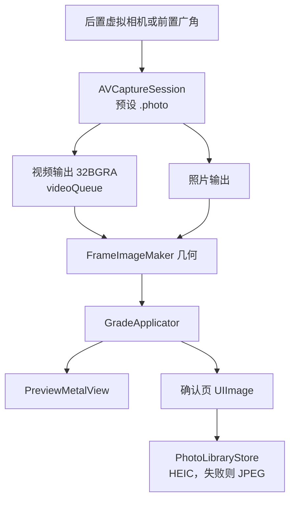

# 采集

采集在 `CameraSessionController`。双摄另走 `DualSessionController`，见 [multicam.md](multicam.md)。预览画到 `CAMetalLayer`（`PreviewMetalView`），不用 `AVCaptureVideoPreviewLayer`。不要设 `deliversPreviewSizedOutputBuffers`：`.photo` 预设下它会抛异常闪退。预览尺寸由 `FrameImageMaker` 把长边收到 1920。`CIContext` 的工作色彩空间是 Display P3。LUT 在 sRGB 里查表，转换由 `CIColorCubeWithColorSpace` 做，不在采集这一层做。渲染怎么套风格见 [rendering.md](rendering.md)。

采集直接用 AVFoundation，代码组织向 Apple 的 AVCam 和 AVMultiCamPiP 两个官方样例看齐，不引入第三方相机库。原因见最后一节。

## 会话

后置按这个顺序选第一台能用的虚拟设备，没有再往下：

1. `builtInTripleCamera`
2. `builtInDualWideCamera`
3. `builtInDualCamera`
4. `builtInWideAngleCamera`

前置固定 `builtInWideAngleCamera`。

会话预设 `.photo`。输出：

- `AVCaptureVideoDataOutput`：像素格式 `32BGRA`，`alwaysDiscardsLateVideoFrames = true`，委托在 `videoQueue`
- `AVCapturePhotoOutput`：`maxPhotoQualityPrioritization = .quality`

这一阶段不开启 Live Photo、人像和 RAW，Live Photo 和录像的路线在最后一节。画幅切换不重建会话，裁切发生在渲染。翻转摄像头会拆掉当前输入再挂上另一侧的设备，并回到该设备的 1x 档。

性能预算（iPhone 13）：预览 30fps，忙时丢旧帧，拍照不堵住预览队列，`CIContext` 复用。预览的 context 建在 `PreviewMetalView` 上，成片也用它的 `makeImage`。会话目前只丢迟到帧，还没有把 `activeVideoMinFrameDuration` 锁到 30fps。

## 变焦

变焦写在设备的 `videoZoomFactor` 上，渲染图不放大。

`ZoomLadderBuilder`：

- 广角因子 `wideAngleFactor`：虚拟设备切换点的第一档；没有切换点时用 `max(minAvailableVideoZoomFactor, 1)`
- 主摄焦段 `mainFocalLength`：取广角那颗镜头当前格式的 `videoFieldOfView`（4:3 横向视角），按 35mm 对角线 43.27mm 换算：`f = 21.63 / (tan(视角/2) × 1.25)`。离 24 或 26 不到 2mm 时取整到这两个标称值，读不出视角时用 26
- 等效焦段 = 主摄焦段 × 设备因子 / 广角因子
- 上限 = `min(设备最大变焦, 广角因子 × 5)`
- 档位 = 实体镜头（最小变焦，加上 `virtualDeviceSwitchOverVideoZoomFactors` 里不超过上限的点），再加推荐焦段 28、35、50、85 里落在范围内的。推荐焦段离某颗实体镜头不到 10% 时不单独出档
- 前置的推荐焦段只到 35；双摄是多摄格式，推荐焦段只到 50
- 打开或翻转后，落到广角因子，即主摄焦段

iPhone 16 Pro 后置得到 13、24、28、35、50、85、120。档位标签只写数字。当前所在或刚越过的那一档改写成实时焦段，如「40mm」，黄字。取景画面上不显示焦段。捏合以开始时的 `zoomFactor` 为基准连续变化，上限同样是广角因子 × 5。

变焦档每一档占 44pt 的点击区，整条变焦条吞掉档与档之间的点击，点偏了不会落到下面的点按对焦上。

## 画幅

界面锁竖屏（`UIInterfaceOrientationPortrait`）。`AspectCrop.pixelRect` 在图像转正之后做中心裁切，预览和成片共用这个矩形。

| 画幅 | `widthOverHeight` | 转正后的框 |
| --- | --- | --- |
| 3:4 | 3/4 | 竖向，传感器原生比例，默认 |
| 2:3 | 2/3 | 竖向 |
| 9:16 | 9/16 | 竖向长条 |
| 1:1 | 1 | 正方形 |
| 4:3 | 4/3 | 横向 |
| 3:2 | 3/2 | 横向 |
| 16:9 | 16/9 | 横向宽条 |
| 2:1 | 2 | 横向宽条 |

标签是转正后照片的宽:高。工具托盘的画幅按钮点开是一张菜单，直接选。`CameraView` 的取景区大小固定，照片按同一个 `widthOverHeight` 等比放进去并居中，画幅外是黑底。

## 方向和镜像

界面只竖屏，所以方向是固定映射，没有用 `AVCaptureDevice.RotationCoordinator`。

| 来源 | 后置 | 前置 |
| --- | --- | --- |
| 预览帧 | `CGImagePropertyOrientation.right` | `.leftMirrored` |
| 成片 | 快门前把照片连接设成 `videoRotationAngle = 90`、不镜像；读图用 `CIImage(data:options: [.applyOrientationProperty: true])` 按 EXIF 转正，之后方向按 `.up` | 同样转正，再 `mirrorHorizontally` |

`.leftMirrored` 已经带镜像，预览路径不再额外做一次水平翻转。前置保存结果和取景一致，都是镜像，拍完不会再翻一次。

预览帧的方向不随拿法变。竖屏下镜像预览像一面镜子，镜子跟着手机转，照出来的人始终是正的，所以横拿、倒拿时前置预览也是正的镜像，不用另外处理。

照片的像素仍是传感器横向，方向只写在 EXIF 里。`CIImage(data:)` 默认不读这个标记，不加选项时存下来的是横着的图。连接设置和读图在 `PhotoOrientation`，单摄和双摄共用。

`FrameImageMaker` 的几何顺序：按 `orientation` 转正，需要时水平镜像，再 `AspectCrop`。

### 拿法

界面仍只竖屏，横拿、倒拿靠 `HoldOrientation`（竖、上端朝右、上端朝左、倒）。`MotionHub` 用一路 Core Motion 重力（30Hz，低通）算横滚角 `atan2(g.x, -g.y)`：竖拿 0，上端朝右 +90°，朝左 −90°，倒拿 180°。只有转到离新方向 30° 以内才换拿法；`|g.z| ≥ 0.8`（接近平放）时保持上一次。同一路数据还驱动水平仪，偏差是横滚角减去当前拿法的角度。

拿法写进 `RenderParameters.hold`，只影响成片，不影响预览。快门按下时记下拿法。成片在调色之后、套相框之前由 `FrameImageMaker.turned` 转正，前后置同一条规则：

| 拿法 | 转法 |
| --- | --- |
| 竖 | 不转 |
| 上端朝右 | `.right`（顺时针 90°） |
| 上端朝左 | `.left`（逆时针 90°） |
| 倒 | `.down` |

成片在转正前和竖屏预览一模一样（前置也已镜像），预览在用户眼里是正的，所以只要把手机转过的角度转回来。前置不能把两个横向互换，也不能先转 180°，否则存下来是倒的。双摄整张合成图照这张表转一次。相框在转正后的照片上排版，横拍得到横向的相框。

## 对焦和闪光灯

对焦从裁切后的取景框换算回传感器，同时设 `focusPointOfInterest`（`.autoFocus`）和 `exposurePointOfInterest`（`.autoExpose`）。

当前实现把点击位置归一化到预览视图，再做竖屏轴交换：后置 `(x: y, y: 1 - x)`，前置 `(x: y, y: x)`。单摄这一步还没有按裁切矩形的内边距回推到传感器。双摄先把点击映射进那一路的格子，再用 `DualFocusMap` 按格子的宽高比补上裁切边距。点画面时如果滤镜面板开着，会先收起面板再对焦。拖动画中画或圆窗松手后不对焦。对焦框约 0.9 秒后消失。

闪光灯只作用于后置：关、开、自动。单摄时前置按钮禁用。双摄里按钮仍可点，闪光只写进后置那一路的 `AVCapturePhotoSettings`。设备不支持的模式不写入。

## 保存

确认页持有已经裁切并套好完整风格的 `UIImage`。`PhotoLibraryStore.save`：

1. 请求或沿用 `.addOnly` 权限。`.authorized` 和 `.limited` 都可以写
2. 优先 HEIC（`public.heic`，质量 0.92），失败则 JPEG 0.92
3. `PHAssetCreationRequest.forAsset()` 追加照片资源

不创建相册。成功后回到取景，横幅「已保存到最近项目」。失败横幅「保存失败，可以再试一次」。重拍只清掉确认页图片。单摄的风格、画幅和变焦留着。双摄重拍回到双摄，排列和两套滤镜留着。

Info.plist 由构建设置生成，声明相机、「仅添加照片」和相框地点：

- `NSCameraUsageDescription`
- `NSPhotoLibraryAddUsageDescription`
- `NSLocationWhenInUseUsageDescription`：地点只在相框打开地点开关时使用
- `NSMicrophoneUsageDescription`：只在实况打开或录像模式里录声音

## Live Photo

界面叫「实况」，工具行第二个按钮，开关记在 `UserDefaults` 的 `capture.live`，默认关。只在单摄：以 `AVCapturePhotoOutput.isLivePhotoCaptureSupported` 为准，双摄时按钮变灰。

1. `CameraSessionController.applyCaptureExtras` 在会话配好之后、`startRunning` 之前打开 `isLivePhotoCaptureEnabled`，换镜头后再设一次。开着实况且麦克风已授权时加一路音频输入，关掉就拿掉；没授权就录无声的。第一次打开实况时请求麦克风。
2. 快门给 `livePhotoMovieFileURL`，按 `uniqueID` 记一条 `LiveShot`。静图和短视频到达的先后不定，两样都到了才开始处理。
3. 静图照旧走 `stillPipeline`：镜像、裁切、调色、按拿法转正、套相框。确认页马上显示静图，角标「实况」转圈，保存按钮显示「实况处理中」。
4. `LivePhotoMovieRenderer` 用 `AVAssetReader` 读出每帧，按轨道的 `preferredTransform` 转正（它按 y 朝下写，Core Image 是 y 朝上，要用翻转共轭），再过同一个 `stillPipeline`，用低优先级的 `CIContext` 渲进缓冲池，`AVAssetWriter` 写 HEVC，色彩标 P3。音轨原样拷。输出尺寸先拿一张同尺寸的空图过一遍管线量出来，取偶数。
5. 配对靠两处同一个 UUID：静图 HEIC 的 Apple maker note 键 `17`，视频的 `com.apple.quicktime.content.identifier`。视频另写一条 `com.apple.quicktime.still-image-time` 元数据轨，时间用相机给的 `photoDisplayTime`。
6. 做好后确认页换成 `PHLivePhotoView`，先轻播一下，之后长按播放。`PHLivePhoto.request(withResourceFileURLs:)` 能加载，说明这对文件能配上。
7. 保存时 `PHAssetCreationRequest` 同时加 `.photo` 和 `.pairedVideo`。视频失败时横幅「实况没有生成，会保存为照片」，照常存静图。重拍、再拍或保存成功都删掉临时文件。

颗粒是一张固定的平铺图，和取景一样不随帧跳动。

## 双摄

单摄继续用上面的 `AVCaptureSession` 和虚拟相机。点「双摄」后先停掉它，再启动 `AVCaptureMultiCamSession`。退出时反过来。预览视图不换。两路先各自调色，合成后再套相框。成片在双摄自己的 `CIContext` 里导出，不占用预览那一个 context。模拟器 `isMultiCamSupported` 为 false，工具行没有这个按钮。

## 录像

快门上方一行「照片 · 录像」切模式，选中的是黄色。单摄和双摄都能录，录下来的就是取景里调好色、带相框的画面，双摄是合成后的整张图。

- 不用 `AVCaptureMovieFileOutput`，它写进去的是没调色的原始帧。`VideoRecorder` 接住每一帧画进取景的图，用自己的 `CIContext` 渲进 `AVAssetWriterInputPixelBufferAdaptor` 的缓冲池，`AVAssetWriter` 写 HEVC，色彩标 P3、传递函数 BT.709，码率按像素数算，最低 8Mbps。编码器忙时丢帧，不排队。
- 尺寸就是取景帧的尺寸（长边 1920 以内），在第一帧到来时定下；所以录像时相框、画幅、双摄排列和单双摄切换都锁住变灰，滤镜和调节可以改。
- 拿法在开录那一刻定下，整段不变。竖拿直接录取景那张图；横拿、倒拿先按成片同一条规则转正，再套相框，相框和字是横的。前置照旧是镜像。
- 时间戳用采样缓冲自己的，写入从第一帧开始，之前的声音丢掉。双摄的合成图每来一路新帧就重画一次，录像按后置那一路的时间戳，每个后置帧最多记一帧。
- 声音：录像模式下加麦克风输入和 `AVCaptureAudioDataOutput`，编码参数用 `recommendedAudioSettingsForAssetWriter`，AAC。第一次切到录像时请求麦克风，没授权就录无声的。单摄在录像模式里关掉实况。双摄用 `addInputWithNoConnections` 加麦克风，手动连到音频输出；`removeAll` 之后按模式重新加。两个会话各自记着模式，录像模式里切单双摄麦克风跟着走。
- 录制中取景顶部居中显示红底计时。快门变红，录制中缩成红色圆角方块。离开前台时自动停。
- 停下后进确认页：循环播放（带声音），重拍删掉临时文件，保存用 `PHAssetCreationRequest` 的 `.video` 资源。写失败时横幅「录像没有保存下来」。
- 先录 SDR。HDR 以后单独做。

为什么不用第三方相机库：

| | Live Photo | 前后同时 | 实时 Core Image 预览 | 说明 |
| --- | --- | --- | --- | --- |
| Apple AVCam | 有 | 另见 AVMultiCamPiP | 用预览图层，要换成我们的 `PreviewMetalView` | 官方维护，照片、Live Photo、录像都有 |
| MijickCamera | 没有 | 没有 | 只能挂 `CIFilter` 数组 | 连界面一起提供，会话在库里 |
| Aespa | 没有 | 没有 | 没有 | 只做拍照和录像的封装 |
| NextLevel | 没有 | 没有 | 可以拿帧自己处理 | 双摄指的是双镜头虚拟设备，不是多摄会话 |

第三方库都把会话握在自己手里。我们的预览要从视频输出拿帧、调色、画进 `CAMetalLayer`，双摄还要 `AVCaptureMultiCamSession`，这两件事它们都挡在中间。

以后可以做：录像分辨率高于取景（另一路按录像尺寸调色），4K，HDR。iPhone 13 上取景和录像两次渲染要撑住 30fps，撑不住先降录像尺寸。
