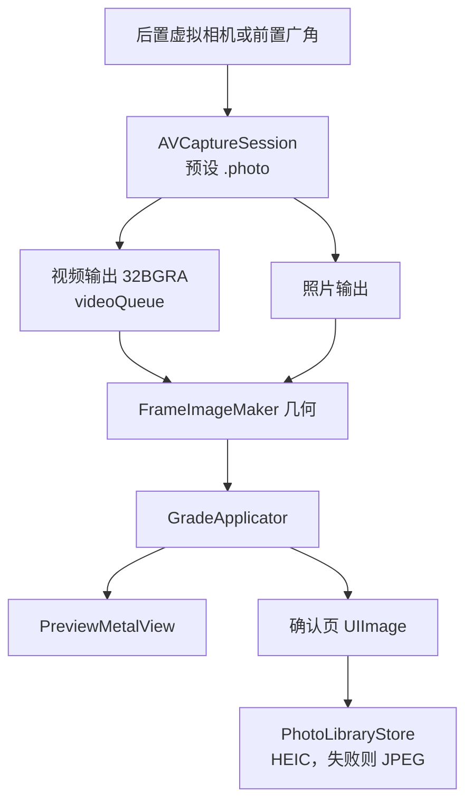

# 采集

采集在 `CameraSessionController`。双摄另走 `DualSessionController`，见 [multicam.md](multicam.md)。预览画到 `MTKView`（`PreviewMetalView`），不用 `AVCaptureVideoPreviewLayer`。工作色彩空间是 Display P3：`CIContext` 的 `workingColorSpace`，以及色彩立方体滤镜的 `inputColorSpace`，都是 Display P3。LUT 图按原字节采样，不在采集这一层做转换。渲染怎么套风格见 [rendering.md](rendering.md)。

## 会话

后置按这个顺序选第一台能用的虚拟设备，没有再往下：

1. `builtInTripleCamera`
2. `builtInDualWideCamera`
3. `builtInDualCamera`
4. `builtInWideAngleCamera`

前置固定 `builtInWideAngleCamera`。

会话预设 `.photo`。输出：

- `AVCaptureVideoDataOutput`：像素格式 `32BGRA`，`alwaysDiscardsLateVideoFrames = true`，委托在 `videoQueue`
- `AVCapturePhotoOutput`：`maxPhotoQualityPrioritization = .quality`

不开启 Live Photo、人像和 RAW。画幅切换不重建会话，裁切发生在渲染。翻转摄像头会拆掉当前输入再挂上另一侧的设备，并回到该设备的 1x 档。

性能预算（iPhone 13）：预览 30fps，忙时丢旧帧，拍照不堵住预览队列，`CIContext` 复用。预览的 context 建在 `PreviewMetalView` 上，成片也用它的 `makeImage`。会话目前只丢迟到帧，还没有把 `activeVideoMinFrameDuration` 锁到 30fps。

## 变焦

变焦写在设备的 `videoZoomFactor` 上，渲染图不放大。

`ZoomLadderBuilder`：

- 广角因子 `wideAngleFactor`：虚拟设备切换点的第一档；没有切换点时用 `max(minAvailableVideoZoomFactor, 1)`
- 显示倍数 = 设备因子 / 广角因子
- 上限 = `min(设备最大变焦, 广角因子 × 5)`
- 档位 = 最小变焦，加上 `virtualDeviceSwitchOverVideoZoomFactors` 里不超过上限的点
- 打开或翻转后，落到显示倍数约等于 1 的那一档

捏合以开始时的 `zoomFactor` 为基准连续变化，松手后倍数读数停留约 0.7 秒。交互稿里前置只留 1 倍。当前 `CameraViewModel.pinchChanged` 在前置直接返回。

## 画幅

界面锁竖屏（`UIInterfaceOrientationPortrait`）。`AspectCrop.pixelRect` 在图像转正之后做中心裁切，预览和成片共用这个矩形。

| 画幅 | `widthOverHeight` | 转正后的框 |
| --- | --- | --- |
| 4:3 | 3/4 | 竖向 3:4 |
| 16:9 | 16/9 | 横向宽条 |
| 1:1 | 1 | 正方形 |

`CameraView` 用同一个 `widthOverHeight` 约束取景区域，画幅外是黑底。

## 方向和镜像

界面只竖屏，所以方向是固定映射，没有用 `AVCaptureDevice.RotationCoordinator`。

| 来源 | 后置 | 前置 |
| --- | --- | --- |
| 预览帧 | `CGImagePropertyOrientation.right` | `.leftMirrored` |
| 成片 | `fileDataRepresentation` 已经是 EXIF `.up`，渲染时把方向改成 `.up` | 同样先按 `.up`，再 `mirrorHorizontally` |

`.leftMirrored` 已经带镜像，预览路径不再额外做一次水平翻转。前置保存结果和取景一致，都是镜像。

`FrameImageMaker` 的几何顺序：按 `orientation` 转正，需要时水平镜像，再 `AspectCrop`。

## 对焦和闪光灯

对焦从裁切后的取景框换算回传感器，同时设 `focusPointOfInterest`（`.autoFocus`）和 `exposurePointOfInterest`（`.autoExpose`）。

当前实现把点击位置归一化到预览视图，再做竖屏轴交换：后置 `(x: y, y: 1 - x)`，前置 `(x: y, y: x)`。单摄这一步还没有按裁切矩形的内边距回推到传感器。双摄先把点击映射进那一路的格子，再用 `DualFocusMap` 按格子的宽高比补上裁切边距。点画面时如果滤镜面板开着，会先收起面板再对焦。拖动画中画或圆窗松手后不对焦。对焦框约 0.9 秒后消失。

闪光灯只作用于后置：关、开、自动。单摄时前置按钮禁用。双摄里按钮仍可点，闪光只写进后置那一路的 `AVCapturePhotoSettings`。设备不支持的模式不写入。

## 保存

确认页持有已经裁切并套好完整风格的 `UIImage`。`PhotoLibraryStore.save`：

1. 请求或沿用 `.addOnly` 权限。`.authorized` 和 `.limited` 都可以写
2. 优先 HEIC（`public.heic`，质量 0.92），失败则 JPEG 0.92
3. `PHAssetCreationRequest.forAsset()` 追加照片资源

不创建相册。成功后回到取景，横幅「已保存到最近项目」。失败横幅「保存失败，可以再试一次」。重拍只清掉确认页图片。单摄的风格、画幅和变焦留着。双摄重拍回到双摄，排列和两套滤镜留着。

Info.plist 由构建设置生成，声明相机、「仅添加照片」和相框地点：

- `NSCameraUsageDescription`
- `NSPhotoLibraryAddUsageDescription`
- `NSLocationWhenInUseUsageDescription`：地点只在相框打开地点开关时使用

## 双摄

单摄继续用上面的 `AVCaptureSession` 和虚拟相机。点「双摄」后先停掉它，再启动 `AVCaptureMultiCamSession`。退出时反过来。预览视图不换。两路先各自调色，合成后再套相框。成片在双摄自己的 `CIContext` 里导出，不占用预览那一个 context。模拟器 `isMultiCamSupported` 为 false，顶栏没有这个按钮。
