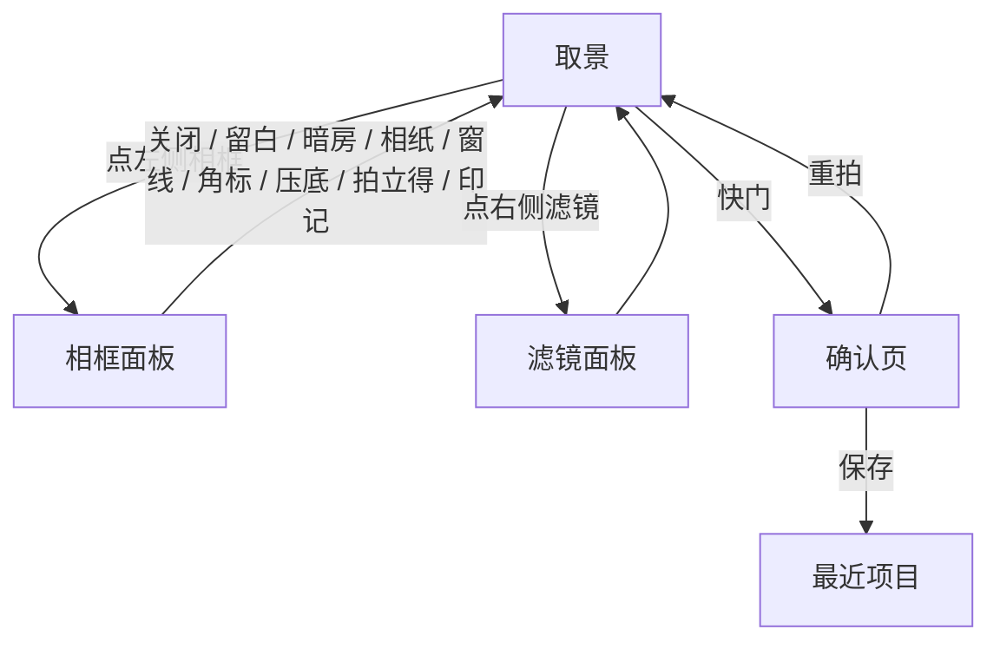
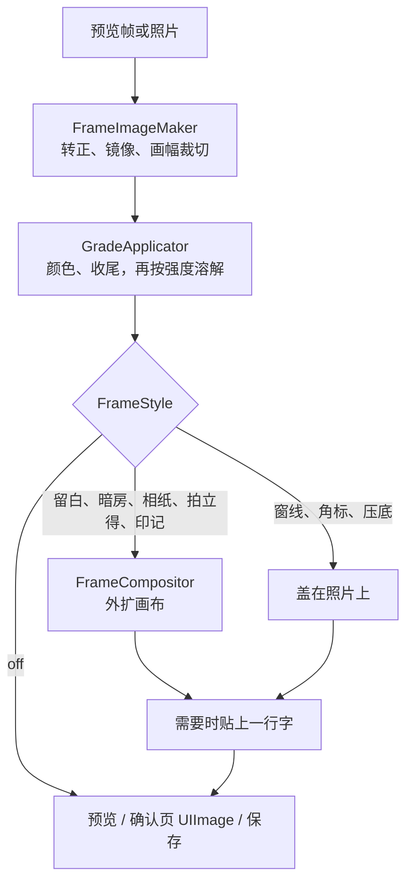

# 相框

取景时就把相框套在预览上。确认页看到的那张，就是保存进最近项目的那张。

相框留在颜色处理之后，不进入 LUT，也不参与收尾。界面上的名字是留白、暗房、相纸、窗线、角标、压底、拍立得、印记。窗线、角标、压底盖在照片上，其余往外扩。

## 结论

这一版做这些：

- **关闭**。画面就是现在的裁切成片。
- **留白**。四周等宽的白卡纸，没有字。短边的 5.5%。
- **暗房**。和留白同一组宽度，底是黑的。没有字。
- **相纸**。和留白同一组宽度，底色是暖相纸 `(0.96, 0.93, 0.86)`，没有字。
- **窗线**。不把画面撑大。在照片内侧 4% 处描一圈白线，线宽约短边的 0.35%，至少 2 像素。
- **角标**。不把画面撑大。白字直接写在画面底部一条里，字带一点阴影。
- **压底**。不把画面撑大。画面底部 18% 从透明压到 62% 的黑，白字落在较暗的一侧。
- **拍立得**。上和左右仍是短边的 5.5%，底边是短边的 20%。底边里可以写字。
- **印记**。上、左、右是短边的 4.5%，底栏是短边的 11%。底栏里可以放手机型号、地点、日期、自定义一行短文本。

角标、压底、拍立得、印记共用那四个开关。字可以分别关掉。四项都关着时，有底栏的样式留白，盖在照片上的样式不印字。外框大小不变。

以前单独的「底部更宽、但一个字都没有」的白卡纸不再单列。它和「印记」把开关全关掉是同一张图。四周等宽的留白留下来，因为它是画廊卡纸，构图和印记底栏不一样。暗房用同一圈宽度，黑白滤镜上更干净。拍立得的宽底边是即时成像那一档，空着也认得出，所以和印记分开。

这一版不做：贴纸库、手写 logo 包、胶片齿孔、多行排版、云端模板商店。产品范围里已经排除的漏光、灰尘、划痕、幻灯片框，继续排除。

默认关闭。选择记在当次打开的内存里，不写磁盘。

## 市场怎么做

公开材料对得上的行为记在这里。页面没有写的比例和字体，不补数字。

| 产品 | 相框出现的时机 | 字段 | 用户能改什么 |
| --- | --- | --- | --- |
| VSCO Borders | 拍完之后。照片进 Studio，点 Edit Image，再选 Borders。会员功能（Plus、Pro、One），只对照片 | 一条可调颜色的边，白色在可选颜色里 | 调色板或从画面吸色。滑杆缩放照片，边就变厚变薄。工具自动铺成正方形 |
| 醒图 | 导入照片之后。商店简介没有把边框写成拍摄功能。教程摘要写的是编辑里的「边框」 | 纯色、渐变或花边 | 教程写宽度约 10–30 像素、圆角 0–100，保存后合成进图片 |
| 美图秀秀 | 导入之后的编辑。商店功能列表里，「边框」和贴纸、文字放在一起 | 边框素材。日期可以手打，也可以走「时间地点」 | 文字样式自己调。教程写「时间地点」读取 EXIF；拼图和模板也能带日期 |
| Huji Cam | 开拍前在设置里定。取景是小窗，双击可以放大。按下快门后进 Lab 显影，加上颗粒、暖色，有时有一块红晕 | 角落里一行橙色日期 | 日期戳可以打开。默认是当天，也可以改成 1998 年的同一天。这张照片显影之后不再改 |
| NOMO CAM | 按下快门之后，和曲线、颗粒、灰尘、漏光、暗角、锐化一起套上片框。先在商店里选一台相机 | 片框跟着那台相机走 | 选相机。PRO 可以关掉 INS 相机的显影等待。商店文案里没有型号、日期这一行 |
| vivo 相机水印 | 拍摄前打开。路径是相机右上角图标里的「水印」。设置页上方预览效果。部分机型视频也能带 | 机型名称、日期和时间、当前位置。另有文字、边框（蔡司、个性、国风、功能等）、艺术签名。节日有限时水印 | 总开关。点某一款再进编辑，改边框类型和签名。部分机型拍完进相册，编辑里还能关掉水印 |

下面几家补上表里没单列、但调研里看过的做法。

**Foodie。** 中美商店文案写的是实时滤镜、美食俯拍引导和后期调节，没有型号白边。ScreensDesign 的界面拆解写：Film 模式除了滤镜，还会把取景界面改成一台胶片相机，并带上时间戳。拆解把它记成界面变化。没有查到官方的边距或字体规格。

**Dazz Cam。** 商店文案（DAZZ PTE. LTD.）写可以拍 135、120、玩具相机、幻灯片、半格、即时成像、一次性相机等，强调按下就出片。官网的日期戳指南把戳放在拍摄过程里，并描述成橙色 LED 角标、VCR 叠字。dazzcam.net 的教程写：主界面菜单里 Timestamp 默认开着，可以关掉，或改成当前时间；不能填一个任意时刻。

**Halide 和 iPhone 自带相机。** Halide Mark III 的商店功能是拍摄时的 Look、构图参考线（网格、三分、黄金分割），以及事后 Photo Lab 里换 Look、改裁切和曝光。功能列表里没有印在画面上的型号或日期。构图参考线留在取景界面上。自带相机把机型和拍摄时间写进照片信息，画面上没有白边，也没有型号行。

**国内白边。** vivo 官方说明是上面表里那一行：拍摄前开关，字段含机型、日期时间、位置，边框样式可换，设置页顶部能预览。OPPO 支持中心页面（aid=2135709）的检索摘要写：部分机型有哈苏水印，显示焦段、光圈、快门和 ISO，路径是相机右上角菜单里的设置、水印。摘要没有底栏高度。小米方面，搜狐转述相机产品经理的说明：徕卡合作机型标准水印上的 LEICA 字样按徕卡全球标识规范使用；小米 15 Ultra 的限定水印，以及连接手柄时的街拍样式，按新规范设计。文库索引另写：普通机型在相机设置的「水印」里选时间、机型、位置，同一处关闭；旗舰另有徕卡水印。文库正文没有打开，高度不沿用。

**酷安和后期白边工具。** 小羿介绍的「相机水印 / PICSEAL」在照片拍完之后套一层小米风格白边，可改图标、大小、自定义文本、字距，并选择要印的 EXIF 项。小众软件写的「相机印」读取 EXIF（标志、型号、镜头、拍摄信息、署名）加到边框上，并写明不压缩原图；某一项留空就用 EXIF，每一项都可以改，还能存成配置。App Store 上「光影印记」的副标题是相机边框水印、参数水印和模板。检索「风景相机」时，靠前的是极影相机功能列表里的「边框水印」，以及 Varlens 的艺术相框（厂商、机型和其他 EXIF）。没有核对到一份名叫「风景相机」的独立步骤说明。

**比例和字体，市场材料里实际写了什么。**

- VSCO：方画布。滑杆把照片在方框里缩放，边是缩放后留下的空隙。成品比例变成正方形。页面没有写「底栏占短边百分之几」。
- 醒图教程：描边宽度按像素，另有圆角。它写的是细描边的像素宽度。
- Huji：橙色日期在角落，一行。材料没有写它占画面的百分比。
- Dazz 的日期戳指南：橙色 LED / VCR 样式，走拍摄过程。没有百分比。
- vivo、OPPO 摘要、小米转述：有信息边框和字段开关。打开到的页面没有底栏高度，也没有指定字体文件。
- 后期工具（PICSEAL、相机印）把字放进外加的边上，并允许改字号或间距。同样没有统一的短边比例。

AngieFilter 的边距、底栏高度和字体写在下面，是这一版的规定。

## UI 与交互

相框在取景时就能看见，盖在预览上，和滤镜同一时机。

原因有三条。第一，底部更宽的白边会改变构图，取景时就要看见，主体才不会坐进底栏。第二，确认页现在只有重拍和保存，相框的选择留在取景页，确认页继续只做这两件事。第三，vivo 的水印、Huji 的日期戳都在开拍前定好；VSCO、醒图、美图的边是导入后再套。AngieFilter 是一台先取景、再确认的相机，和前一种时机贴在一起。

快门条左侧是「相框」，中间是快门，右侧是「滤镜」。双摄时，「相框」旁边显示当前选中的是后置还是前置。两个面板都收起、且当前滤镜有名称时，名称跟在「相框」后面，空间不够就省略尾部。任一面板展开时，左侧只留「相框」。当前是原图且面板收起时，左侧也只有「相框」。

面板出现在预览和快门条之间，和滤镜面板同一个位置。一次只展开一个。点「相框」时若滤镜面板开着，先收起滤镜。点「滤镜」时若相框面板开着，先收起相框。再点同一个按钮，面板收起。点画面也收起当前面板。点在照片内容上时，收起之后仍对焦，和现在点画面收滤镜一样。点在相框边上只收起面板，不对焦。相框边没有对应的传感器位置。

相框面板里的操作：

1. 九选一：关闭、留白、暗房、相纸、窗线、角标、压底、拍立得、印记。点下去预览立刻变。芯片放不下就横滑。
2. 角标、压底、拍立得、印记展开四个控件：型号开关、地点开关、日期开关、一行输入。输入提示是「一行短句」。回车收起键盘。
3. 自定义最多 12 个字素。超出的在输入时截掉。只含空白的文本当成空。
4. 地点默认关。打开时才向系统要「使用期间」的位置。拒绝或还没解析出地名时，底栏不印地点，面板上写「未获得位置」。这句不进照片。

和滤镜的关系：相框不进滤镜目录，也不进调节滑杆。换滤镜、改强度，相框保持原样。滤镜缩略图仍然只套风格，不加相框，方便和取景对照。

确认页持有的 `UIImage` 已经含相框和字。`ReviewView` 继续只有重拍和保存。重拍清掉这张图，相框选择留在取景里，和现在重拍后风格、画幅、变焦还在一样。

空状态：

| 状态 | 预览和成片 |
| --- | --- |
| 关闭 | 没有边 |
| 留白 | 四周等宽白卡纸，没有字 |
| 暗房 | 四周等宽黑底，没有字 |
| 相纸 | 四周等宽暖底，没有字 |
| 窗线 | 照片比例不变，内侧一圈白线 |
| 角标或压底，字都关 | 照片比例不变，不印字 |
| 拍立得或印记，字都关 | 底栏留白。外框仍是该样式自己的尺寸 |
| 能印字的样式，只开其中几项 | 只画打开的那几段 |

前置摄像头：照片内容保持现在的镜像，和取景一致。型号、地点、日期、自定义画在镜像之后，字是正的。

各档画幅都先裁切，再套相框，照片内容不因相框被裁掉。留白、暗房、相纸、拍立得、印记会把取景宽高比改成外框。窗线、角标、压底不改变照片比例。相框关闭时，取景区域回到画幅比例。有外扩底栏时，变焦条停在底栏上方，不压住字。

## 技术方案

分层不变。`FrameSettings` 是 Domain 里的值，和 `RenderParameters` 一起过队列。画布和字留在 CameraPipeline。Domain 继续不 import SwiftUI、AVFoundation、Core Image。

单摄预览在 `CameraSessionController` 里，`FrameImageMaker.graded` 之后、`previewView.draw` 之前进入 `FrameCompositor`。成片在同一处的 `graded` 之后、`previewView.makeImage` 之前进入。双摄先由 `DualFrameComposer` 合成，再进同一个相框。两条都读同一份 `RenderParameters` 快照。缩略图继续用裁切后的源图加 `GradeApplicator`，不经过相框，也不合成双摄。

### 数据

`FrameStyle`：`off`、`white`、`black`、`paper`、`window`、`stamp`、`scrim`、`instant`、`captioned`。

`FrameSettings` 放在 `AngieFilter/Domain/Rendering/`，`Equatable`、`Sendable`：

| 字段 | 含义 |
| --- | --- |
| `style` | 关闭、留白、暗房、相纸、窗线、角标、压底、拍立得、印记。默认 `off` |
| `showsModel` | 型号开关。只在角标、压底、拍立得、印记时画出来 |
| `showsPlace` | 地点开关。只在这四种样式时画出来。默认关 |
| `showsDate` | 日期开关。只在这四种样式时画出来 |
| `customText` | 一行短文本。空则不画 |

从能印字的样式切走时，开关和自定义文本留在结构体里。再切回来，刚才的字还在。

`RenderParameters` 增加 `frame: FrameSettings`。它和画幅、滤镜、方向一起放进现有的 `Locked` 快照。`videoQueue` 只读这份值。相框不写进 `Look`，也不写进 `LookGrade`。

### 画布

外扩，不裁照片。工作空间仍是 Display P3。

设裁切并调色之后的照片宽 `W`、高 `H`，短边 `S = min(W, H)`。白是 (1, 1, 1)，黑是 (0, 0, 0)。

| 样式 | 左、右 | 上 | 底 |
| --- | --- | --- | --- |
| 留白、暗房、相纸 | `0.055 × S` | `0.055 × S` | `0.055 × S` |
| 窗线、角标、压底 | 0 | 0 | 0，字或线盖在照片上 |
| 印记 | `0.045 × S` | `0.045 × S` | `0.11 × S` |
| 拍立得 | `0.055 × S` | `0.055 × S` | `0.20 × S` |

开关字不改变这一档的像素尺寸。外扩底栏的字号是短边的 3.1%，角标和压底是短边的 2.6%。

取景约束用这一档的外框比例。印记的 3:4 竖图外框比照片略高，高出来的是底栏。拍立得底边更宽，外框更高。留白和暗房四周等宽，外框接近照片比例。

合成用 `CIImage`。留白、拍立得、印记铺白底，暗房铺黑底，相纸铺 `(0.96, 0.93, 0.86)`。窗线、角标、压底不扩大画布。窗线是内侧白线。角标和压底把浅色字盖在画面底部，压底另有一条从透明到黑的渐变。预览和成片继续走现有的 `CIContext`。

### 字

一行，系统字体，字重 medium。外扩底栏字号 = `0.031 × S`，黑色，不透明度 0.82，在底栏里垂直居中。角标和压底字号 = `0.026 × S`，白色，不透明度 0.92，并带一点阴影。压底的字靠近暗带下沿。留白、暗房、相纸、窗线不写字。

从左到右最多四段：型号靠左，地点挨着型号，自定义在中间，日期靠右。关掉或为空的那一段不占位。只剩自定义时，在底栏内水平居中。中间那段放不下就截断，并加省略号。地点放不下时同样截断，不挤掉日期。

型号从 `utsname` 的 `machine` 读一次，例如 `iPhone14,5`、`iPhone15,2`。Domain 里放一张对照表，把标识换成营销名：`iPhone14,5` 显示 iPhone 13，`iPhone15,2` 显示 iPhone 14 Pro。表覆盖 iPhone 13 及更新机型，按 Apple 公开的内部标识维护。表里没有的标识显示「iPhone」，不把 `iPhone15,2` 这种字符串画出来。读取放在 CameraPipeline，启动时做一次，会话内复用。

日期是公历 `yyyy.MM.dd`，设备时区，例如 `2026.09.28`。不含时刻。预览用打开取景时的日历日，跨日时更新一次。成片用按下快门时的日期，写进那张图，之后不再跟预览的「今天」一起变。

### 地点

底栏印的是**城市和区**，写成 `上海 · 徐汇区`。这是这一版要的粒度。

门牌、街道和兴趣点不印。取景时人在走动，街道和店名会每隔几十米换一次，预览上的字会跳。区在同一片地方是稳定的，长度也能放进已经有型号和日期的那一行。坐标不印，也不写进照片 EXIF。照片上能看到的位置，就是底栏这几个字。

地名用系统语言。中文环境下去掉城市名末尾单独的「市」，剩下至少两个字才去：`上海市` 显示「上海」，`芒市` 不去。区、县保留系统给的全称，避免把「浦东新区」切坏。市和区相同，或只有其中一个，就只印有内容的那段。两段都空，这一格留空。

| 系统返回 | 底栏 |
| --- | --- |
| 上海市，徐汇区 | 上海 · 徐汇区 |
| 杭州市，西湖区 | 杭州 · 西湖区 |
| 昆山市，区为空 | 昆山 |
| 巴黎，区为空 | 巴黎 |
| 市和区都空 | 不印 |

读取在界面层，用 `CLLocationManager`，精度 `kCLLocationAccuracyHundredMeters`，权限是使用期间。只有地点开关打开、并且当前样式能印字时才开始更新，关掉就停。位移超过约 300 米，或距上次解析超过约 2 分钟，才做一次 `CLGeocoder` 逆地理。地名没变就不重画字图。

预览用最近一次解析出的字符串。还没有结果时不印「定位中」。快门把当时的字符串冻进那张成片，和日期一样。`RenderParameters` 增加 `framePlace`。排版规则放在 Domain 的纯函数里，入参是已经解析好的城市和区，Domain 不 import Core Location。CameraPipeline 只把这个字符串画进底栏。

Info.plist 增加 `NSLocationWhenInUseUsageDescription`：说明位置只用来印在相框上。

字图用 Core Graphics 在主线程生成，收成小图，再包成 `CIImage`。预览按当前预览底栏的像素宽度生成一张；快门时按成片底栏的像素宽度再生成一张。`videoQueue` 只做贴图。设置、营销名、日历日、目标宽度都没变时，沿用上一张字图。

### 保存尺寸

成片像素变大，照片内容的像素尺寸不变。`PhotoLibraryStore` 仍是 HEIC、质量 0.92，失败则 JPEG 0.92，追加到最近项目。文件会比不加相框时大，因为画布更大。方向在几何阶段已经转正，相框画在转正之后的图上。

## 默认值和记忆

默认 `FrameStyle.off`。型号开关和日期开关的初始值是开，地点开关是关，自定义文本是空。字只在角标、压底、拍立得、印记上画。第一次打开，画面上没有相框。地点保持关闭，避免一进相框就弹出位置权限。

`CameraViewModel` 把 `FrameSettings` 留在这次启动的内存里，不写 UserDefaults，也不另存配置文件。和滤镜调节一样，杀掉进程再打开就回到默认。点选项立刻进入预览和下一张快照。相框面板里不放单独的保存按钮。

重拍、换滤镜、切换画幅、翻转摄像头，都不重置相框。翻转之后营销名不变；前置只多一次镜像，字仍是正的。

## 当前实现

应用已经按上面的规格接上取景、成片和确认页，包括地点。地点默认关。打开后才请求使用期间的位置，解析出城市和区才印上底栏。没有结果时面板写「未获得位置」，这句不进照片。

类型和入口：

- `FrameStyle`、`FrameSettings`、`FrameLayout`、`FrameDateText` 在 `FrameSettings.swift`
- `PlaceCaption` 把城市和区拼成底栏字符串。`PlaceReader` 在界面层读位置并做逆地理
- `PhoneModelName` 把机型标识换成营销名
- `FrameCompositor` 外扩或盖线、角标、压底。`FrameCaptionRenderer` 在主线程画字，`FrameCaptionCache` 留最近两张
- `DeviceMachine` 在会话里读一次 `utsname`
- 单摄在 `CameraSessionController` 里、双摄在合成之后套相框。预览的字图异步生成，成片同步生成。按下快门时冻结日期和当时的地点
- `CameraView` 左侧是「相框」。取景宽高比在相框打开时改成外框。对焦只认照片内容

可点击的对照在 `design/interaction.html`。类型总表在 [code-map.md](code-map.md)。
