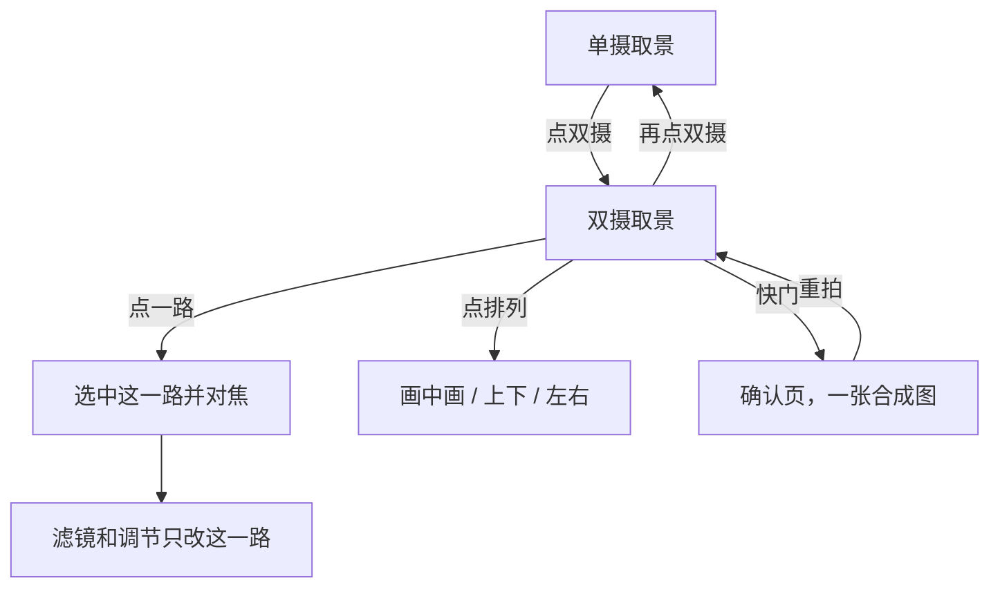
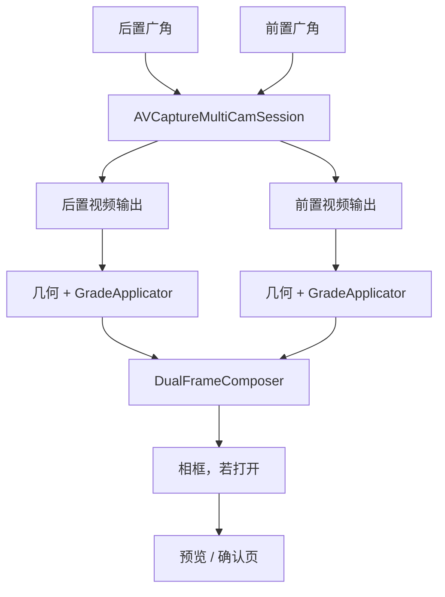

# 双摄

同时打开前置和后置，把两路画面排进同一张取景里。每一路有自己的滤镜、对焦和变焦。快门保存的就是这一张合成图。

默认仍是现在的单摄。双摄是取景页里的一种模式，不替换单摄的虚拟相机和 0.5 / 1 / 2 档。

## 结论

这一版做这些：

- 后置广角 + 前置广角，同时出预览。
- 三种排列：画中画、上下、左右。画中画的小窗在四个角之间切换。
- 点中哪一路，滤镜、调节、捏合就作用在哪一路。另一路保持自己的滤镜。
- 点在某一路的画面上，对焦那一台相机，并选中这一路。
- 快门同时拍两路，按当前排列合成一张，再进现在的确认页。

这一版不做：录像、三路以上、自由拖动小窗、把小窗放大到任意比例、前后用不同画幅、在双摄里走超广角到长焦的虚拟变焦。

模拟器上 `AVCaptureMultiCamSession.isMultiCamSupported` 为 false。双摄按钮不出现，单摄照常使用。

## 系统限制

依据是 Apple 的 [AVMultiCamPiP](https://developer.apple.com/documentation/AVFoundation/avmulticampip-capturing-from-multiple-cameras) 和 `AVCaptureDevice.Format.isMultiCamSupported`。iPhone 13 是 A15，在 A12 及更新的机器上可以开多摄。真正能不能开，以 `isMultiCamSupported` 和 `supportedMultiCamDeviceSets` 为准，不在代码里写死机型名单。

多摄会话只用 `.inputPriority`。分辨率从该设备里 `isMultiCamSupported == true` 的格式里选，并且要在 `addInput` 之前设好 `activeFormat`。这批格式比单摄的 `.photo` 少。

单摄后置用的 `builtInTripleCamera` 一类虚拟设备，内部会在几颗镜头之间切换。多摄会话要接到具体的物理镜头上。所以双摄打开后，后置是广角，变焦是这颗广角上的数码变焦，不再出现 0.5 和 2 这两档光学切换。前置的 `videoMaxZoomFactor` 在多摄格式上通常是 1，捏合不改变倍数。

两路都要留在系统给的硬件预算里。配完会话后看 `hardwareCost`。超了就改用更小的多摄格式，而不是退回单摄的 `.photo`。

## 交互

入口在顶栏，翻转按钮旁边，文案是「双摄」。点一次进入，再点一次回到进入前的那颗单摄镜头和它的滤镜。双摄里的两套滤镜记在这次打开的内存里，再次进入双摄时还在。杀掉进程就回到默认：后置广角、原图，前置也是原图。

排列在快门上方，只有双摄开着才出现，三个字：画中画、上下、左右。点下去预览立刻变。画中画再多一个「换角」，在右下、左下、左上、右上之间循环。小窗默认右下，避开变焦条。

选中的那一路有 2pt 白环。滤镜面板标题旁写「后置」或「前置」，避免不知道在调哪一路。调节、保存、恢复默认沿用现在的规则，按「镜头 + 滤镜 id」分开记。给后置的自然色拖了颗粒，不会改到前置。

变焦条只描述当前选中的那一路。选中后置时，条上是这颗广角能到的倍数，上限仍是单摄那套显示倍数 5。选中前置时，条上只有 1×，捏合不改变画面。

闪光灯仍只作用于后置，和现在一样。前置那一路没有闪光灯。

画幅仍是 4:3、16:9、1:1，作用在整张合成图的外框上。每一路先按自己格子的宽高比做中心裁切，再放进格子。照片内容不被对方盖住以外的部分裁掉；画中画的小窗盖住大图的一角，这是排列本身。

点在两路之间的黑边上，只收起面板，不对焦。点在小窗上，选中并聚焦小窗那一路，不把点击算到后面的大图上。

相框若已打开，套在合成之后的整张图上，不分别套两路。确认页仍只有重拍和保存。重拍回到双摄，排列、选中的一路和两套滤镜都还在。

前置这一路的预览和成片都镜像，字如果落在相框底栏上，仍是正的。后置不镜像。

## 技术方案

单摄继续用现在的 `AVCaptureSession` 和虚拟相机。双摄另开一条会话，不往现有会话里塞第二颗镜头。

分层不变。排列和两路的滤镜选择是 Domain 里的值，放进 `RenderParameters` 的快照。`CIImage` 的拼接留在 CameraPipeline。Domain 不 import AVFoundation 和 Core Image。

建议新类型：

| 类型 | 层 | 作用 |
| --- | --- | --- |
| `DualLayout` | Domain | `pip`、`stacked`、`sideBySide`。画中画另有 `PipCorner` |
| `DualSettings` | Domain | 排列、哪一路选中、两路各自的 `lookID` 和 `LookAdjustment` |
| `DualSessionController` | CameraPipeline | 拥有 `AVCaptureMultiCamSession`、两路设备和两路输出 |
| `DualFrameComposer` | CameraPipeline | 把两张已经调色的图按排列贴进外框 |

`CameraViewModel` 在单摄和双摄之间切换正在跑的会话，预览仍是同一个 `PreviewMetalView`。合成在画进这个视图之前完成，所以金属视图不用知道有两路。

两路回调各自更新自己的最近一帧。任一帧到达，就用另一路的上一帧一起合成。某一路还没来第一帧时，那一格留黑。`renderBusy` 按路分开：后置忙只丢后置的新帧，不挡住前置。

预览格式在多摄格式里选宽边接近 1920 的一档。两路都跑现有的立方体或 LUT，再加上 `FilmFinish`。iPhone 13 上若预览稳不住 30fps，先降格式，再考虑预览时跳过光晕的模糊。缩略图仍用单路最近一帧加 `GradeApplicator`，不合成双摄，避免条上出现两张脸。

成片：两路各挂一个 `AVCapturePhotoOutput`，快门时都触发。两张都到了，用按下时冻结的 `DualSettings`、各自的方向和前置镜像，按预览同一套格子合成，再套相框。缺一路就失败，不保存半张。日期按按下快门的那一天写进相框。

变焦写在被选中的那台 `AVCaptureDevice.videoZoomFactor` 上。对焦点按格子把点击映射回该设备的坐标系，沿用现在的前置 `(y, x)`、后置 `(y, 1-x)`。格子内的裁切边距要先除掉，再映射到传感器。单摄里裁切边距还没参与映射，双摄的格子更小，这一步要做。

进入双摄时停掉单摄会话再启动多摄会话，退出时反过来。两套会话不同时 `startRunning`。

## 后续实现清单

1. Domain 增加 `DualLayout`、`PipCorner`、`DualSettings`，并放进 `RenderParameters`。
2. `DualSessionController` 查询 `supportedMultiCamDeviceSets`，连接后置广角和前置广角，只选 `isMultiCamSupported` 的格式。
3. `DualFrameComposer` 按三种排列合成。预览和成片共用。
4. `CameraViewModel` 记住两套滤镜，选中的一路决定调节和变焦。
5. `CameraView` 增加「双摄」、排列和换角。点某一路选中并对焦。滤镜面板标明当前镜头。
6. 模拟器隐藏入口。真机验收：两路同时出画、各自换滤镜、后置能对焦和变焦、前置保持 1×、快门合成图与预览一致。
