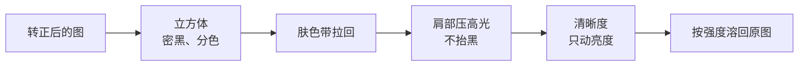

# 海报

海报质感是一张印出来的彩色海报：颜色分开、黑色密、主体从背景里浮出来。它仍然是一款配方，不新开渲染方案。

## 结论

用现有的立方体、`FilmFinish` 和清晰度做一款，名字叫「海报」。运行时仍是 `CIColorCubeWithColorSpace`，然后肤色、影调、清晰度。预览、成片和缩略图不用改调用点。

不要做这三件事：

- 色调分离。`CIColorPosterize` 或把通道收成几级，天空和皮肤会出现色带。那是波普和丝网，不是海报质感。
- 半色调网点、纸纹、油墨扩散。那是盖在照片上的效果，和贴纸一类。颗粒板是胶片颗粒，海报不用。
- 再放一张 LUT。LUT 路径没有清晰度。海报看起来「有质感」，主要是局部对比，不是一张更饱和的颜色表。

和目录里相近的几款差在这里：

| | 鲜明 | 鲜艳 / 爱克塔 | 海报 |
| --- | --- | --- | --- |
| 对比 | 高，颜色仍自然 | 高，绿和红被整体推开 | 黑色更密，高光仍滚落 |
| 饱和 | 接近原图 | 全局很高，肤色跟着红衣走 | 衣服、天空、植物分开，肤色拉回 |
| 清晰度 | 有一些 | 鲜艳几乎没有 | 这款的主体。人从背景里浮出来 |
| 褪色、颗粒 | 鲜明几乎没有 | 爱克塔有肩部 | 不抬黑，不加颗粒 |

醒图、轻颜里的「海报」「杂志」，以及后期里的 release print，都是这条：密度、分色、局部对比。Dehancer 一类胶片工具里的印刷密度也是影调和分色，不是把色阶砍断。

## 画面上长什么样

- 黑位接近实墨。褪色保持很低，不把黑抬成灰。
- 高光有肩部，白衣服不裁成一块死白。
- 红衣服、绿植、蓝天彼此分开。橙色肤色带不跟着红衣服一起被推饱和。这一步用已经在跑的肤色内核：红衣服的色相在这个带外面。
- 清晰度只提升亮度上的局部对比，再合回彩色，避免彩边。人、建筑和食物的边缘更清楚，画面仍是照片，不是 HDR。
- 没有光晕，没有颗粒，暗角很弱或没有。海报是平的印刷品，不是镜头光斑。

## 第一版参数

烘焙脚本现在只有全局色温、对比、饱和、亮度、色相。分色相和分色调在渲染文档里写过，脚本里还没有。第一版不改运行时，只用现有旋钮，放进「数码」。它不是胶片库存，也不进 LUT 的「新锐」。

| 项 | 起步 | 为什么 |
| --- | --- | --- |
| id / 名称 | `poster` / 海报 | 和胶片库存的名字分开 |
| 对比 | 1.22 | 比鲜明（1.18）更密，不到漂白（1.28）那种抽色 |
| 饱和 | 1.28 | 低于鲜艳和爱克塔的 1.55，避免整张图变成糖果色 |
| 色温 | 6200 | 略冷，天空干净。不走青橙强分色 |
| 清晰度 | 0.50 | 高于自然的 0.35。调节里仍可再拉 |
| 褪色 | 0.02 | 黑位留住 |
| 肩部 | 0.16 | 高光滚落，和经典铬黄同一档 |
| 肤色 | 0.40 | 接近人像 LUT。红衣服不动 |
| 颗粒 / 暗角 / 光晕 | 0 | 不加胶片痕迹 |

清晰度、褪色仍走现在的调节。颗粒和暗角因为目录是 0，滑杆在，默认不出效果。光晕不出现。

验收仍用那六个场景。和鲜明、鲜艳并排看：

- 肤色不偏橙，不出现一块一块的色阶。
- 红衣服和绿植比鲜明更分开，比鲜艳更不发飘。
- 白衣服高光有层次，夜景灯光不糊成光斑。
- 蓝天是连续的，没有色带。

达不到就改这张立方体和上面的数，不改 `LookGrade`。

## 如果第一版颜色还糊在一起

只改 `Tools/BakeColorCubes.swift`，把分色写进立方体。运行时仍然是同一张 65³。

- 分色相：橙色相饱和压低，红、黄、蓝、绿提高。肤色内核继续留着，作为第二道。
- 分色调：阴影略偏青，高光略偏暖，幅度要小。幅度大了会变成另一款电影青橙，和 800T、新锐「电影」撞车。

这两项是烘焙时的颜色，不是每帧新滤镜。清晰度仍然留在立方体之外，因为它跟着画面尺寸走。
