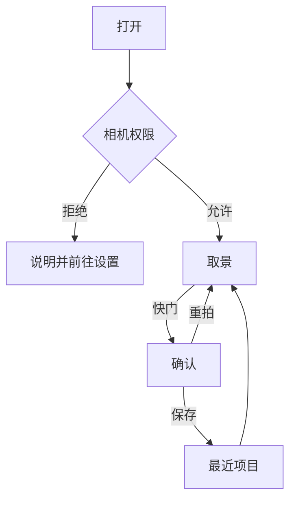

# 产品

一句话：拍摄时套上一种观感，然后拍下来并保存。

最低机型是 iPhone 13 全系（A15）。iPhone 13 / 13 mini 是超广角加广角，13 Pro / 13 Pro Max 另有长焦；更新机型的镜头数量不一样。变焦档位按当前设备发现，不写死机型表。最低系统 iOS 18，竖屏 iPhone 应用。性能、镜头档位和真机验收都以 iPhone 13 为底线。

## 做

- 后置和前置实时预览，风格直接画在预览上
- 变焦：捏合连续变焦，加上设备实际有的镜头档位。界面上限 5x
- 画幅 4:3、16:9、1:1。取景框和成片用同一块裁切
- 点按对焦
- 闪光灯关 / 开 / 自动，仅后置
- 翻转摄像头
- 快门之后进入确认：重拍或保存
- 前置预览和保存下来的照片都是镜像
- 保存只追加到「最近项目」。优先 HEIC，不可用时 JPEG，质量 0.92。不建自定义相册

## 不做

这一阶段只做照片。

- 视频、Live Photo、RAW、手动 ISO / 快门
- 美颜、人脸重塑、贴纸、AR
- 从相册导入再编辑、滤镜商店、账号
- 美图 / Faceu 式美颜、食物模板、Instagram 式趣味预设

## 质量底线

对标徕卡色彩和富士胶片模拟，以及 Dehancer、Cobalt、RNI、Mastin、VSCO 实际在卖的那些胶片和机身色彩。

iPhone 出图已经是处理过的 Display P3 / sRGB，这一阶段在这张成片上重现影调、色相、肤色、高光滚落、颗粒和微对比。复制不了另一颗传感器的光谱响应。配方在本仓库里写，用色卡和实拍验收。不从相机固件抽取 LUT。

## 滤镜目录

界面文案是「滤镜」。代码类型是 `Look`。一条横滑，原图在第一项。徕卡、富士、柯达、电影、理光、哈苏、依尔福、宝丽来、数码机身，以及 LUT 的人像、风景、美食、新锐，是同一层分类。

可点击目录在 [interaction.html](interaction.html)。脚本里按家族分组。配方滤镜的 id 同时是 `Look.id` 和 `ColorCubes/<id>.acube` 的文件名。LUT 滤镜的 id 以 `lut-` 开头，图在 `LUTs/<lutImage>.png`。

每一款非原图都是正式内置资源。下面五款是视觉验收组：自然、经典铬黄、肖像 400、800T、黑白（`acros`）。

| id | 名称 | 家族 | 验收 |
| --- | --- | --- | --- |
| `original` | 原图 | — | |
| `natural` | 自然 | 徕卡 | 验收 |
| `classic` | 经典 | 徕卡 | |
| `bright` | 鲜明 | 徕卡 | |
| `mono` | 单色 | 徕卡 | |
| `standard` | 标准 | 富士 | |
| `vivid` | 鲜艳 | 富士 | |
| `soft` | 柔和 | 富士 | |
| `chrome` | 经典铬黄 | 富士 | 验收 |
| `neg` | 经典负片 | 富士 | |
| `nostalgia` | 怀旧负片 | 富士 | |
| `real` | 真实 | 富士 | |
| `cinema` | 电影 | 富士 | |
| `bleach` | 漂白 | 富士 | |
| `portrait` | 人像 | 富士 | |
| `portrait-hi` | 人像高 | 富士 | |
| `acros` | 黑白 | 富士 | 验收。Acros。Tri-X 在目录里叫「黑白 400」（`trix`） |
| `pro400h` | 400H | 富士 | |
| `superia` | 超级丽爱 | 富士 | |
| `portra160` | 肖像 160 | 柯达 | |
| `portra400` | 肖像 400 | 柯达 | 验收 |
| `portra800` | 肖像 800 | 柯达 | |
| `gold` | 金 200 | 柯达 | |
| `ektar` | 爱克塔 | 柯达 | |
| `ultramax` | 日常 400 | 柯达 | |
| `colorplus` | 彩色+ | 柯达 | |
| `kodachrome` | 柯达克罗姆 | 柯达 | |
| `ektachrome` | 爱克塔克罗姆 | 柯达 | |
| `trix` | 黑白 400 | 柯达 | |
| `tmax` | 黑白细 | 柯达 | T-Max |
| `cs800t` | 800T | 电影 | 验收 |
| `cs50d` | 50D | 电影 | |
| `cs400d` | 400D | 电影 | |
| `v250d` | 日光 250 | 电影 | |
| `v500t` | 灯光 500 | 电影 | |
| `positive` | 正片 | 理光 | |
| `negative` | 负片 | 理光 | |
| `hibw` | 高对比黑白 | 理光 | |
| `hncs` | 自然色 | 哈苏 | |
| `hp5` | HP5 | 依尔福 | |
| `delta` | 德尔塔 | 依尔福 | |
| `fp4` | FP4 | 依尔福 | |
| `xp2` | XP2 | 依尔福 | |
| `sx70` | SX-70 | 宝丽来 | |
| `p600` | 600 | 宝丽来 | |
| `canon` | 佳能 | 数码 | |
| `nikon` | 尼康 | 数码 | |
| `sony` | 索尼 | 数码 | |

Acros 的黄、红、绿滤镜不单列。强度、颗粒板和清晰度见 [rendering.md](rendering.md)。

## 交互

主路径两屏。取景页构图、变焦、画幅、闪光灯和风格。确认页只有结果、`重拍`、`保存`。强度留在滤镜面板里，不另开一页。

取景页，黑底，控件浮在画面上：

- 顶栏从左到右：闪光灯（关 / 开 / 自动，前置禁用）、画幅（4:3 → 16:9 → 1:1 循环）、翻转摄像头
- 中部只显示当前画幅。点按对焦，双指变焦。变焦条贴在画面底部，档位来自当前后置虚拟设备。捏合时连续变化，并短暂显示当前倍数
- 面板默认收起，取景尽量占满。快门右侧是「滤镜」。附加控制收在按钮后面，需要时才展开，取景保持大
- 点「滤镜」后，快门上方展开两排。上面是分类：原图、徕卡、富士、柯达、电影、理光、哈苏、依尔福、宝丽来、数码。下面只显示当前分类的缩略图。点分类不改已经套上的风格。再点按钮，或点画面，面板收起。点画面收起时仍会对焦
- 缩略图是当前画面。选中为 2pt 白环。非原图风格可以点「调节」，或再点一次已选缩略图，改强度、清晰度、颗粒和暗角。拖动时预览跟着变。点「保存」后记在这次打开的内存里，换到别的风格再回来仍然是改过的数值。不点保存就收起，回到上次保存的数值。原图没有调节
- 换到另一款非原图风格时，强度回到 100
- 快门是白环。按下进入确认页。确认页持有的就是刚才取景里那张已经裁切、已经套好风格的图

权限被拒时说明用途，并提供前往系统设置。保存只用「仅添加」相册权限。相机用途文案：`AngieFilter 需要使用相机取景和拍摄。` 相册用途文案：`AngieFilter 会把拍好的照片保存到相册。`

## 验收

固定场景：肤色、蓝天、绿植、红衣服、白衣服高光、夜景灯光。

- 自然：肤色不能偏橙
- 经典铬黄：更闷，暗部更硬
- 鲜艳：绿和红分开
- 黑白（`acros`）：阴影留得住细节，颗粒随画面大小变化

达不到就改配方和资源，不改渲染架构。交互稿好不好看不作为验收。
