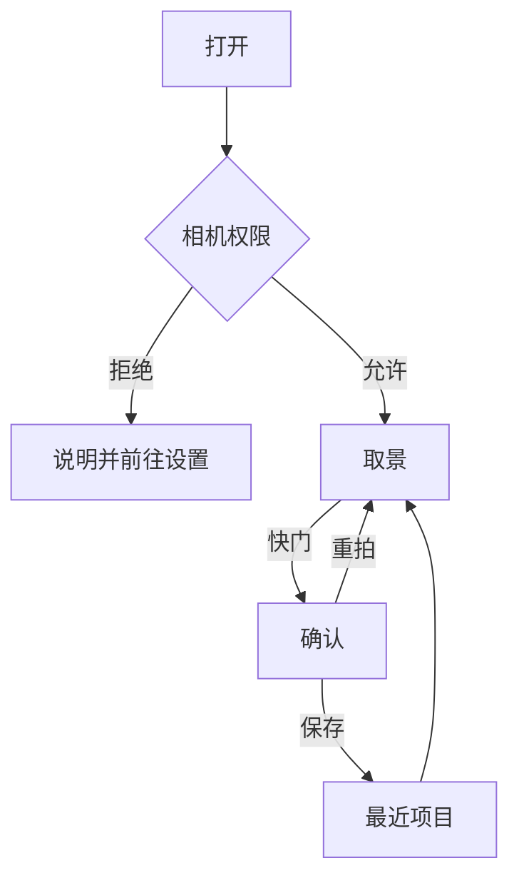

# 产品

一句话：拍摄时套上一种观感，然后拍下来并保存。

最低机型是 iPhone 13 全系（A15）。iPhone 13 / 13 mini 是超广角加广角，13 Pro / 13 Pro Max 另有长焦；更新机型的镜头数量不一样。变焦档位按当前设备发现，不写死机型表。最低系统 iOS 18，竖屏 iPhone 应用。性能、镜头档位和真机验收都以 iPhone 13 为底线。

## 做

- 后置和前置实时预览，风格直接画在预览上
- 变焦：捏合连续变焦，加上设备实际有的镜头档位。界面上限 5x
- 画幅（宽:高）3:4、2:3、9:16、1:1、4:3、3:2、16:9、2:1，默认 3:4。取景框和成片用同一块裁切
- 点按对焦
- 闪光灯关 / 开 / 自动，仅后置
- 翻转摄像头
- 双摄：前后广角同时取景，上下、左右、画中画、圆窗、叠加。画中画和圆窗的小窗可以拖。两路各自滤镜。模拟器不提供这个入口
- 相框：留白、暗房、相纸、窗线、角标、压底、拍立得、印记。角标、压底、拍立得、印记可以印型号、地点、日期和一行短句。地点默认关
- 快门之后进入确认：重拍或保存
- 前置预览和保存下来的照片都是镜像
- 保存只追加到「最近项目」。优先 HEIC，不可用时 JPEG，质量 0.92。不建自定义相册

## 不做

这一阶段只做照片。

- 视频、Live Photo（以后可能做，采集层的路线在 [capture.md](capture.md)）
- RAW、手动 ISO / 快门
- 美颜、人脸重塑、贴纸、AR
- 从相册导入再编辑、滤镜商店、账号
- 美图 / Faceu 式美颜、食物模板、Instagram 式趣味预设

## 质量底线

对标 Dehancer、VSCO、RNI 这类胶片模拟的观感：影调、色相、肤色、高光滚落和颗粒像胶片，而不是整体调个色温。

颜色不在仓库里手调。胶片款用开源的 RawTherapee Film Simulation Collection（CC BY-SA 4.0），系统款用 Core Image 自带的照片效果。GFX 电影机、GFX 无反、GFX 固定镜头、X 无反、X 固定镜头这五个分类来自富士官方的 F-Log2 LUT，没有再分发许可，只用于本地构建，公开发布前要删掉或拿到授权，见 [rendering.md](rendering.md)。iPhone 出图已经是处理过的 Display P3，在这张成片上套 LUT，复制不了另一颗传感器或真实胶片的光谱响应。不从相机固件抽取 LUT。公开发布的版本不打包许可不允许再分发的 LUT；富士官方这五个分类、StormCam 和 Halide 分类是例外。

## 滤镜目录

界面文案是「滤镜」。代码类型是 `Look`。一条横滑，原图在第一项。实验室、柯达、富士、GFX 电影机、GFX 无反、GFX 固定镜头、X 无反、X 固定镜头、StormCam、Halide、拍立得、黑白、爱克发、电影感、系统，是同一层分类。

胶片款的图在 `FilmLUTs/film-<id>.png`，由 `Tools/ImportFilmLUTs.swift` 从 HaldCLUT 转换，名称、默认强度、颗粒和暗角也写在这个脚本里。系统款没有图，直接调用 Core Image 滤镜。

视觉验收组：波特拉 400、Pro 400H、Velvia 50、Tri-X 400、宝丽来 669、大片。

| id | 名称 | 家族 | 来源 |
| --- | --- | --- | --- |
| `original` | 原图 | 原图 | — |
| `portra160` | 波特拉 160 | 柯达 | Kodak Portra 160 2 |
| `portra400` | 波特拉 400 | 柯达 | Kodak Portra 400 2 |
| `portra400vc` | 波特拉 VC | 柯达 | Kodak Portra 400 VC 2 |
| `portra800` | 波特拉 800 | 柯达 | Kodak Portra 800 2 |
| `ektar100` | 艾克塔 100 | 柯达 | Kodak Ektar 100 |
| `elite200` | 精英 200 | 柯达 | Kodak Elite Color 200 |
| `elite400` | 精英 400 | 柯达 | Kodak Elite Color 400 |
| `kodachrome64` | 柯达克罗姆 | 柯达 | Kodak Kodachrome 64 |
| `ektachrome100vs` | 爱克塔克罗姆 | 柯达 | Kodak Ektachrome 100 VS |
| `elitechrome200` | 精英反转 | 柯达 | Kodak Elite Chrome 200 |
| `trix400` | Tri-X 400 | 柯达 | Kodak TRI-X 400 2 |
| `tmax100` | T-Max 100 | 柯达 | Kodak T-Max 100 |
| `bw400cn` | BW400CN | 柯达 | Kodak BW 400 CN |
| `pro400h` | Pro 400H | 富士 | Fuji 400H 2 |
| `pro160c` | Pro 160C | 富士 | Fuji 160C 2 |
| `pro800z` | Pro 800Z | 富士 | Fuji 800Z 2 |
| `superia200` | Superia 200 | 富士 | Fuji Superia 200 |
| `superia400` | Superia 400 | 富士 | Fuji Superia 400 2 |
| `superia800` | Superia 800 | 富士 | Fuji Superia X-Tra 800 |
| `reala100` | Reala 100 | 富士 | Fuji Superia Reala 100 |
| `velvia50` | Velvia 50 | 富士 | Fuji Velvia 50 |
| `provia100f` | Provia 100F | 富士 | Fuji Provia 100F |
| `astia100f` | Astia 100F | 富士 | Fuji Astia 100F |
| `acros100` | Acros 100 | 富士 | Fuji Neopan Acros 100 |
| `neopan1600` | Neopan 1600 | 富士 | Fuji Neopan 1600 2 |
| `fp100c` | FP-100C | 拍立得 | Fuji FP-100c 3 |
| `polaroid669` | 宝丽来 669 | 拍立得 | Polaroid 669 3 |
| `polaroid669cold` | 669 冷调 | 拍立得 | Polaroid 669 Cold 3 |
| `polaroid690` | 宝丽来 690 | 拍立得 | Polaroid 690 3 |
| `px70` | PX-70 | 拍立得 | Polaroid PX-70 3 |
| `px680` | PX-680 | 拍立得 | Polaroid PX-680 3 |
| `px100warm` | PX-100 暖 | 拍立得 | Polaroid PX-100UV+ Warm 3 |
| `timezero` | 过期相纸 | 拍立得 | Polaroid Time Zero (Expired) 4 |
| `polachrome` | Polachrome | 拍立得 | Polaroid Polachrome |
| `polaroid665` | 宝丽来 665 | 拍立得 | Polaroid 665 3 |
| `hp5` | HP5 400 | 黑白 | Ilford HP5 Plus 400 |
| `delta100` | Delta 100 | 黑白 | Ilford Delta 100 |
| `delta3200` | Delta 3200 | 黑白 | Ilford Delta 3200 2 |
| `fp4` | FP4 125 | 黑白 | Ilford FP4 Plus 125 |
| `panf50` | Pan F 50 | 黑白 | Ilford Pan F Plus 50 |
| `xp2` | XP2 | 黑白 | Ilford XP2 |
| `apx100` | APX 100 | 黑白 | Agfa APX 100 |
| `retro100` | Retro 100 | 黑白 | Rollei Retro 100 Tonal |
| `ortho25` | Ortho 25 | 黑白 | Rollei Ortho 25 |
| `infrared` | 红外 | 黑白 | Kodak HIE (HS Infra) |
| `vista200` | Vista 200 | 爱克发 | Agfa Vista 200 |
| `precisa100` | Precisa 100 | 爱克发 | Agfa Precisa 100 |
| `ultra100` | Ultra 100 | 爱克发 | Agfa Ultra Color 100 |
| `xproslide` | 交叉冲洗 | 爱克发 | Lomography X-Pro Slide 200 |
| `redscale` | 红阶 | 爱克发 | Lomography Redscale 100 |
| `elitexpro` | 精英交叉 | 爱克发 | Kodak Elite 100 XPRO |
| `tealorange` | 大片 | 电影感 | TealOrange |
| `bleachbypass` | 跳漂白 | 电影感 | BleachBypass1 |
| `crispwarm` | 暖阳 | 电影感 | CrispWarm |
| `crispwinter` | 冬日 | 电影感 | CrispWinter |
| `softwarming` | 柔暖 | 电影感 | SoftWarming |
| `latesunset` | 日落 | 电影感 | LateSunset |
| `fallcolors` | 秋色 | 电影感 | FallColors |
| `moonlight` | 月光 | 电影感 | Moonlight |
| `foggynight` | 雾夜 | 电影感 | FoggyNight |
| `candlelight` | 烛光 | 电影感 | CandleLight |
| `tealmagentagold` | 霓虹 | 电影感 | TealMagentaGold |
| `sys-chrome` | 铬黄 | 系统 | `CIPhotoEffectChrome` |
| `sys-fade` | 褪色 | 系统 | `CIPhotoEffectFade` |
| `sys-instant` | 怀旧 | 系统 | `CIPhotoEffectInstant` |
| `sys-process` | 冲印 | 系统 | `CIPhotoEffectProcess` |
| `sys-transfer` | 岁月 | 系统 | `CIPhotoEffectTransfer` |
| `sys-mono` | 单色 | 系统 | `CIPhotoEffectMono` |
| `sys-tonal` | 色调 | 系统 | `CIPhotoEffectTonal` |
| `sys-noir` | 黑白 | 系统 | `CIPhotoEffectNoir` |
| `fx-eterna55-provia` | PROVIA | GFX 电影机 | GFX ETERNA 55 FLog2_to_PROVIA |
| `fx-eterna55-velvia` | Velvia | GFX 电影机 | GFX ETERNA 55 FLog2_to_Velvia |
| `fx-eterna55-astia` | ASTIA | GFX 电影机 | GFX ETERNA 55 FLog2_to_ASTIA |
| `fx-eterna55-classicchrome` | Classic Chrome | GFX 电影机 | GFX ETERNA 55 FLog2_to_CLASSIC-CHROME |
| `fx-eterna55-realaace` | Reala Ace | GFX 电影机 | GFX ETERNA 55 FLog2_to_REALA-ACE |
| `fx-eterna55-proneg` | PRO Neg. Std | GFX 电影机 | GFX ETERNA 55 FLog2_to_PRO-Neg.Std |
| `fx-eterna55-classicneg` | Classic Neg. | GFX 电影机 | GFX ETERNA 55 FLog2_to_CLASSIC-Neg. |
| `fx-eterna55-eterna` | ETERNA | GFX 电影机 | GFX ETERNA 55 FLog2_to_ETERNA |
| `fx-eterna55-eternabb` | ETERNA 跳漂白 | GFX 电影机 | GFX ETERNA 55 FLog2_to_ETERNA-BB |
| `fx-eterna55-acros` | ACROS | GFX 电影机 | GFX ETERNA 55 FLog2_to_ACROS |
| `fx-gfx100ii-eterna` / `-eternabb` | ETERNA / ETERNA 跳漂白 | GFX 无反 | GFX100 II |
| `fx-gfx100rf-eterna` / `-eternabb` | ETERNA / ETERNA 跳漂白 | GFX 固定镜头 | GFX100RF |
| `fx-xt30iii-eterna` / `-eternabb` | ETERNA / ETERNA 跳漂白 | X 无反 | X-T30 III |
| `fx-x100vi-eterna` / `-eternabb` | ETERNA / ETERNA 跳漂白 | X 固定镜头 | X100VI |
| `storm-losangeles` … `storm-cannes` | 洛杉矶、拉普兰、巴厘岛、米兰、奥斯陆、塞维利亚、雷克雅维克、昆士兰、布拉格、拉斯维加斯、戛纳 | StormCam | StormCam 1.5.4 标准影调 `<名称>33.cube` |
| `storm-restore` … `storm-kiruna` | 还原、自然、首尔、海岛、镰仓、曼哈顿、托斯卡纳、香格里拉、黑白、摩登、罗马、戈壁、伦敦、伊斯坦布尔、悉尼、基律纳 | StormCam | StormCam 1.5.4 Log 影调，成片换算成 Apple Log 后烘焙 |

实验室的 22 款和 Halide 的 6 款（Valencia、Rembrandt、Nova、Zephyr、Chroma Noir、Scarlet）不在这张表里，目录是 `LabLooks.json`，每款的来源和数值见 [competitor-effects.md](competitor-effects.md)。这些款先上机看效果，好的再转进正式分类。

来源一栏是 HaldCLUT 的文件名或 Core Image 滤镜名。强度、颗粒、暗角和光晕的默认值见 `Looks.json`，做法见 [rendering.md](rendering.md)。

## 交互

主路径两屏。取景页构图、变焦、画幅、闪光灯和风格。确认页只有结果、`重拍`、`保存`。强度留在滤镜面板里，不另开一页。

取景页，黑底，控件浮在画面上：

- 顶栏从左到右：闪光灯（关 / 开 / 自动）、画幅（点开菜单选）、「双摄」（仅当这台设备支持多摄）、翻转摄像头。单摄时前置禁用闪光灯。双摄里闪光灯仍只打后置那一路，按钮保持可点
- 中部只显示当前画幅。点按对焦，双指变焦。变焦条贴在画面底部。单摄的档位来自当前后置虚拟设备。捏合时连续变化，并短暂显示当前倍数
- 点「双摄」进入前后同时取景，再点一次回到进入前的单摄镜头和滤镜。双摄里两套滤镜留在这次打开的内存里。排列在快门上方：上下、左右、画中画、圆窗、叠加。上下和左右可以交换谁在上或在左。画中画和圆窗的小窗可以在画面里拖，换角吸回四角，交换对调谁是大图。叠加有透明度（0.2 到 0.8）和换层。点中哪一路，滤镜和变焦只改这一路。滤镜标题旁可以点「后置」「前置」。双摄时翻转改成交换两路位置，不退出双摄。细节在 [multicam.md](multicam.md)
- 面板默认收起，取景尽量占满。快门左侧是「相框」，右侧是「滤镜」。两个面板互斥，一次只展开一个。附加控制收在按钮后面，需要时才展开，取景保持大
- 点「相框」后可以选：关闭、留白、暗房、相纸、窗线、角标、压底、拍立得、印记。留白、暗房、相纸、拍立得、印记往外扩。窗线、角标、压底盖在照片上，不改变成片比例。角标、压底、拍立得、印记可以开关型号、地点和日期，并写一行最多 12 个字的短句。地点默认关。改动立刻出现在取景上。点相框边只收起面板；点照片内容会收起面板并对焦
- 点「滤镜」后，快门上方展开两排。上面是分类：原图、实验室、柯达、富士、GFX 电影机、GFX 无反、GFX 固定镜头、X 无反、X 固定镜头、StormCam、Halide、拍立得、黑白、爱克发、电影感、系统。下面只显示当前分类的缩略图。点分类不改已经套上的风格。再点按钮，或点画面，面板收起。点画面收起时仍会对焦
- 缩略图是当前画面。选中为 2pt 白环。非原图风格可以点「调节」，或再点一次已选缩略图，改强度、褪色、颗粒和暗角。光晕只出现在大片、雾夜、烛光。拖动时预览跟着变。点「保存」后记在这次打开的内存里，换到别的风格再回来仍然是改过的数值。不点保存就收起，回到上次保存的数值。原图没有调节
- 第一次套上某款时，强度、褪色、颗粒和暗角用这款自己的默认。多数胶片款强度是 100，反差大的几款是 60 到 85，写在目录里
- 快门是白环。按下进入确认页。确认页持有的就是刚才取景里那张已经裁切、已经套好风格、并且带上当前相框的图。确认页仍只有重拍和保存

权限被拒时说明用途，并提供前往系统设置。保存只用「仅添加」相册权限。相机用途文案：`AngieFilter 需要使用相机取景和拍摄。` 相册用途文案：`AngieFilter 会把拍好的照片保存到相册。`

## 验收

固定场景：肤色、蓝天、绿植、红衣服、白衣服高光、夜景灯光。

- 波特拉 400：肤色暖而干净，高光不发灰
- Pro 400H：绿偏青，肤色不发青
- Velvia 50：蓝天和绿叶很浓，但红衣服不糊成色块
- Tri-X 400：阴影留得住细节，颗粒随画面大小变化
- 宝丽来 669：偏暖、有暗角，白衣服不发黄到脏
- 大片：暗部偏青，肤色偏暖，夜景灯光有一点光晕

达不到先改目录里的默认强度，其次换同一胶片的另一档 HaldCLUT（例如 `Kodak Portra 400 1 -` 或 `3 +`），不改渲染架构。交互稿好不好看不作为验收。双摄的真机验收写在 [multicam.md](multicam.md)。
