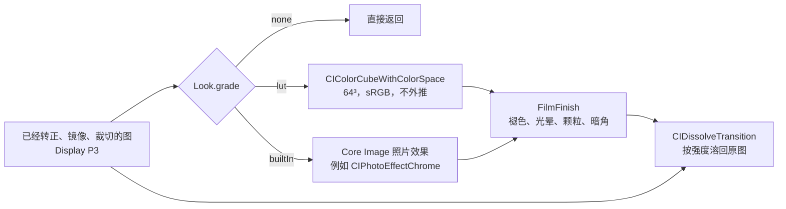

# 渲染

预览、成片和缩略图走同一条路径。几何先做完，再做颜色，然后是一段共用的收尾，最后按强度溶回原图。

渲染框架是 Core Image，Metal 后端。颜色不在仓库里手调：胶片款来自开源的 RawTherapee Film Simulation Collection，另有 Core Image 自带的八款照片效果。正式分类运行时只用系统内置滤镜，不写自定义 kernel。例外是「实验室」分类：它照竞品逆向报告复现处理链，带几个小 kernel，见 [competitor-effects.md](competitor-effects.md)。

## 为什么是 Core Image

| | Core Image | Harbeth、GPUImage3、MetalPetal |
| --- | --- | --- |
| 3D LUT | `CIColorCubeWithColorSpace`，按色彩空间转换进出 | 各自实现，最终也是同一种查表 |
| 以后的 Live Photo 和录像 | `AVVideoComposition` 可以直接用 Core Image 处理每一帧；`CIContext` 能写进 `CVPixelBuffer` 交给 `AVAssetWriter` | 要自己把纹理接回 AVFoundation |
| 广色域、HDR | 跟系统走 | 要自己处理 |
| 维护 | 随系统更新 | Harbeth 一人维护；GPUImage3 不收外部功能；MetalPetal 2024 年后没有提交 |

换框架换不来颜色。颜色取决于 LUT 数据，框架只负责把表查一遍。

## 一帧



1. `ColorGrader` 做颜色。LUT 款把 `LUTStore` 展开的 64³ 数据交给 `CIColorCubeWithColorSpace`。`inputColorSpace` 是 sRGB，因为这些 LUT 都是在 sRGB 图上做的；Core Image 负责从 P3 工作空间转进去再转回来。P3 里超出 sRGB 的颜色贴到立方体边上。`inputExtrapolate = false`。内置款直接调用目录里写的 Core Image 滤镜。
2. `FilmFinish` 收尾，所有非原图款都走，顺序是褪色、光晕、颗粒、暗角。全部用系统滤镜拼出来，见下一节。
3. `GradeApplicator` 按强度用 `CIDissolveTransition` 溶回几何之后的原图。0 是原图，1 是完整风格。强度约等于 0 时整段直接返回。
4. 相框在这之后，由 `FrameCompositor` 贴进更大的白画布。缩略图停在第 3 步。

缩略图用 `quality = .thumbnail` 和这款的默认调节：只做颜色、褪色和暗角，不做光晕和颗粒。

## 收尾

| 步骤 | 做法 | 默认 |
| --- | --- | --- |
| 褪色 | `CIToneCurve` 抬黑位。滑杆 0 到 1，黑位最多到 0.12，白点略降 | 全部 0 |
| 光晕 | 亮度走 `CIToneCurve` 取高光，`CIGaussianBlur` 一次，`CIColorMatrix` 染成偏红后 `CIScreenBlendMode`。同一次模糊再叠一层淡白雾，量是光晕的 0.28。半径是宽度的 0.012（预览）或 0.022（成片） | 只有目录里 `halation > 0` 的款有滑杆：大片 0.15、雾夜 0.2、烛光 0.15 |
| 颗粒 | 颗粒板用 `CIAffineTile` 平铺，`CISoftLightBlendMode` 叠上，再用亮度曲线做的遮罩 `CIBlendWithMask`：阴影最多，纯白干净。细板横向铺 3 次，粗板 1.7 次 | 按感光度写在目录里，0.05 到 0.45。没有写板的款拉高颗粒时用细板 |
| 暗角 | `CIVignetteEffect`，圆心在画面中心，半径是半对角线的 0.85，衰减 0.6，强度是暗角量乘 0.35。量为 1 时四角压暗三分之一左右，滑杆上限 1.5 | 拍立得 0.3 到 0.4、交叉冲洗和红阶 0.3、柯达克罗姆 0.15，其余 0 |

颗粒板是 `Grain/fine.png` 和 `Grain/coarse.png`，512×512 灰度，由导入脚本用固定种子生成，重跑结果不变。不用 `CIRandomGenerator`，它是逐像素噪声，预览和成片的颗粒大小会不一样。

调节面板对所有非原图款都一样：强度、褪色、颗粒、暗角，目录里开了光晕的款多一根光晕。调节后的数值按滤镜 id 记在这次打开的内存里。

## 颜色从哪来

| 来源 | 款数 | 许可 | 位置 |
| --- | --- | --- | --- |
| RawTherapee Film Simulation Collection 2015-09-20（Pat David、Pavlov Dmitry、Michael Ezra） | 62 | CC BY-SA 4.0 | `Resources/FilmLUTs/film-<id>.png` |
| Core Image 照片效果 | 8 | 系统自带 | 不占资源 |
| 富士官方 F-Log2 3D-LUT，下载页每个系列一台机型 | 18 | 没有再分发许可，只用于本地构建 | `Resources/FujiLUTs/fuji-<机型>-<模拟>.png` |
| StormCam 1.5.4 标准影调和 Log 影调，从应用内加密资源解出 | 27 | 没有授权 | `Resources/StormCamLUTs/storm-<id>.png` |
| Halide 3.1.1 创意 Look 的 SDR `.ccube` | 6 | 没有授权 | `Resources/HalideLUTs/halide-<id>.png` |

富士下载页按系列分组，每个系列取一台带 F-Log2 的新机型，一个系列是一个分类：

| 分类 | 机型包 | 款 |
| --- | --- | --- |
| GFX 电影机 | GFX ETERNA 55 Ver.1.10 | PROVIA、Velvia、ASTIA、Classic Chrome、Reala Ace、PRO Neg. Std、Classic Neg.、ETERNA、ETERNA 跳漂白、ACROS |
| GFX 无反 | GFX100 II Ver.1.00 | ETERNA、ETERNA 跳漂白 |
| GFX 固定镜头 | GFX100RF Ver.1.00 | ETERNA、ETERNA 跳漂白 |
| X 无反 | X-T30 III Ver.1.00 | ETERNA、ETERNA 跳漂白 |
| X 固定镜头 | X100VI Ver.1.00 | ETERNA、ETERNA 跳漂白 |

只有 GFX ETERNA 55 的包带完整的胶片模拟，其他机型的 F-Log2 只有 ETERNA 和跳漂白，而且只有 33 格点。GFX100 II 和 GFX100RF 的源 LUT 逐字节相同，这两个分类的效果一样。四台照相机的 WDR 中性渲染也是同一份。X-T30 III、X100VI 的 ETERNA 和 GFX 的不同，和 GFX ETERNA 55 的差得更多，平均约 15/255。

富士的下载页和压缩包里都没有许可条款，没有授权就不能随应用公开发布；上架前要么拿到富士的书面许可，要么删掉 `FujiLUTs/` 和目录里 `fx-` 开头的条目。

原始 LUT 的输入是 F-Log2 视频，不是成片。`Tools/ImportFujiLUTs.swift` 把照片当作这台机型中性渲染 `FLog2_to_WDR` 的输出，数值求逆得到对应的 F-Log2，再接上 `FLog2_to_<模拟>`，合成一张 64³ 表。所以这组效果是「同一台富士相机，中性渲染和这款模拟之间的差」，不是在复制富士的传感器。WDR 渲染不出 sRGB 里最饱和的蓝，这些蓝会先落到它能渲出的最近颜色，所以深蓝的天和水会比原图略淡。

下载地址和解压目录写在脚本开头。每个包解压到以机型 id 命名的子目录，然后：

```bash
swiftc -O Tools/ImportFujiLUTs.swift -o /tmp/import-fuji
/tmp/import-fuji /tmp/fuji-lut
```

机型和模拟的名称、说明、默认强度写在 `Tools/ImportFilmLUTs.swift` 的 `fujiPackages` 和 `fujiSimulations`，由它写进 `Looks.json`。分组在 `LookLibrary.familySpecs`。

StormCam 有三族影调：标准（sRGB 进、SDR 出）11 款，Log 16 款，高亮（Log 进、HDR 出）7 款。接了标准和 Log 两族，高亮款要 HDR 输出，没接。标准款和我们一样在 sRGB 编码值上套 LUT，所以 `Tools/ImportStormCamLUTs.swift` 只把 33³ cube 三线性重采样成 64³，和原 cube 平均差 0.13/255，最大 2.9/255。Log 款的输入是 Apple Log（Rec.2020），输出是普通 SDR；成片先按和 Halide 相同的办法还原到场景光（显示白到场景 12，18% 灰不动），转 Rec.2020、Apple Log 编码，再查表，有 65³ 版本的用 65³。StormCam 自己的颗粒、柔光等效果预设没有接，这里的 StormCam 款只有颜色，收尾走我们的 `FilmFinish`。名称和说明写在 `Tools/ImportFilmLUTs.swift` 的 `stormLooks`。

```bash
swiftc -O Tools/ImportStormCamLUTs.swift -o /tmp/import-stormcam
/tmp/import-stormcam /Users/zhe/Desktop/reverse/stormcam/reverse/decrypted/demo/luts
```

Halide 的 `.ccube` 是 LZFSE 压缩的 33³ Float16 表，输入是场景线性的 Apple Log，输出是 Display P3 gamma 2.2（Chroma Noir 是 Rec.2020 PQ）。成片不能直接喂：成片的白已经被压到 1，落在场景 1.0 上，Halide 把它渲成 0.8 左右的灰。`Tools/ImportHalideLUTs.swift` 对每个格点依次做：

1. sRGB 解码成线性。
2. 按最大通道做反向的扩展 Reinhard，显示白还原到场景 12，18% 灰保持 18%。
3. 转到 Look 的输入色域：Valencia、Rembrandt、Nova、Zephyr、Scarlet 是 Apple Log 2 的 Apple Wide Gamut（原色取 OpenColorIO ACES 配置），Chroma Noir 是 Apple Log 的 Rec.2020。
4. Apple Log 编码（Apple Log 2 同一条曲线），查 Halide 的表。
5. 输出按 gamma 2.2 或 PQ 解码，PQ 的 100 nit 当作白；再转回 sRGB，超出 sRGB 的颜色截断。

Halide 的表本身暗部压得很深，场景 0.02 只出 0.06。iPhone 成片的暗部被本地色调映射提亮过，套上后阴影比原图重得多，这是这组 Look 的主要观感。场景白 12 是这里定的，上机觉得高光发灰就调大，觉得过曝就调小。

```bash
mkdir -p /tmp/halide && unzip -q /Users/zhe/Desktop/reverse/halide/com.chromanoir.Zeit_3.1.1_und3fined.ipa '*.ccube' -d /tmp/halide/ipa
swiftc -O Tools/ImportHalideLUTs.swift -o /tmp/import-halide
/tmp/import-halide /tmp/halide/ipa/Payload/Halide.app/Frameworks/HalideCamera.framework
```

胶片 LUT 的署名和改动说明在 `Resources/FilmLUTs/FilmSimulation-LICENSE.txt`，跟着应用一起打包。CC BY-SA 要求署名、给出许可链接、注明改动，改过的 LUT 仍按 CC BY-SA 发布。以后上架时，应用里要有一处能看到这段署名。

没用的来源和原因：

- spektrafilm：光谱级胶片模拟，效果最好。但代码是 GPLv3，导出的 LUT 另有「不得转售」条款，作者明确不希望 LUT 被打包进闭源应用。
- Stuart Sowerby 的富士 X-Trans III 模拟：没有写许可。
- cedeber/hald-clut 里的 Apple Photos 和 Pixelmator 表：是商业软件的输出。

这些 HaldCLUT 原本是给中性 RAW 用的，iPhone 成片已经带了对比，所以反差大的几款默认强度调低到 0.6 到 0.85。富士 Superia 交叉冲洗和 CreativePack 的 Anime 在人像和风景上偏色太重，没有收进目录。

### 导入

```bash
git clone https://github.com/cedeber/hald-clut.git /tmp/hald-clut
swiftc -O Tools/ImportFilmLUTs.swift -o /tmp/import-luts
/tmp/import-luts /tmp/hald-clut/HaldCLUT
```

只想取用到的文件时，`/tmp/import-luts --sources` 列出目录读的 HaldCLUT 路径，可以配合 `git clone --filter=blob:none --no-checkout` 按需检出。

脚本做这些事：

1. 读 level 12 的 HaldCLUT：1728×1728 的 8-bit sRGB PNG，里面是 144³ 的表。黑白款是单通道灰度图，按三通道相同读。不做色彩管理，按原始字节读。
2. 三线性插值重采样成 64³，写成 512×512 PNG，布局同下一节。每款抽 2000 个格点和 HaldCLUT 直接插值比较，差不超过 1/255。
3. 删掉 `FilmLUTs/` 里目录已经不用的 `film-*.png`。
4. 用固定种子重写两张颗粒板。
5. 重写 `Looks.json`：原图、八款内置、胶片款、富士款。富士款的 PNG 不由这个脚本生成。

改名称、说明、默认强度、颗粒、暗角、光晕，或者增删一款，都在脚本顶部的目录里改，然后重跑。分组在 `LookLibrary.familySpecs`。

## LUT 图

所有 LUT 都是同一种 PNG：512×512，8 行 8 列，每块 64×64，一共 64 个蓝色切片。蓝 0 是左上第一块，从左到右、再从上到下。块内红从左到右，绿从上到下。

`LUTStore` 用 sRGB 的 `CGContext` 把 PNG 画成 8-bit RGBA，不翻转。每块的一行正好是连续 64 个格点，按行用 `vDSP_vfltu8` 转成 float，再乘 1/255，就是 `CIColorCubeWithColorSpace` 要的 64³ RGBA。一张约 4MB，保留最近 16 张，盖住最大的分类加上正在预览的那一款。

图不是 512×512 或读不出来时，这一款的颜色步骤退回输入图，收尾仍然执行，并在 Debug 控制台打一行 `lut <name> failed to load`。

立方体维度是 64。iOS 的 `CIColorCube` 只接受 2 到 64，给 65 时滤镜不出图，画面原样通过；macOS 上限是 128，只在 Mac 上验证查不出来。

扩展名是 `.png` 的文件必须真的是 PNG。Xcode 打包时会用 pngcrush 处理 PNG，遇到其实是 JPEG 的文件会报 `libpng error` 并把它漏掉，那一款在真机上就是原图。

## 目录 JSON

`Looks.json` 由导入脚本写出，是唯一的目录。原图必须存在，id 是 `original`。

| 字段 | 类型 | 含义 |
| --- | --- | --- |
| `id` | string | `Look.id` |
| `name` | string | 界面名称 |
| `about` | string | 这款在做什么 |
| `grade` | `lut` / `builtIn` | 原图不写 |
| `lut` | string | LUT 图文件名，不含扩展名 |
| `filter` | string | `builtIn` 用的 Core Image 滤镜名 |
| `strength` | number | 第一次套上时的强度，0 到 1，缺省 1 |
| `fade` | number | 褪色默认值，缺省 0 |
| `halation` | number | 大于 0 才出现「光晕」滑杆 |
| `grain` | number | 颗粒默认值，缺省 0 |
| `grainPlate` | `fine` / `coarse` | 缺省细板 |
| `vignette` | number | 暗角默认值，缺省 0 |

`grade` 不认识，或 `builtIn` 没写 `filter` 时，这一条被跳过，不会冒充原图出现在目录里。界面按 `LookLibrary.families` 分组显示，不按数组平铺。没有放进任何分组的款落到「其他」。`Looks.json` 缺失或解码失败时只剩内置原图。

## 性能

iPhone 13 上预览保持 30fps。旧帧丢掉。拍照的编码和套风格不占 `videoQueue`。预览帧长边收到 1920 以内。`PreviewMetalView` 是 `CAMetalLayer`，在自己的队列上每帧取一张新画布，GPU 上同时只有一帧，画完之前来的帧只留最新一张。主线程只设图层尺寸。预览和缩略图各自复用 `CIContext`，工作空间都是 Display P3。

相机的缓冲池只有几块，任何一块被预览之外的地方拿住，相机就不再送帧，预览停在最后一帧。所以缩略图不读相机缓冲：`ThumbnailFrameTap` 在视频队列上每 0.5 秒把当前帧拷成一张宽 160 的位图，缩略图只读这张拷贝，取中间正方形按滤镜各渲一次。缩略图的 `CIContext` 是低优先级，先渲已选那一款，每 4 张交给界面一次。
