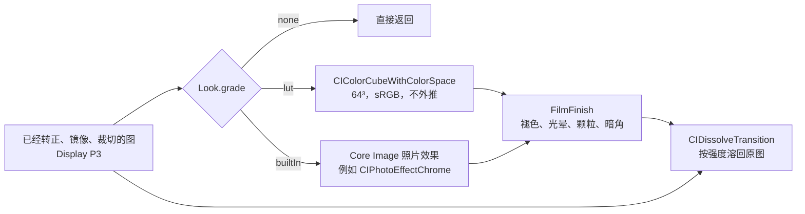
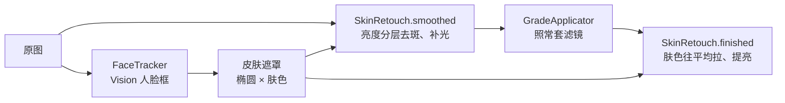

# 渲染

预览、成片和缩略图走同一条路径。几何先做完，再做颜色，然后是一段共用的收尾，最后按强度溶回原图。

渲染框架是 Core Image，Metal 后端。颜色不在仓库里手调：胶片款来自开源的 RawTherapee Film Simulation Collection，另有 Core Image 自带的八款照片效果。正式分类运行时只用系统内置滤镜，不写自定义 kernel。例外是「实验室」分类：它照竞品逆向报告复现处理链，带几个小 kernel，见 [competitor-effects.md](competitor-effects.md)。银幕分类的场景光和美颜也用 `EffectKernels.metal` 里的 kernel。

## 为什么是 Core Image

| | Core Image | Harbeth、GPUImage3、MetalPetal |
| --- | --- | --- |
| 3D LUT | `CIColorCubeWithColorSpace`，按色彩空间转换进出 | 各自实现，最终也是同一种查表 |
| 以后的 Live Photo 和录像 | `AVVideoComposition` 可以直接用 Core Image 处理每一帧；`CIContext` 能写进 `CVPixelBuffer` 交给 `AVAssetWriter` | 要自己把纹理接回 AVFoundation |
| 广色域、HDR | 跟系统走 | 要自己处理 |
| 维护 | 随系统更新 | Harbeth 一人维护；GPUImage3 不收外部功能；MetalPetal 2024 年后没有提交 |

换框架换不来颜色。颜色取决于 LUT 数据，框架只负责把表查一遍。

## 一帧



1. `ColorGrader` 做颜色。LUT 款把 `LUTStore` 展开的 64³ 数据交给 `CIColorCubeWithColorSpace`。`inputColorSpace` 是 sRGB，因为这些 LUT 都是在 sRGB 图上做的；Core Image 负责从 P3 工作空间转进去再转回来。P3 里超出 sRGB 的颜色贴到立方体边上。`inputExtrapolate = false`。内置款直接调用目录里写的 Core Image 滤镜。
2. `FilmFinish` 收尾，所有非原图款都走，顺序是褪色、光晕、颗粒、暗角。全部用系统滤镜拼出来，见下一节。
3. `GradeApplicator` 按强度用 `CIDissolveTransition` 溶回几何之后的原图。0 是原图，1 是完整风格。强度约等于 0 时整段直接返回。
4. 相框在这之后，由 `FrameCompositor` 贴进更大的白画布。缩略图停在第 3 步。

缩略图用 `quality = .thumbnail` 和这款的默认调节：只做颜色、褪色和暗角，不做光晕和颗粒。

## 收尾

| 步骤 | 做法 | 默认 |
| --- | --- | --- |
| 褪色 | `CIToneCurve` 抬黑位。滑杆 0 到 1，黑位最多到 0.12，白点略降 | 全部 0 |
| 光晕 | 亮度走 `CIToneCurve` 取高光，`CIGaussianBlur` 一次，`CIColorMatrix` 染成偏红后 `CIScreenBlendMode`。同一次模糊再叠一层淡白雾，量是光晕的 0.28。半径是宽度的 0.012（预览）或 0.022（成片） | 只有目录里 `halation > 0` 的款有滑杆：大片 0.15、雾夜 0.2、烛光 0.15 |
| 颗粒 | 颗粒板用 `CIAffineTile` 平铺，`CISoftLightBlendMode` 叠上，再用亮度曲线做的遮罩 `CIBlendWithMask`：阴影最多，纯白干净。细板横向铺 3 次，粗板 1.7 次 | 按感光度写在目录里，0.05 到 0.45。没有写板的款拉高颗粒时用细板 |
| 暗角 | `CIVignetteEffect`，圆心在画面中心，半径是半对角线的 0.85，衰减 0.6，强度是暗角量乘 0.35。量为 1 时四角压暗三分之一左右，滑杆上限 1.5 | 拍立得 0.3 到 0.4、交叉冲洗和红阶 0.3、柯达克罗姆 0.15，其余 0 |

颗粒板是 `Grain/fine.png` 和 `Grain/coarse.png`，512×512 灰度，由导入脚本用固定种子生成，重跑结果不变。不用 `CIRandomGenerator`，它是逐像素噪声，预览和成片的颗粒大小会不一样。

调节面板对所有非原图款都一样：强度、褪色、颗粒、暗角，目录里开了光晕的款多一根光晕，银幕款再多一根柔光。调节后的数值按滤镜 id 记在这次打开的内存里。

## 美颜

工具托盘上的笑脸按钮。关着时点一下就打开，并在焦段环的位置换成强度滑杆；开着时点它只显示或收起滑杆，点画面也收起。滑杆 0 到 100，默认 30，双击数字回到 30，行尾「关闭」关掉美颜。打开后每一款都做，原图也做；照片、实况、录像和双摄两路都走，缩略图不做。关着或强度为 0 时这一段整个跳过，画面和以前一样。开关和强度记在 `UserDefaults` 的 `capture.beauty` 和 `capture.beautyAmount`，默认关。

下面的数值都是强度 100 时的，每一项都按强度线性缩放。默认的 30 只让大块明暗和斑点软一些，毛孔和胡茬几乎不动，看不出磨过。

要解决的问题：印片和胶片 LUT 的中间调反差陡、暗部偏青，脸上本来不明显的明暗起伏被放大成一块黑一块白，背光的半边脸被染青。在一张办公室顶灯下的自拍上量过：块状起伏里亮度的波动是颜色的 5 到 6 倍，而且脸颊上顶灯打出的大块明暗和鼻翼轮廓的幅度差不多。所以重点是亮度，并且要分尺度处理。



1. 找脸。`FaceTracker` 用 Vision 的 `VNDetectFaceRectanglesRequest`，拿框和 roll。取景每秒最多测 10 次：在视频队列上把帧拷成长边 512 的小图，再交给自己的队列检测，相机缓冲不出视频队列。脸丢了保留 0.5 秒，新框和上一次的同一张脸取平均，防抖。成片在拍下的图上同步再测一次，实况短视频的每一帧沿用成片的框。双摄两路各有一个。框归一化到画幅裁切之后的原图。
2. 遮罩。`FaceRegion.ellipse` 把框变成椭圆：宽是框的 0.6 倍、高 0.78 倍，中心沿 roll 往头顶抬 0.12 倍框高，把额头包进来；内 60% 是 1，往外渐隐。再乘一个肤色条件，在模糊到脸宽 3% 的原图上判断：亮度够，排除头发、眉毛和暗背景；不明显偏蓝，红减蓝从 −0.12 起算，冷光下的皮肤也留得住。最多四张脸，窄于画面 4% 的不做。计算只在脸的外接框里。
3. 套滤镜之前，`SkinRetouch.smoothed` 只动亮度，每个通道加同一个差值。亮度按脸宽拆成四层模糊：0.3%、1.5%、6%、20%。
   - 0.3% 以下是毛孔，不动。
   - 0.3% 到 1.5% 的斑点层和 1.5% 到 6% 的块斑层做软阈值：摆幅明显小于 0.05 和 0.07 的分别去掉 60% 和 80%。斑点层去得少，细纹理比块斑留得久。眼皮、鼻翼、唇线摆幅大，留下。
   - 6% 到 20% 的明暗层整体压平 30%，像补了一盏柔光灯。
4. 银幕款从场景光印片时，`skinRelight` 把上一步在显示图上做的变化，按 `screenExpand` 的同一条曲线换成增益，乘到场景光上。
5. 套滤镜之后，`SkinRetouch.finished` 做两件事：
   - 肤色统一：遮罩加权的色度（红、蓝各减亮度）在脸宽 15% 上求平均，每个像素往平均拉 60%。离平均越远拉得越少，差 0.06 左右（嘴唇、眼睛）就基本不动。
   - 提亮：皮肤往白推 8%，和 screen 一样亮处推得少，所以反差也略降。

没用保边滤波（guided filter）：试过，脸颊上的大块明暗在窗口里方差大，被当成边缘留下，斑点只降了一成左右。

离线验证是在 Mac 上跑同一份 kernel 和 `SkinRetouch`。因为那张自拍已经套过偏青的滤镜，遮罩改用调暖的副本来算，模拟套滤镜之前的原图。脸颊和下巴上量到的结果（剩下原来的多少）：

| 强度 | 块斑 | 大块明暗 | 毛孔 |
| --- | --- | --- | --- |
| 30 | 88% 到 95% | 90% 到 94% | 94% 到 96% |
| 50 | 81% 到 92% | 84% 到 89% | 91% 到 94% |
| 100 | 63% 到 86% | 69% 到 81% | 83% 到 88% |

## 颜色从哪来

| 来源 | 款数 | 许可 | 位置 |
| --- | --- | --- | --- |
| RawTherapee Film Simulation Collection 2015-09-20（Pat David、Pavlov Dmitry、Michael Ezra） | 62 | CC BY-SA 4.0 | `Resources/FilmLUTs/film-<id>.png` |
| Core Image 照片效果 | 8 | 系统自带 | 不占资源 |
| 富士官方 F-Log2 3D-LUT，下载页每个系列一台机型 | 18 | 没有再分发许可，只用于本地构建 | `Resources/FujiLUTs/fuji-<机型>-<模拟>.png` |
| StormCam 1.5.4 标准影调和 Log 影调，从应用内加密资源解出 | 27 | 没有授权 | `Resources/StormCamLUTs/storm-<id>.png` |
| Halide 3.1.1 创意 Look 的 SDR `.ccube` | 6 | 没有授权 | `Resources/HalideLUTs/halide-<id>.png` |
| spektrafilm 0.3.4 光谱模拟：柯达 Vision3 负片印 2383 / 2393 放映拷贝 | 7 | 代码 GPLv3，数据 CC BY-SA 4.0 | `Resources/ScreenLUTs/screen-<id>.png` |

富士下载页按系列分组，每个系列取一台带 F-Log2 的新机型，一个系列是一个分类：

| 分类 | 机型包 | 款 |
| --- | --- | --- |
| GFX 电影机 | GFX ETERNA 55 Ver.1.10 | PROVIA、Velvia、ASTIA、Classic Chrome、Reala Ace、PRO Neg. Std、Classic Neg.、ETERNA、ETERNA 跳漂白、ACROS |
| GFX 无反 | GFX100 II Ver.1.00 | ETERNA、ETERNA 跳漂白 |
| GFX 固定镜头 | GFX100RF Ver.1.00 | ETERNA、ETERNA 跳漂白 |
| X 无反 | X-T30 III Ver.1.00 | ETERNA、ETERNA 跳漂白 |
| X 固定镜头 | X100VI Ver.1.00 | ETERNA、ETERNA 跳漂白 |

只有 GFX ETERNA 55 的包带完整的胶片模拟，其他机型的 F-Log2 只有 ETERNA 和跳漂白，而且只有 33 格点。GFX100 II 和 GFX100RF 的源 LUT 逐字节相同，这两个分类的效果一样。四台照相机的 WDR 中性渲染也是同一份。X-T30 III、X100VI 的 ETERNA 和 GFX 的不同，和 GFX ETERNA 55 的差得更多，平均约 15/255。

富士的下载页和压缩包里都没有许可条款，没有授权就不能随应用公开发布；上架前要么拿到富士的书面许可，要么删掉 `FujiLUTs/` 和目录里 `fx-` 开头的条目。

原始 LUT 的输入是 F-Log2 视频，不是成片。`Tools/ImportFujiLUTs.swift` 把照片当作这台机型中性渲染 `FLog2_to_WDR` 的输出，数值求逆得到对应的 F-Log2，再接上 `FLog2_to_<模拟>`，合成一张 64³ 表。所以这组效果是「同一台富士相机，中性渲染和这款模拟之间的差」，不是在复制富士的传感器。WDR 渲染不出 sRGB 里最饱和的蓝，这些蓝会先落到它能渲出的最近颜色，所以深蓝的天和水会比原图略淡。

下载地址和解压目录写在脚本开头。每个包解压到以机型 id 命名的子目录，然后：

```bash
swiftc -O Tools/ImportFujiLUTs.swift -o /tmp/import-fuji
/tmp/import-fuji /tmp/fuji-lut
```

机型和模拟的名称、说明、默认强度写在 `Tools/ImportFilmLUTs.swift` 的 `fujiPackages` 和 `fujiSimulations`，由它写进 `Looks.json`。分组在 `LookLibrary.familySpecs`。

StormCam 有三族影调：标准（sRGB 进、SDR 出）11 款，Log 16 款，高亮（Log 进、HDR 出）7 款。接了标准和 Log 两族，高亮款要 HDR 输出，没接。标准款和我们一样在 sRGB 编码值上套 LUT，所以 `Tools/ImportStormCamLUTs.swift` 只把 33³ cube 三线性重采样成 64³，和原 cube 平均差 0.13/255，最大 2.9/255。Log 款的输入是 Apple Log（Rec.2020），输出是普通 SDR；成片先按和 Halide 相同的办法还原到场景光（显示白到场景 12，18% 灰不动），转 Rec.2020、Apple Log 编码，再查表，有 65³ 版本的用 65³。StormCam 自己的颗粒、柔光等效果预设没有接，这里的 StormCam 款只有颜色，收尾走我们的 `FilmFinish`。名称和说明写在 `Tools/ImportFilmLUTs.swift` 的 `stormLooks`。

```bash
swiftc -O Tools/ImportStormCamLUTs.swift -o /tmp/import-stormcam
/tmp/import-stormcam /Users/zhe/Desktop/reverse/stormcam/reverse/decrypted/demo/luts
```

Halide 的 `.ccube` 是 LZFSE 压缩的 33³ Float16 表，输入是场景线性的 Apple Log，输出是 Display P3 gamma 2.2（Chroma Noir 是 Rec.2020 PQ）。成片不能直接喂：成片的白已经被压到 1，落在场景 1.0 上，Halide 把它渲成 0.8 左右的灰。`Tools/ImportHalideLUTs.swift` 对每个格点依次做：

1. sRGB 解码成线性。
2. 按最大通道做反向的扩展 Reinhard，显示白还原到场景 12，18% 灰保持 18%。
3. 转到 Look 的输入色域：Valencia、Rembrandt、Nova、Zephyr、Scarlet 是 Apple Log 2 的 Apple Wide Gamut（原色取 OpenColorIO ACES 配置），Chroma Noir 是 Apple Log 的 Rec.2020。
4. Apple Log 编码（Apple Log 2 同一条曲线），查 Halide 的表。
5. 输出按 gamma 2.2 或 PQ 解码，PQ 的 100 nit 当作白；再转回 sRGB，超出 sRGB 的颜色截断。

Halide 的表本身暗部压得很深，场景 0.02 只出 0.06。iPhone 成片的暗部被本地色调映射提亮过，套上后阴影比原图重得多，这是这组 Look 的主要观感。场景白 12 是这里定的，上机觉得高光发灰就调大，觉得过曝就调小。

```bash
mkdir -p /tmp/halide && unzip -q /Users/zhe/Desktop/reverse/halide/com.chromanoir.Zeit_3.1.1_und3fined.ipa '*.ccube' -d /tmp/halide/ipa
swiftc -O Tools/ImportHalideLUTs.swift -o /tmp/import-halide
/tmp/import-halide /tmp/halide/ipa/Payload/Halide.app/Frameworks/HalideCamera.framework
```

### 银幕

「银幕」分类是电影质感的新路线，和「电影感」分开，不改原有分类。电影感那 11 款是 RawTherapee 的通用调色表，只在显示空间里改颜色；银幕按真实的电影工艺链模拟：场景光曝光到柯达 Vision3 负片，负片在印片机里印到 2383（或 Vision Premier 2393）放映拷贝，再放映出来。模拟用 [spektrafilm](https://github.com/andreavolpato/spektrafilm)（原 agx-emulsion），它按染料光谱、特性曲线和 DIR 耦合剂算颜色，不是拟合出来的表。

烘焙脚本是 `Tools/BakeScreenLUTs.py`，对 64³ 每个格点：

1. sRGB 解码成线性。
2. 还原到场景光：反向扩展 Reinhard，显示白到 12，18% 灰不动，和 Halide、StormCam Log 一样。区别是按「亮度和最小通道的平均」而不是最大通道来扩展。按最大通道时，显示值为 1 的纯红、纯黄会被当成比中灰高六档的高光，在负片上过曝发白。
3. 加 veiling glare（`flare`，场景光的 0.5% 到 1.8%）。2383 的趾部很陡，不加时 −3 EV 只印出 0.035，手机照片的暗部全黑。加在负片这边，相当于镜头杂光抬暗部；加在印片上（preflash）只会整体变暗。
4. spektrafilm 的 LUT 模式：颗粒、光晕、耦合剂的空间扩散、自动曝光都关掉，只留逐像素的颜色，空间效果在运行时做（见下面「银幕的光学效果」）。输入输出都是线性 sRGB 原色。
5. 输出按通道除以显示白印出来的值，让白印成白。2383 本身最亮只到 0.88 左右、略偏暖，在手机上像发灰的高光。
6. 印片曝光和黄、品滤色（Kodak CC 值）用牛顿法解：18% 灰印到 sRGB 0.46，并且三通道相等。每款自己的偏色加在解出的中性滤色上，再单独解一次曝光。相机 EV 在这里不起作用，spektrafilm 会在印片时把它补回去。

| id | 名称 | 负片 → 拷贝 | 配光 | flare |
| --- | --- | --- | --- | --- |
| `screen-250d` | 2383 放映 | 250D → 2383 | 中性 | 1.2% |
| `screen-50d` | 50D 日景 | 50D → 2383 | 中性 | 0.8% |
| `screen-200t` | 200T 暖印 | 200T → 2383 | Y −5、M −1.5 | 1.2% |
| `screen-golden` | 黄金时刻 | 250D → 2383 | Y −10、M −3 | 1.4% |
| `screen-500t` | 500T 夜戏 | 500T → 2383 | Y +3、M +1 | 1.8% |
| `screen-500t-blue` | 日光 500T | 500T → 2383 | 不做中性，只用数据库滤色再 Y +10，偏蓝 | 1.8% |
| `screen-premier` | 2393 高级拷贝 | 250D → 2393 | 中性 | 0.5% |

Y 加得多印出来偏蓝，M 加得多偏绿。四种 Vision3 负片中性化以后差别很小，真实的片子也是这样，所以这几款主要靠配光拉开。中灰两档以下明显比原图深（−2 EV 从 0.26 到 0.15 左右），高光平滑滚到白，深绿偏橄榄，暗部略青，这是 Vision3 + 2383 的特征。目录 `ScreenLooks.json` 手工编辑，`grade` 是 `screen`，分组在 `LookLibrary.familySpecs` 的 `screen`，排在原图后面。

#### 银幕的光学效果

其他分类的光晕在显示值上做：高光用色调曲线取出来，模糊后滤色叠加。显示值里白墙和灯泡都是 1，分不出谁更亮，所以白衣服、天空也会长红边。银幕这组改成在场景光里做，由 `ScreenPrint` 接管整条链，不经过 `EffectChain`：

1. 还原到场景光（kernel `screenExpand`），和烘焙脚本第 2 步是同一条曲线：显示白到 12，18% 灰不动。
2. 柔光（「柔光」滑杆，kernel `screenMist`）：模仿 Pro-Mist 一类柔光镜，把每个像素的一部分光挪到近、远两圈光晕里，`scene += 0.35 × 柔光 × (0.5·G(0.008S) + 0.5·G(0.04S) − scene)`，S 是短边。总光量不变，亮光源周围泛一层白雾，暗部被抬起一点，反差变软。
3. 光晕（「光晕」滑杆，kernel `screenBright` + `screenHalation`）：只取场景光里超过 1.2 的部分（比中灰高约 2.7 档，漫反射白到不了），模糊成 `0.6·G(0.004S) + 0.4·G(0.012S)`，取亮度，乘 `0.4 × 光晕`，按 (1, 0.3, 0.06) 染成红橙色加回去。这对应光穿过乳剂、在片基背面反射回来先曝红层，所以不论光源什么颜色，晕都是红橙色，而且只在路灯、窗户、太阳这类真正的亮光源周围出现。
4. 压回显示值（kernel `screenCompress`），是第 1 步的精确逆。柔光和光晕都为 0 时整个往返不改变像素，LUT 看到的就是原图。
5. `ColorGrader.lut` 套这款的印片 LUT。
6. `FilmFinish` 收尾，但光晕置 0（已经在第 3 步做过），只做褪色、颗粒、暗角。颗粒板每 1/24 秒换一个平铺偏移（按帧序号乘黄金比例取小数，横竖各一个），预览和视频里颗粒像胶片一样逐帧跳动；其他分类的颗粒仍然固定不动。

模糊半径按短边的比例算，预览和成片看起来一样。缩略图跳过第 1 到 4 步。工作格式是半浮点，场景光的 12 存得下。颜色 kernel 里的 `whiteness` 用 Display P3 的亮度系数，和脚本里 sRGB 的系数算出来是同一个亮度。

| id | 柔光 | 光晕 | 颗粒 |
| --- | --- | --- | --- |
| `screen-250d` | 0.25 | 0.3 | 0.15 |
| `screen-50d` | 0.15 | 0.2 | 0.08 |
| `screen-200t` | 0.3 | 0.35 | 0.18 |
| `screen-golden` | 0.45 | 0.4 | 0.15 |
| `screen-500t` | 0.35 | 0.5 | 0.3 |
| `screen-500t-blue` | 0.3 | 0.4 | 0.3 |
| `screen-premier` | 0.15 | 0.25 | 0.08 |

参数是离线在合成夜景（点光源、窗户、肤色块、灰阶条）上对照调出来的，Python 原型复用 `BakeScreenLUTs.py` 的 `scene_light` 和 `apply_lut`。

#### 银幕的 RAW 成片

取景和其他分类都从处理过的照片出发，第 1 步的还原只是近似：手机照片里有局部色调映射，暗部被提亮了约三档（下面样张里场景 1.3% 的暗部，Apple 显影后是 0.264，关掉局部色调映射是 0.017），天空和高光被压平，全局曲线还原不回来。所以银幕款拍照时改拍 ProRAW（采集见 [capture.md](capture.md)），显影出线性的场景光，跳过第 1 步，直接进柔光、光晕、压回、LUT。

`ScreenPrint.sceneLight` 用 kernel `screenLinear` 把显影结果换成和第 1 步同一套场景光：

1. 解码工作空间的传输曲线，乘 `2^(baselineExposure + 0.5)`。`baselineExposure` 是文件自己的基准曝光（样张是 −0.30）；0.5 是额外补的半档：关掉局部色调映射以后，文件自己的曝光印出来中位亮度 0.38，比手机照片和取景（约 0.52）暗；补半档后是 0.48。
1. 饱和度 ×1.3（按亮度缩放色度，`ScreenPrint.sceneSaturation`）。ProRAW 线性显影是按色度学还原的，比手机自己的渲染淡；取景是从手机渲染还原的，带着这份加强。样张上 1.3 时两边印出来的平均 Oklab 色度相同（1.0 时只有 0.81），中位亮度 0.58 对 0.62，RAW 的影调仍然更深。
2. 高光延伸：norm 超过 1.2 以后斜率变成 4。传感器在中灰上约四档就截了（样张场景光最大 2.9），而负片还能往上记录；取景路径里截掉的灯会被还原到 9.9。延伸后样张最亮处约 8，灯、反光、太阳能和取景一样长出光晕，印出来也能到白。只有 0.15% 的像素超过 1.2，云和天空不受影响。

离线验证用的是公开的 iPhone 12 Pro ProRAW 样张（Photoprism 的 samples 库），在 Mac 上用同一套 `CIRAWFilter` 参数显影，再用 Python 原型套 2383。只用 Python 原型不够：它不经过 Core Image 的工作空间，查不出 `exposure` 在伽马空间里乘的问题。所以还要在 Mac 上把 `EffectKernels.metal` 编成 metallib（`xcrun metal -fcikernel`、`xcrun metallib -cikernel`），用 Display P3 工作空间的 `CIContext` 把 App 的链路原样跑一遍，和原型逐像素对比，平均差 0.7/255。和照片路径比：天空更深、云有层次、逆光的前景暗下去，不再是手机那种处处提亮的 HDR 感。

拍照模式的取景仍然是处理过的视频帧加第 1 步的近似，所以银幕款拍出来的照片会比取景暗部更深、反差更大。这是有意的：取景负责构图，成片才是真正的印片。

#### 银幕的 Apple Log 录像

录像模式下银幕款的取景和录像帧是 Apple Log（采集见 [capture.md](capture.md)），同样跳过第 1 步。kernel `screenAppleLog`：

1. 每个通道按 Apple Log 白皮书的曲线解码，常数和 `Tools/ImportStormCamLUTs.swift` 一样。Apple Log 本身就是场景光：18% 灰编码在 0.488，编码值 1 解出来是 12.0，正好是第 1 步的场景白，所以不需要 RAW 那样的高光延伸，截掉的灯和取景路径一样落在 12 附近。
2. Rec.2020 线性转 Display P3 线性（D65 到 D65 的矩阵，由 colour-science 算出；和 sRGB→Rec.2020 串起来与 sRGB→P3 直算差 1e-4 以内），负值截成 0。
3. 乘 `2^logExposureStops`，现在是 0：先相信相机在 Log 下的自动曝光。
4. 饱和度 ×1.3，和 RAW 同一个值：Apple Log 同样是色度学的，缺的是同一份手机渲染的加强，这样银幕的照片和录像颜色一致。这个值还没在 Log 素材上单独量过。

之后和 RAW 一样进柔光、光晕、压回、LUT、逐帧颗粒。缩略图和其他分类拿到的是压回后的显示图：它的第 1 步还原正好得回这份场景光，所以滤镜条上银幕款的缩略图和取景一致。

曲线往返误差 1e-14。帧在读的时候已经缩到预览尺寸，缩放发生在 Log 编码值上，不是线性光，缩小时的误差看不出来。

```bash
uv venv -p 3.13 /tmp/sf/venv
git clone --depth 1 https://github.com/andreavolpato/spektrafilm /tmp/sf/spektrafilm
uv pip install --python /tmp/sf/venv numpy scipy colour-science scikit-image matplotlib opt-einsum numba OpenImageIO pyfftw rawpy exiv2 lensfunpy Pillow
uv pip install --python /tmp/sf/venv --no-deps -e /tmp/sf/spektrafilm
/tmp/sf/venv/bin/python Tools/BakeScreenLUTs.py probe          # 每款的灰阶
/tmp/sf/venv/bin/python Tools/BakeScreenLUTs.py bake           # 写 ScreenLUTs/
/tmp/sf/venv/bin/python Tools/BakeScreenLUTs.py chart out.png  # 色卡、肤色、色相、灰阶对比图
```

GUI 依赖（PySide6、napari）不用装。一次全部烘焙约 10 秒。

胶片 LUT 的署名和改动说明在 `Resources/FilmLUTs/FilmSimulation-LICENSE.txt`，跟着应用一起打包。CC BY-SA 要求署名、给出许可链接、注明改动，改过的 LUT 仍按 CC BY-SA 发布。以后上架时，应用里要有一处能看到这段署名。

没用的来源和原因：

- Stuart Sowerby 的富士 X-Trans III 模拟：没有写许可。
- cedeber/hald-clut 里的 Apple Photos 和 Pixelmator 表：是商业软件的输出。

这些 HaldCLUT 原本是给中性 RAW 用的，iPhone 成片已经带了对比，所以反差大的几款默认强度调低到 0.6 到 0.85。富士 Superia 交叉冲洗和 CreativePack 的 Anime 在人像和风景上偏色太重，没有收进目录。

### 导入

```bash
git clone https://github.com/cedeber/hald-clut.git /tmp/hald-clut
swiftc -O Tools/ImportFilmLUTs.swift -o /tmp/import-luts
/tmp/import-luts /tmp/hald-clut/HaldCLUT
```

只想取用到的文件时，`/tmp/import-luts --sources` 列出目录读的 HaldCLUT 路径，可以配合 `git clone --filter=blob:none --no-checkout` 按需检出。

脚本做这些事：

1. 读 level 12 的 HaldCLUT：1728×1728 的 8-bit sRGB PNG，里面是 144³ 的表。黑白款是单通道灰度图，按三通道相同读。不做色彩管理，按原始字节读。
2. 三线性插值重采样成 64³，写成 512×512 PNG，布局同下一节。每款抽 2000 个格点和 HaldCLUT 直接插值比较，差不超过 1/255。
3. 删掉 `FilmLUTs/` 里目录已经不用的 `film-*.png`。
4. 用固定种子重写两张颗粒板。
5. 重写 `Looks.json`：原图、八款内置、胶片款、富士款。富士款的 PNG 不由这个脚本生成。

改名称、说明、默认强度、颗粒、暗角、光晕，或者增删一款，都在脚本顶部的目录里改，然后重跑。分组在 `LookLibrary.familySpecs`。

## LUT 图

所有 LUT 都是同一种 PNG：512×512，8 行 8 列，每块 64×64，一共 64 个蓝色切片。蓝 0 是左上第一块，从左到右、再从上到下。块内红从左到右，绿从上到下。

`LUTStore` 用 sRGB 的 `CGContext` 把 PNG 画成 8-bit RGBA，不翻转。每块的一行正好是连续 64 个格点，按行用 `vDSP_vfltu8` 转成 float，再乘 1/255，就是 `CIColorCubeWithColorSpace` 要的 64³ RGBA。一张约 4MB，保留最近 16 张，盖住最大的分类加上正在预览的那一款。

图不是 512×512 或读不出来时，这一款的颜色步骤退回输入图，收尾仍然执行，并在 Debug 控制台打一行 `lut <name> failed to load`。

立方体维度是 64。iOS 的 `CIColorCube` 只接受 2 到 64，给 65 时滤镜不出图，画面原样通过；macOS 上限是 128，只在 Mac 上验证查不出来。

扩展名是 `.png` 的文件必须真的是 PNG。Xcode 打包时会用 pngcrush 处理 PNG，遇到其实是 JPEG 的文件会报 `libpng error` 并把它漏掉，那一款在真机上就是原图。

## 目录 JSON

`Looks.json` 由导入脚本写出，是唯一的目录。原图必须存在，id 是 `original`。

| 字段 | 类型 | 含义 |
| --- | --- | --- |
| `id` | string | `Look.id` |
| `name` | string | 界面名称 |
| `about` | string | 这款在做什么 |
| `grade` | `lut` / `builtIn` / `effect` / `screen` | 原图不写。`screen` 是银幕的 LUT 加场景光柔光、光晕 |
| `lut` | string | LUT 图文件名，不含扩展名 |
| `filter` | string | `builtIn` 用的 Core Image 滤镜名 |
| `strength` | number | 第一次套上时的强度，0 到 1，缺省 1 |
| `fade` | number | 褪色默认值，缺省 0 |
| `halation` | number | 大于 0 才出现「光晕」滑杆 |
| `grain` | number | 颗粒默认值，缺省 0 |
| `grainPlate` | `fine` / `coarse` | 缺省细板 |
| `vignette` | number | 暗角默认值，缺省 0 |
| `diffusion` | number | 柔光默认值，缺省 0，只有 `screen` 款用 |

`grade` 不认识，或 `builtIn` 没写 `filter` 时，这一条被跳过，不会冒充原图出现在目录里。界面按 `LookLibrary.families` 分组显示，不按数组平铺。没有放进任何分组的款落到「其他」。`Looks.json` 缺失或解码失败时只剩内置原图。

## 性能

iPhone 13 上预览保持 30fps。旧帧丢掉。拍照的编码和套风格不占 `videoQueue`。预览帧长边收到 1920 以内。`PreviewMetalView` 是 `CAMetalLayer`，在自己的队列上每帧取一张新画布，GPU 上同时只有一帧，画完之前来的帧只留最新一张。主线程只设图层尺寸。预览和缩略图各自复用 `CIContext`，工作空间都是 Display P3。

美颜打开且有脸时，每帧在脸的外接框里多做五次高斯模糊和三个 kernel，检测不在视频队列上跑。成片多一次同步检测。

相机的缓冲池只有几块，任何一块被预览之外的地方拿住，相机就不再送帧，预览停在最后一帧。所以缩略图不读相机缓冲，也不实时刷新：

- 参考帧：打开滤镜面板那一刻，`ThumbnailFrameTap.request` 挂一个请求，视频队列上的下一帧被拷成一张宽 160 的位图，再取中间正方形。没有请求时视频队列只多一次加锁。这一次打开里所有缩略图都套在这一张参考帧上。收起面板就丢掉它，下次打开再取最新一帧。双摄换镜头、进出双摄时重新取
- 只渲一次：每款在一次打开里只渲一次。换分类时只渲新分类里还没渲过的款
- 小立方：`quality = .thumbnail` 时 LUT 用 `LUTStore.smallLatticeData`，从 64³ 每隔 3 个格点取一个，得到 22³，约 170KB。小立方单独缓存 96 张，不挤掉预览正在用的 64³
- 图集：在串行的缩略图队列上，每 8 款拼成一行图集，一次 `createCGImage` 读回，再用 `CGImage.cropping` 切开，一行一行交给界面。缩略图的 `CIContext` 是低优先级
- 单独发布：缩略图放在 `ThumbnailStore`，只有 `FilterStripView` 观察它，不让整个取景页重算。上一次打开的图留着，新图到了再替换
