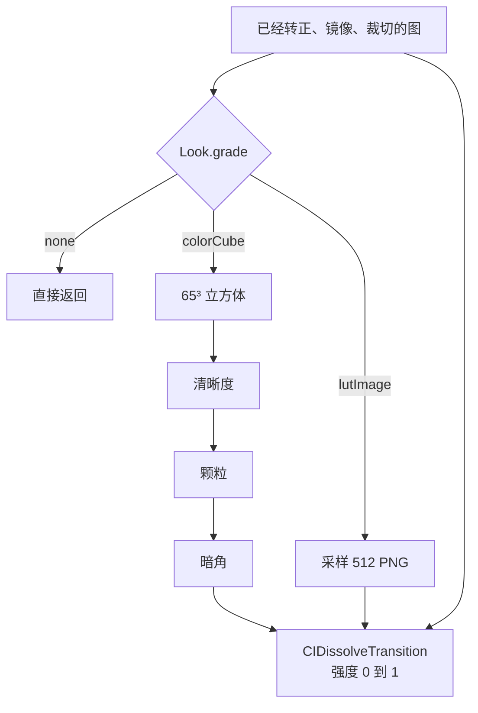
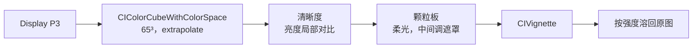
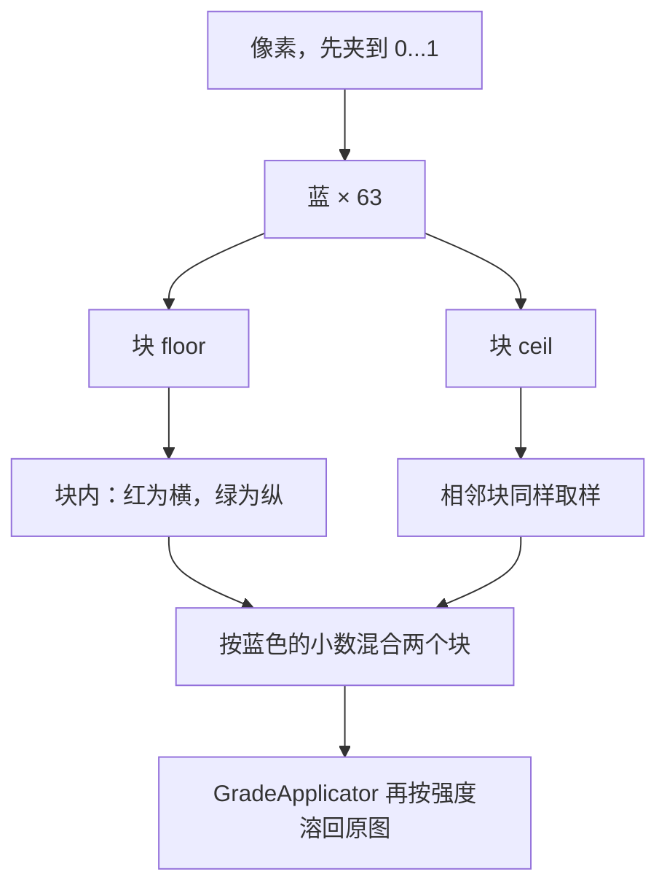

# 渲染

预览、成片和缩略图走同一条路径。几何先做完，再按 `Look.grade` 选渲染方案，最后按强度溶回原图。

第一阶段用 Core Image 的 Metal 后端。不引入 GPUImage 或 MetalPetal，除非 iPhone 13 的预览掉到 30fps 以下，或者下一阶段要做时域处理或美颜。到那时换的是某个 grader 的实现，`Look` 和调用入口保持不动。

## 两条方案

再加一种方案时，在 `LookGrade` 加一个 case，并在 CameraPipeline 加一个 grader。预览、成片和缩略图仍只调用 `GradeApplicator.apply`。

配方和 LUT 的差别：

| | 配方 `colorCube` | LUT 图 `lutImage` |
| --- | --- | --- |
| 颜色从哪来 | 烘焙进 65³ `.acube` | 运行时采样 PNG |
| 清晰度、颗粒、暗角 | 在颜色之后，按画面尺寸做 | 不做。图里已经有的对比就留在图里 |
| 调节 | 强度、清晰度、颗粒、暗角 | 只有强度 |
| 默认强度 | 1 | `LUTLooks.json` 的 `strength`，例如 0.8 |
| 谁写出资源 | `Tools/BakeColorCubes.swift` | 把 PNG 放进 `Resources/LUTs/`，并写 `LUTLooks.json` |

颗粒为 0 的配方如果把颗粒调高，用细颗粒板。LUT 没有这三根滑杆。

缩略图使用 `quality = .preview` 和这款的默认调节，因此缩略图是目录里的样子，不是用户改过的草稿。

## 几何

`FrameImageMaker` 在套风格之前做完这些事，两条方案共用：

1. 按 `orientation` 转正
2. 需要时水平镜像
3. `AspectCrop` 中心裁切
4. 工作空间 Display P3

方向和画幅的具体映射在 [capture.md](capture.md)。

## 配方：立方体之后的空间处理

色温、饱和、色相烤进立方体，不在每帧上用 `CITemperatureAndTint`、`CIColorControls`、`CIHueAdjust` 现算。和分辨率有关的处理留在立方体之后，这样放大之后颗粒和微对比仍跟着画面尺寸走。

1. `CIColorCubeWithColorSpace` 采样 65³，`inputExtrapolate = true`，`inputColorSpace` 是 Display P3。
2. 清晰度：只在亮度上做局部对比，再以 `CIColorBlendMode` 回到彩色，避免彩边。预览半径 8，成片半径 18。这是立体感，不是锐化滑杆。
3. 颗粒板：平铺，`CISoftLightBlendMode`，中间调遮罩压住死黑和纯白，再按颗粒量溶回这一步的输入。细板横向大约铺 3 次，粗板大约 1.7 次。不用 `CIRandomGenerator`。
4. 暗角：`CIVignette`。预览半径 1.2，成片半径 1.6。多数风格这一项是 0。
5. `GradeApplicator` 按强度用 `CIDissolveTransition` 溶回几何之后的原图。0 是原图，1 是完整风格。强度约等于 0 时整段直接返回。

中间调遮罩是亮度上的 `CIToneCurve`：`(0,0)`、`(0.22, 0.2)`、`(0.5, 1)`、`(0.78, 0.2)`、`(1, 0)`。`CIColorControls` 只用来抽出亮度。

65³ 是调色母版的常用精度。预览和成片用同一张立方体，不降到 33³。

### 立方体文件

包内格式是紧凑文件，加载时展开成 `CIColorCubeWithColorSpace` 要的 float RGBA。

路径：`AngieFilter/Resources/ColorCubes/<id>.acube`。`<id>` 等于 `Look.id`，例如 `natural.acube`。

布局，小端：

| 偏移 | 内容 |
| --- | --- |
| 0 | 4 字节魔数 `AC65` |
| 4 | `UInt16` 维度，必须是 65 |
| 6 | `UInt16` 版本，当前是 2 |
| 8 | Float16 RGB 顶点，小端，红变化最快。顶点个数 `65³`，每点 6 字节 |

高光和色相会把通道推到 0 以下或 1 以上。`CIColorCube` 最后会把显示结果夹回 0...1，但插值必须用未夹紧的顶点，否则肩部会错。所以包里用 Float16，不用 8-bit。每款约 1.6MB，47 款约 77MB。加载时展开成 float RGBA，A 固定为 1，大约 4.4MB。`ColorCubeStore` 保留最近 16 张，盖住当前分类和正在预览的那一款，避免缩略图刷新把预览挤掉。

找不到文件、魔数不对、维度不是 65、版本不是 2 或长度不符时，立方体这一步退回输入图。清晰度、颗粒和暗角仍按目录执行。

配方在 `Tools/BakeColorCubes.swift` 里。改完后在仓库根目录执行 `swift Tools/BakeColorCubes.swift`。脚本会核对格子方向，并抽肤色、天空、绿植、红衣、高光、暗部，和现场滤镜在 0...1 内的差要小于 0.04。这个脚本会重写 `Looks.json`，并删掉配方列表里没有的 `.acube`。它不读 `LUTLooks.json`，也不删除 `LUTs/`。烤之前每款要写清：

- 趾部和肩部的影调曲线。高光滚落
- 分色调：阴影和高光可以偏不同的颜色
- 分色相的饱和与色相。自然、柔和、人像里保住肤色带，不跟着红衣一起被推饱和
- 鲜艳故意推开绿和红

改一款配方是换资源和 `Look` 参数，不改渲染代码。

### 颗粒板

两张板：`AngieFilter/Resources/Grain/fine.png`、`AngieFilter/Resources/Grain/coarse.png`。`GrainLibrary` 按 `grainPlate` 取图。`grain == 0` 且用户没有把颗粒调高时不铺板。

粗板：经典负片、怀旧负片、超级丽爱、肖像 800、金 200、日常 400、彩色+、黑白 400、800T、HP5、FP4、SX-70、600。

细板：其余 `grain > 0` 的风格。其中包括单色、黑白（`acros`）、黑白细（T-Max）、德尔塔、50D、肖像 400。

哈苏自然色有清晰度，没有颗粒，因此没有板。板缺失时，该风格的颗粒步骤会被跳过。

## LUT 图

LUT 方案直接采样 PNG，不把图收成 `.acube`。布局和常见的 8×8 方格着色器一致：512×512，8 行 8 列，每块 64×64，一共 64 个蓝色切片。

块的位置从 PNG 左上角数。蓝 0 是左上第一块，从左到右、再从上到下。块内红轴从左到右，绿轴从上到下。采样点往里收半个像素，避免踩到相邻块的边上。

`LUTImageStore` 按原字节加载，不做色彩空间转换，保留最近 16 张。图不是 512×512 时这一款退回输入图。`LUTImageGrader` 用 `CIKernel` 做上面的采样。内核建不起来时，用同一张 PNG 点采样成 64³ 立方体再查表，画面不会静默变回原图。强度不写进 kernel，免得和分发处的溶解做两次。

`LUTLooks.json` 每条：

| 字段 | 含义 |
| --- | --- |
| `id` | `Look.id`，以 `lut-` 开头，避免和配方 id 撞名 |
| `name` | 界面名称 |
| `about` | 一句说明 |
| `grade` | 固定 `lutImage` |
| `lutImage` | `LUTs/<lutImage>.png` 的文件名，不含扩展名 |
| `strength` | 第一次套上时的强度，0 到 1 |

分类在 `LookLibrary.familySpecs`：人像、风景、美食、新锐。点分类只换缩略图，点缩略图才套用。

## 目录 JSON

`Looks.json` 是配方数组。原图必须存在，`id` 为 `original`，读入后 grade 是 `none`。没有 `grade` 字段的其他条目按 `colorCube` 读，立方体名等于 `id`。

| 字段 | 类型 | 含义 |
| --- | --- | --- |
| `id` | string | 与立方体文件名一致 |
| `name` | string | 界面名称，见 [product.md](product.md) |
| `about` | string | 这款在做什么。原图是「不套风格。」 |
| `clarity` | number | 0–1 左右的局部对比强度 |
| `grain` | number | 0 表示没有颗粒 |
| `grainPlate` | `none` / `fine` / `coarse` | 与 `GrainPlateKind` 一致 |
| `vignette` | number | 0 表示没有暗角 |

界面不按 JSON 数组平铺，而按 `LookLibrary.families` 显示。`Looks.json` 缺失、解码失败或数组为空时只返回内置原图。`LUTLooks.json` 缺失时，配方滤镜仍在。

## 验收和性能

场景和五款配方验收标准在 [product.md](product.md)。达不到就改立方体和 `Looks.json` 里的空间参数。LUT 图的验收是：采样和 PNG 上对应格子一致，默认强度和目录里的 `strength` 一致。

iPhone 13 上预览保持 30fps。旧帧丢掉。拍照的编码和套风格不要占住 `videoQueue`。预览 `CIContext` 复用；缩略图目前每次刷新另建一个 context。`ColorCubeStore` 和 `LUTImageStore` 各保留最近 16 份，不一次展开全部资源。
